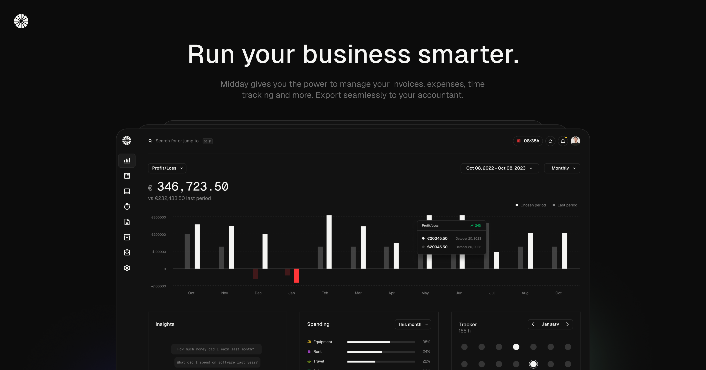

	<h1 align="center"><b>Midday</b></h1>

    Run your business smarter
     
     
    <a href="https://go.midday.ai/anPiuRx">Discord</a>
    ·
    <a href="https://midday.ai">Website</a>
    ·
    <a href="https://github.com/midday-ai/midday/issues">Issues</a>
  

# Under active development

> We have been working with Midday for the past 4 months and our philosophy has been "make it work, make it right". Currently, we're actively improving Midday's code quality and best practices. In the meantime, fasten your seatbelts and enjoy the ride!

# Get started

We are working on the documentation to get started with Midday for local development: https://docs.midday.ai/local-development

# App Architecture

- Monorepo
- Bun
- React
- TypeScript
- Nextjs
- Supabase
- Shadcn
- ToDesktop
- Expo
- TailwindCSS

### Hosting

- Supabase (database, storage, realtime, auth)
- Vercel (Website, edge-config, and metrics)
- Upstash (redis)

### Services

- Trigger.dev (background jobs)
- Resend (email)
- Novu (notifications)
- Github Actions (CI/CD)
- GoCardLess (Bank connection EU)
- Plaid (Bank connection in Canada and US)
- Teller (Bank connection in the US)
- Loops (Marketing email)
- OpenPanel (Events and Analytics)
- Dub (Short URLs)

## Repo Activity

