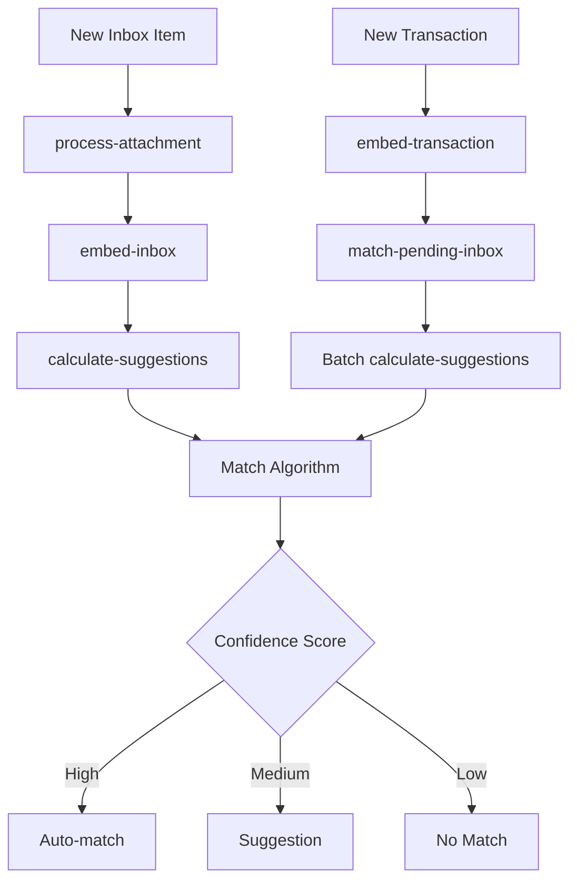

# Inbox Matching System

## Overview

The Inbox Matching System is an AI-powered feature that automatically matches incoming receipts, invoices, and other financial documents with corresponding bank transactions. It uses embeddings, financial pattern recognition, and confidence calibration to provide accurate matches.

## Key Features

- **🤖 AI-Powered Matching**: Uses 768-dimensional embeddings to understand semantic similarity between transactions and inbox items
- **💰 Financial Accuracy**: Sophisticated amount, currency, and date matching with accounting-specific logic
- **🎯 Confidence Calibration**: Learns from user feedback to improve matching accuracy over time
- **🔄 Bidirectional Processing**: Matches new transactions against existing inbox items AND new inbox items against existing transactions
- **⚡ Auto-matching**: High-confidence matches are automatically processed
- **💡 Smart Suggestions**: Lower-confidence matches are presented as suggestions for user review

## Architecture Overview

### Core Components

1. **Embedding Generation**: Creates semantic vectors for transactions and inbox items
2. **Matching Algorithm**: Compares embeddings and financial data to find matches
3. **Confidence Scoring**: Calculates match confidence based on multiple factors
4. **Calibration System**: Adapts thresholds based on user feedback
5. **Job Orchestration**: Manages the processing pipeline

### Data Flow



## Task Flow Architecture

### 1. New Transaction Processing

**Flow**: `upsert-transactions` → `embed-transaction` → `match-pending-inbox` → `process-inbox-matching`

```typescript
// Entry Point: Bank sync creates new transactions
upsertTransactions({
  transactions: [...],
  teamId,
  bankAccountId
})
  ↓
// Step 1: Create embeddings for new transactions
await embedTransaction.triggerAndWait({
  transactionIds,
  teamId
})
  ↓
// Step 2: Check pending inbox items against new transactions
await tasks.trigger("match-pending-inbox", {
  teamId,
  newTransactionIds: transactionIds
})
  ↓
// Step 3: Batch process matching for relevant inbox items
await tasks.batchTrigger("process-inbox-matching", batchJobs)
```

### 2. New Inbox Item Processing

**Flow**: `process-attachment` → `embed-inbox` → `process-inbox-matching`

```typescript
// Entry Point: Gmail sync, email webhook, or manual upload
processAttachment({
  filePath,
  teamId,
  mimetype,
  size
})
  ↓
// Step 1: Process document (OCR, data extraction)
await updateInboxWithProcessedData(...)
  ↓
// Step 2: Create embeddings for inbox item
await embedInbox.triggerAndWait({
  inboxId,
  teamId
})
  ↓
// Step 3: Find matches against existing transactions
await processInboxMatching.trigger({
  teamId,
  inboxId
})
```

### 3. Job Responsibilities

| Job | Responsibility | Orchestration Level |
|-----|---------------|-------------------|
| `upsert-transactions` | **Orchestrator** - Manages entire transaction pipeline | High |
| `embed-transaction` | Creates transaction embeddings | Low |
| `match-pending-inbox` | **Orchestrator** - Finds relevant inbox items to recheck | Medium |
| `process-attachment` | **Orchestrator** - Manages entire inbox item pipeline | High |
| `embed-inbox` | Creates inbox item embeddings | Low |
| `process-inbox-matching` | Performs matching algorithm and creates suggestions | Low |

## Matching Algorithm

### Confidence Scoring

The matching confidence is calculated using multiple weighted factors:

```typescript
const confidenceScore = 
  (embeddingScore * embeddingWeight) +
  (amountScore * amountWeight) +
  (currencyScore * currencyWeight) +
  (dateScore * dateWeight) +
  (recurringBonus * recurringWeight)
```

### Scoring Components

1. **Embedding Score** (40% weight)
   - Cosine similarity between transaction and inbox item embeddings
   - Captures semantic similarity of merchant names, descriptions

2. **Amount Score** (25% weight)
   - Exact match: 1.0
   - Close match (within 5%): 0.9
   - Cross-currency with base amounts: 0.85

3. **Currency Score** (15% weight)
   - Same currency: 1.0
   - Different currency with base match: 0.8

4. **Date Score** (20% weight)
   - Asymmetric logic for invoices vs expenses
   - Payment terms awareness (Net 7, 15, 30, etc.)
   - Open banking delay compensation (3 days)

5. **Recurring Bonus** (Variable)
   - Boosts confidence for recurring transaction patterns

### Thresholds

- **Auto-match**: ≥ 0.92 confidence (very strict)
- **Suggested match**: ≥ 0.75 confidence
- **Calibrated thresholds**: Adjust based on user feedback

## Confidence Calibration

The system learns from user actions to improve matching accuracy:

### Feedback Loop

1. **User confirms match** → Increase confidence in similar patterns
2. **User declines match** → Decrease confidence, adjust thresholds
3. **Continuous learning** → Thresholds adapt to team-specific patterns


### Status Flow

```
inbox.status: new → analyzing → pending → suggested_match/done
transaction_match_suggestions.status: pending → confirmed/declined
```

## Entry Points

### 1. Bank Transaction Sync
- **Trigger**: Bank connection sync (Plaid, GoCardless, Teller)
- **Entry Job**: `upsert-transactions`
- **Flow**: Transaction → Embedding → Match against inbox

### 2. Gmail Account Sync
- **Trigger**: Gmail API sync for attachments
- **Entry Job**: `sync-inbox-account` → `process-attachment`
- **Flow**: Attachment → Process → Embed → Match against transactions

### 3. Email Webhook
- **Trigger**: Email forwarded to team inbox
- **Entry Job**: `webhook/inbox/route.ts` → `process-attachment`
- **Flow**: Email attachment → Process → Embed → Match

### 4. Manual Upload
- **Trigger**: User uploads document via dashboard
- **Entry Job**: `process-attachment`
- **Flow**: Upload → Process → Embed → Match

### 5. Slack Integration
- **Trigger**: File shared in Slack channel
- **Entry Job**: `inbox-slack-upload`
- **Flow**: Slack file → Process → Embed → Match

## Performance Characteristics

### Efficiency Features

- **Batch Processing**: Multiple inbox items processed simultaneously
- **Smart Filtering**: Only relevant items are checked for matches
- **Embedding Reuse**: Embeddings cached and reused across matches
- **Calibrated Thresholds**: Reduces false positives over time

### Scalability

- **Concurrent Jobs**: Multiple matching jobs can run in parallel
- **Vector Similarity**: Efficient PostgreSQL vector operations
- **Reasonable Limits**: 100 item batches prevent job overload

## Monitoring & Observability

### Key Metrics

- **Auto-match Accuracy**: Percentage of auto-matches confirmed by users
- **Suggestion Accuracy**: Percentage of suggestions confirmed by users
- **Processing Time**: Time from inbox item creation to match completion
- **Calibration Effectiveness**: Improvement in accuracy over time

### Logging

Each job provides structured logging:

```typescript
logger.info("Match completed", {
  inboxId,
  transactionId,
  confidence: 0.89,
  matchType: "suggested_match",
  teamId
})
```