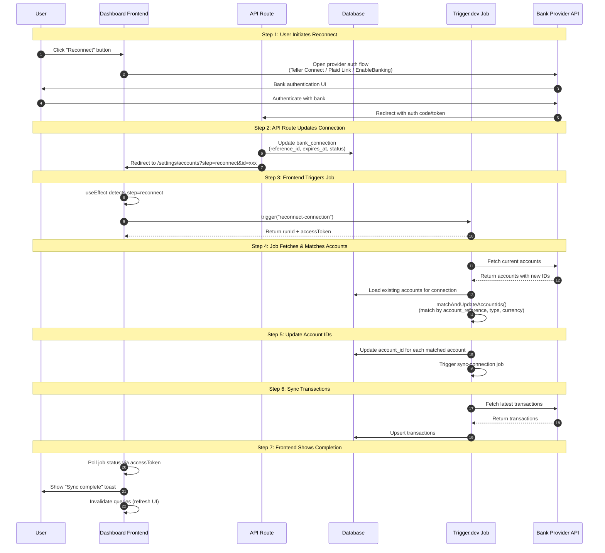
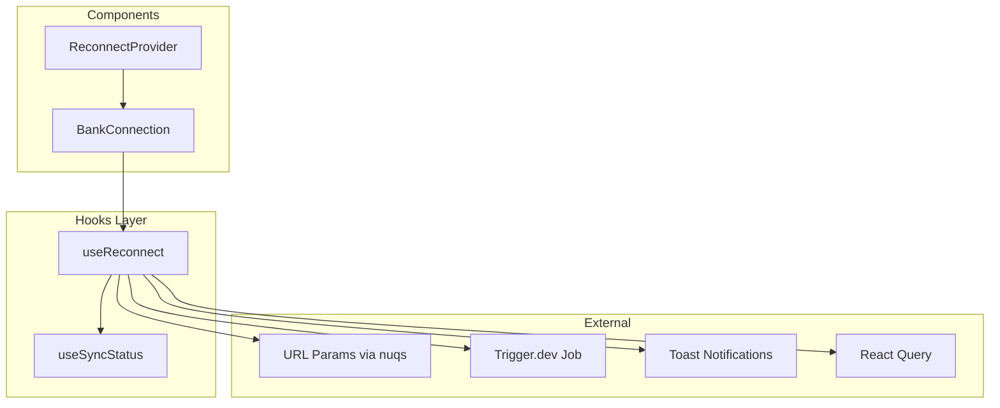

# Bank Account Reconnect Logic

## Overview

When a user reconnects a bank connection, the provider may assign new account IDs. This document describes how we safely match existing database accounts to the new API accounts and update the `account_id` field without data corruption.

## Reconnect Flow Diagram



## Provider-Specific Flow Variations

### GoCardless / EnableBanking (EU/UK)
```
User clicks Reconnect
    → Opens provider's auth page in new window
    → User authenticates at bank
    → Provider redirects to /api/gocardless/reconnect or /api/enablebanking/session
    → API route updates DB + redirects to frontend with ?step=reconnect&id=xxx
    → useReconnect hook detects URL params → triggers reconnect-connection job
    → URL params cleared to prevent re-triggering
```

### Teller (US)
```
User clicks Reconnect
    → Opens Teller Connect modal
    → User authenticates at bank
    → Teller Connect calls onComplete("reconnect")
    → BankConnection routes to triggerReconnect()
    → useReconnect hook triggers reconnect-connection job
```

### Plaid (US)
```
User clicks Reconnect  
    → Opens Plaid Link in "update mode"
    → User authenticates at bank
    → Plaid preserves account IDs (no remapping needed)
    → Plaid Link calls onComplete("sync")
    → BankConnection routes to triggerManualSync()
    → useReconnect hook triggers manual sync job
```

## The Problem

Bank providers (GoCardless, Teller, EnableBanking) may change account IDs after a reconnect. We need to match existing database accounts to the new API accounts to maintain transaction history continuity.

**The original bug**: If multiple accounts shared the same identifier (e.g., two accounts ending in "1234"), the update query would affect multiple rows, causing both accounts to point to the same `account_id`. One account would effectively stop syncing.

## Solution: Unified Matching Algorithm

All providers use a shared `matchAndUpdateAccountIds()` function that safely matches and updates accounts.

### Matching Priority

1. **resource_id (account_reference)** - Must match exactly
2. **type** - If DB has type, must match API type
3. **currency** - If DB has currency, must match API currency
4. **name** - Tiebreaker if multiple candidates remain

### Safety Mechanisms

- Each DB account can only be matched once (tracked via `matchedDbIds` Set)
- Updates use unique DB `id`, not potentially duplicated `account_reference`
- Unmatched accounts are logged for debugging

## Provider-Specific Behavior

### GoCardless (EU/UK)

- **resource_id**: `account.resourceId` (stable identifier)
- **Additional data**: `iban`, `bic`, `available_balance` (from `interimAvailable` balance type)
- **Note**: `credit_limit` is NOT available - only `creditLimitIncluded` boolean exists
- **Reconnect flow**: User re-authenticates → job triggered → accounts remapped

### Teller (US)

- **resource_id**: `last_four` (last 4 digits of account number)
- **Additional data**: `subtype`, `routing_number`, `wire_routing_number`, `account_number`, `sort_code`, `available_balance`
- **Account details**: Available instantly for most institutions (`verify.instant`), some require microdeposit verification
- **Balances**: `ledger` (total) and `available` (net pending) - no `credit_limit`
- **Note**: `last_four` can be shared between accounts (e.g., checking and savings with same last 4 digits)
- **Reconnect flow**: User re-authenticates → job triggered → accounts remapped

### EnableBanking (EU)

- **resource_id**: `identification_hash` (cryptographic hash, very stable)
- **Additional data**: `iban`, `bic`, `subtype`, `available_balance`
- **Note**: `credit_limit` is NOT in EnableBanking's documented API (may return from some banks but not guaranteed)
- **Reconnect flow**: API route updates connection → triggers reconnect job

### Plaid (US)

- **resource_id**: `persistent_account_id || mask`
- **Additional data**: `subtype`, `available_balance`, `credit_limit`
- **Note**: Plaid uses "update mode" for reconnects which preserves account IDs. No remapping needed.

## Data Fields

### Account Identification Fields

| Field | Description | Providers |
|-------|-------------|-----------|
| `account_reference` | Stable identifier for matching | All |
| `iban` | International Bank Account Number (encrypted) | GoCardless, EnableBanking |
| `bic` | Bank Identifier Code (SWIFT) | GoCardless, EnableBanking |
| `subtype` | Granular account type | Teller, Plaid, EnableBanking |

### US Bank Details (Teller, Plaid)

| Field | Description | Notes |
|-------|-------------|-------|
| `routing_number` | ACH routing number | Public info |
| `wire_routing_number` | Wire routing number | May differ from ACH |
| `account_number` | Full account number (encrypted) | Sensitive |
| `sort_code` | UK BACS sort code | UK accounts via Teller |

### Balance Fields

| Field | Description | Providers | Sync Frequency |
|-------|-------------|-----------|----------------|
| `balance` | Current/ledger balance (depository) or amount owed (credit) | All | Every sync |
| `available_balance` | Spendable funds (depository) or available credit (cards) | All | Every sync |
| `credit_limit` | Maximum credit line (cards only) | Plaid only* | Every sync |

*EnableBanking does NOT officially support `credit_limit` - our code handles it if returned but it's not guaranteed

**Balance vs Available Balance:**
- **Depository accounts**: `balance` is ledger balance, `available_balance` is spendable (minus holds/pending)
- **Credit accounts**: `balance` is amount owed, `available_balance` is remaining credit

### Encryption

Sensitive fields are encrypted at rest using `@midday/encryption`:
- `iban` - Encrypted
- `account_number` - Encrypted

Non-sensitive fields stored in plain text:
- `routing_number`, `wire_routing_number`, `bic`, `sort_code`

To retrieve decrypted values, use the `bankAccounts.getDetails` tRPC procedure.

### Subtype Values

- **Teller**: `checking`, `savings`, `money_market`, `certificate_of_deposit`, `treasury`, `sweep`, `credit_card`
- **Plaid**: `checking`, `savings`, `credit_card`, `mortgage`, `student`, `auto`, etc.
- **EnableBanking**: `cacc` (current), `card`, `svgs` (savings), `loan`, `cash`

## Sync Flow

### Regular Balance Sync (`syncAccount`)

The `syncAccount` job runs periodically and updates:
- `balance` - Primary balance from `/accounts/balance` endpoint
- `available_balance` - From same endpoint (added to response)
- `credit_limit` - From same endpoint (added to response)

### Static Field Backfill (`backfillAccountStaticFields`)

For existing accounts that were created before these fields existed, the sync job includes a temporary backfill that populates:
- `iban`, `subtype`, `bic` (EU/UK accounts)
- `routing_number`, `wire_routing_number`, `account_number`, `sort_code` (US/UK accounts)

This backfill only runs for accounts missing ALL static fields and can be removed after most accounts have been updated.

## Troubleshooting

### "No matching DB account found" Warning

This means an API account couldn't be matched to any database account. Possible causes:
1. User added a new account at the bank
2. Account was deleted from the database
3. `account_reference` changed (shouldn't happen)

### Accounts Not Syncing After Reconnect

1. Check `bank_accounts.error_retries` - may have exceeded limit
2. Verify `bank_accounts.account_id` matches the new API account ID
3. Check reconnect job logs for matching results

## Key Files

| File | Purpose |
|------|---------|
| `apps/dashboard/src/hooks/use-reconnect.ts` | Hook encapsulating all reconnect/sync logic |
| `apps/dashboard/src/components/bank-connections.tsx` | Frontend component using useReconnect hook |
| `apps/dashboard/src/components/reconnect-provider.tsx` | Provider-specific reconnect UI (Teller Connect, Plaid Link, etc.) |
| `apps/dashboard/src/app/api/enablebanking/session/route.ts` | EnableBanking OAuth callback - updates DB, redirects to frontend |
| `apps/dashboard/src/app/api/gocardless/reconnect/route.ts` | GoCardless OAuth callback - updates DB, redirects to frontend |
| `apps/dashboard/src/actions/transactions/reconnect-connection-action.ts` | Server action that triggers the reconnect job |
| `packages/jobs/src/tasks/reconnect/connection.ts` | Main reconnect job - fetches accounts, matches, updates IDs |
| `packages/jobs/src/utils/account-matching.ts` | Shared `matchAndUpdateAccountIds()` function |

## useReconnect Hook

All reconnect and sync logic is encapsulated in the `useReconnect` hook, providing a clean interface for the `BankConnection` component.

### Usage

```typescript
const { isSyncing, triggerReconnect, triggerManualSync } = useReconnect({
  connectionId: connection.id,
  provider: connection.provider,
});
```

### What the Hook Handles

1. **URL param detection** - Detects `step=reconnect&id=xxx` for OAuth providers
2. **URL param cleanup** - Clears params after triggering to prevent re-triggering
3. **Job triggering** - Via `reconnectConnectionAction` or `manualSyncTransactionsAction`
4. **Status tracking** - Uses `useSyncStatus` hook to track job progress
5. **Toast notifications** - Shows syncing, success, and error toasts
6. **Query invalidation** - Refreshes bank connections, accounts, and transactions on completion

### Architecture



## ReconnectProvider Callback

The `ReconnectProvider` component uses a unified `onComplete` callback:

```typescript
type OnCompleteType = "reconnect" | "sync";

// In ReconnectProvider
onComplete: (type: OnCompleteType) => void;

// In BankConnection
const handleComplete = (type: "reconnect" | "sync") => {
  if (type === "reconnect") {
    triggerReconnect();  // Account IDs may have changed
  } else {
    triggerManualSync(); // Account IDs preserved (Plaid)
  }
};
```

- **"reconnect"**: Provider may have changed account IDs (Teller) - triggers reconnect job
- **"sync"**: Provider preserves account IDs (Plaid update mode) - triggers manual sync

## Important Implementation Notes

### Single Job Trigger
The reconnect job should only be triggered **once** per reconnect flow. The `useReconnect` hook handles this:

```typescript
// In useReconnect hook - only triggers when params.id matches this connection
useEffect(() => {
  if (params.step === "reconnect" && params.id === connectionId) {
    reconnectConnection.execute({
      connectionId,
      provider: provider as Provider,
    });

    // Clear URL params to prevent re-triggering on page refresh
    setParams({ step: null, id: null });
  }
}, [params.step, params.id, connectionId, provider, setParams]);
```

API routes (EnableBanking, GoCardless) do **not** trigger the job - they only update the database and redirect. This ensures:
1. No duplicate job triggers (race conditions)
2. Frontend can track job progress via `runId`/`accessToken`
3. UI shows proper sync status feedback
4. URL params are cleared immediately to prevent re-triggering on page refresh
