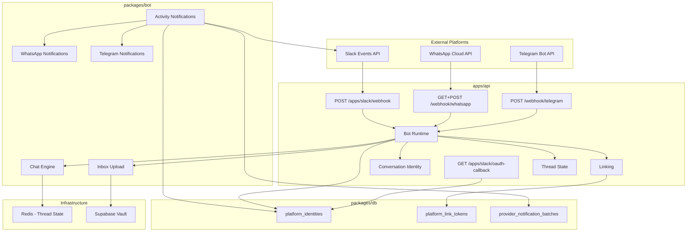
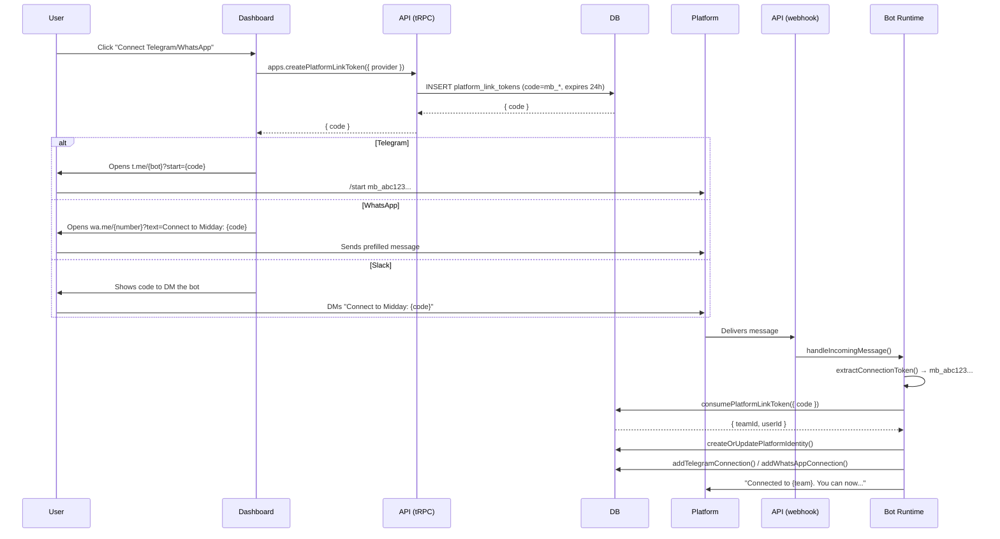
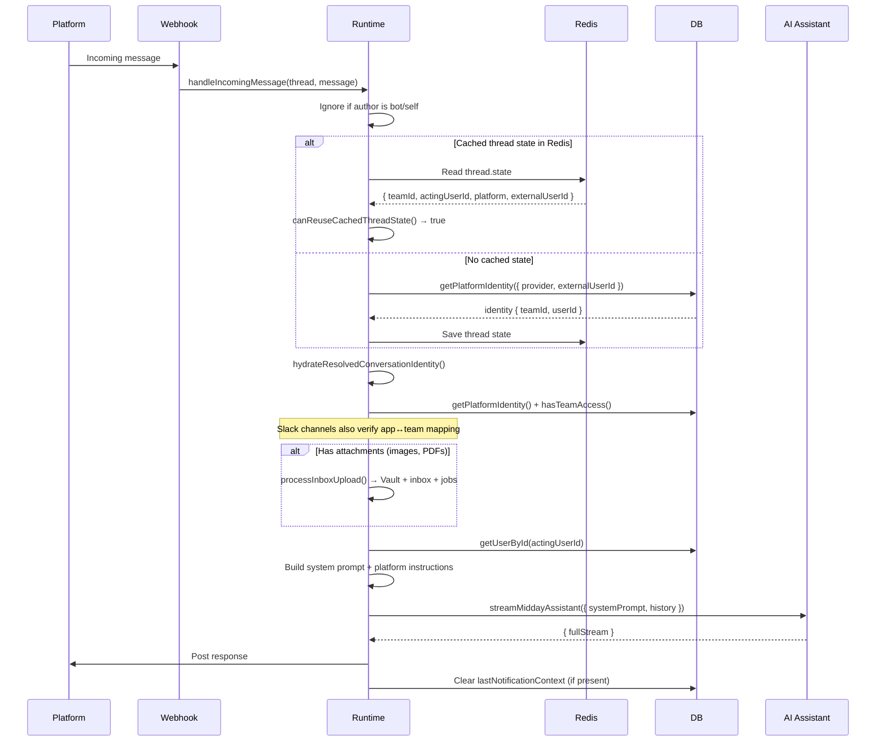
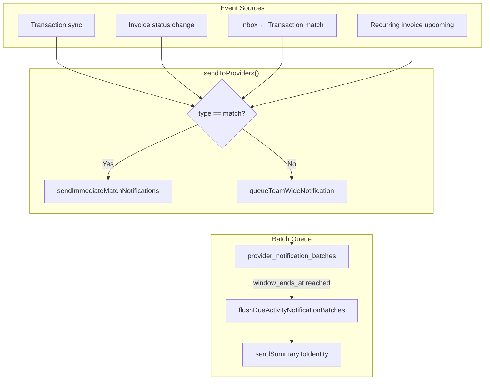
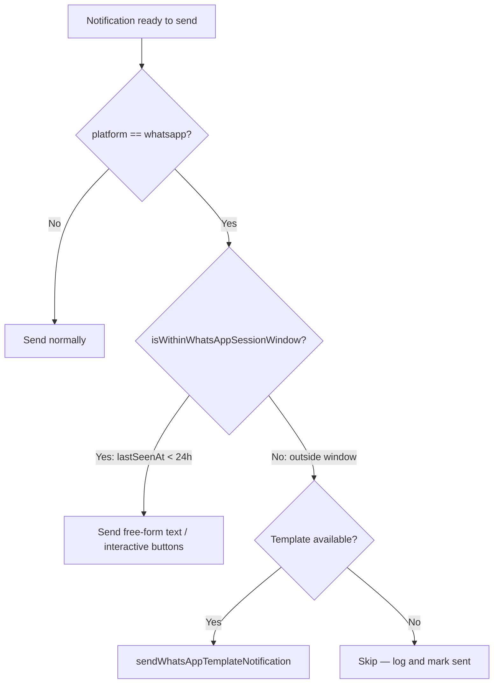
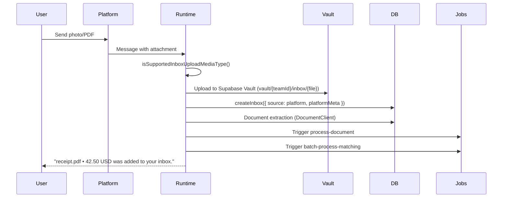

# Bot & Messaging Integration (Telegram, WhatsApp, Slack)

## Overview

The bot integration extends Midday into external messaging platforms — Telegram, WhatsApp, and Slack — so users can chat with the Midday AI assistant, submit receipts/invoices, and receive proactive notifications without opening the dashboard.

The system is built around three pillars:

1. **Conversational AI** — full assistant access from any connected platform.
2. **Inbox uploads** — send photos of receipts or PDFs directly in chat; they are extracted, stored, and matched automatically.
3. **Activity notifications** — batched and immediate notifications for transactions, invoices, and receipt matches, delivered to the platform the user is active on.

## Architecture



## Package Structure

### `packages/bot/` — Shared bot logic

| File | Purpose |
|------|---------|
| `src/instance.ts` | Creates the `Chat` singleton with WhatsApp, Telegram, and Slack adapters, backed by Redis state. Debounce concurrency at 1500 ms. |
| `src/platform-rules.ts` | Exports `BotPlatform` type and `getPlatformInstructions()` which appends platform-specific formatting hints to the system prompt. |
| `src/activity-notifications.ts` | Notification orchestration: batching, flushing, and delivery across all platforms. Contains the `sendToProviders` entry point. |
| `src/whatsapp-notifications.ts` | WhatsApp Cloud API v21.0 calls: text messages, interactive buttons (match confirm/decline), and Meta Message Templates. |
| `src/telegram-notifications.ts` | Telegram Bot API calls for sending text notifications. |
| `src/inbox-upload.ts` | Processes file attachments: uploads to Supabase Vault, creates inbox entries, triggers document extraction and matching jobs. |
| `src/index.ts` | Barrel re-export of all modules. |

### `apps/api/src/bot/` — API-side runtime

| File | Purpose |
|------|---------|
| `runtime.ts` | `registerMiddayBotRuntime()` — wires chat events to message handlers. Resolves conversations, hydrates identities, streams the AI assistant, handles attachments. |
| `conversation-identity.ts` | Types and helpers for resolving a connected conversation's identity and extracting notification context from metadata. |
| `linking.ts` | `extractConnectionToken()` — parses `mb_*` link codes from Telegram `/start` payloads, WhatsApp/Slack connection messages. |
| `thread-state.ts` | Redis-backed `BotThreadState` and `canReuseCachedThreadState()` to avoid re-resolving identity on every message from the same user. |

---

## Database Schema

### `platform_identities`

Links an external messaging account to a Midday user and team.

| Column | Type | Description |
|--------|------|-------------|
| `id` | uuid | Primary key |
| `provider` | `platform_provider` enum | `slack`, `telegram`, or `whatsapp` |
| `team_id` | uuid FK → teams | The Midday team |
| `user_id` | uuid FK → users | The Midday user |
| `external_user_id` | text | Platform-specific user ID (phone number, Telegram user ID, Slack user ID) |
| `external_team_id` | text | Platform-specific workspace ID (Slack team ID; empty string for Telegram/WhatsApp) |
| `external_channel_id` | text | Outbound channel (e.g. Telegram chat ID for sending notifications) |
| `metadata` | jsonb | Mutable metadata: `lastSeenAt`, `lastNotificationContext`, `lastNotificationSentAt`, `displayName` |

**Unique constraint:** `(provider, external_team_id, external_user_id)` — one identity per external account.

### `platform_link_tokens`

Short-lived, one-time codes for securely connecting a messaging account to a Midday user.

| Column | Type | Description |
|--------|------|-------------|
| `id` | uuid | Primary key |
| `code` | text | `mb_` + nanoid(18), unique |
| `provider` | `platform_provider` enum | Which platform this token is for |
| `team_id` | uuid FK → teams | The team being linked |
| `user_id` | uuid FK → users | The user being linked |
| `expires_at` | timestamptz | Default 24h from creation |
| `used_at` | timestamptz | Set when consumed; null until used |

### `provider_notification_batches`

Coalesces multiple events of the same type into a single notification per identity.

| Column | Type | Description |
|--------|------|-------------|
| `id` | uuid | Primary key |
| `batch_key` | text | `{identity_id}:{event_family}`, unique |
| `platform_identity_id` | uuid FK → platform_identities | Recipient |
| `team_id` | uuid FK → teams | |
| `user_id` | uuid FK → users | |
| `provider` | `platform_provider` enum | |
| `event_family` | text | `transaction`, `invoice_paid`, `invoice_overdue`, `recurring_invoice_upcoming` |
| `payload` | jsonb | `{ entries: [...] }` — events accumulated during the batch window |
| `notification_context` | jsonb | Context metadata attached when sent |
| `window_ends_at` | timestamptz | When the batch should be flushed |
| `sent_at` | timestamptz | Set when delivered; null while pending |

### Row-Level Security

All three tables have RLS enabled. Policies restrict all operations (SELECT, INSERT, UPDATE, DELETE) to authenticated users whose `team_id` is in `private.get_teams_for_authenticated_user()`. Server-side workers use a service-role DB client that bypasses RLS.

---

## Flows

### 1. Account Linking

Users connect their messaging account from the Midday dashboard. The flow is the same across platforms, with platform-specific deep links.



**Slack workspace install** follows a separate OAuth flow:

1. Dashboard redirects to Slack OAuth (`/apps/slack/install-url`).
2. User authorizes in Slack.
3. Callback (`/apps/slack/oauth-callback`) exchanges the code, persists the app + Slack adapter installation, creates a `platform_identity`, and sends a welcome message.

### 2. Message Handling

Every incoming message from a connected platform follows the same pipeline.



### 3. Activity Notifications

Notifications are categorized into **immediate** (match) and **batched** (everything else).



#### Batch Windows

| Event Type | Window |
|------------|--------|
| `transaction` | 10 minutes |
| `invoice_paid` | 10 minutes |
| `invoice_overdue` | 30 minutes |
| `recurring_invoice_upcoming` | 60 minutes |

Events of the same type for the same identity are merged into a single batch (`payload.entries[]`). When the window expires, the worker flushes the batch, builds a human-readable summary, and delivers it.

#### Notification Gating

Before sending, the system checks:

1. **App installed** — `getAppByAppId()` for the provider and team.
2. **App setting enabled** — per-app toggle (`transactions`, `invoices`, `matches`).
3. **User notification preference** — `shouldSendNotification()` checks the user's `in_app` notification settings.

#### Platform Delivery

| Platform | Batched notifications | Match notifications |
|----------|----------------------|---------------------|
| **Slack** | DM via `conversations.open` + `chat.postMessage` | Thread reply in source channel with Block Kit |
| **Telegram** | Text message to `external_channel_id` | Text message to source chat |
| **WhatsApp (in-session)** | Free-form text message | Interactive buttons (confirm/decline) |
| **WhatsApp (out-of-session)** | Meta Message Template | Meta Message Template |

### 4. WhatsApp 24-Hour Session Window

Meta restricts free-form WhatsApp messages to users who have interacted within the last 24 hours. The system handles this transparently:



`lastSeenAt` is updated on every incoming message from a WhatsApp user. Templates are pre-approved in Meta Business Manager and mapped via `WHATSAPP_TEMPLATE_NAMES`:

| Internal Event | Template Name |
|---------------|---------------|
| `transaction` | `midday_new_transactions` |
| `invoice_paid` | `midday_invoice_paid` |
| `invoice_overdue` | `midday_invoice_overdue` |
| `recurring_invoice_upcoming` | `midday_recurring_upcoming` |
| `match` | `midday_receipt_matched` |

Templates are always sent with `language.code = "en"`.

### 5. Inbox Upload from Chat

Users can send images or PDFs directly in any chat platform. The bot processes them into the Midday inbox.



Supported types: `image/*`, `application/pdf`, `application/octet-stream`.

### 6. Notification Context & Conversational Follow-Up

When a notification is sent, the system stores a `NotificationContext` on the platform identity:

```typescript
{
  eventType: "transaction",
  teamId: "...",
  userId: "...",
  entityType: "transaction",
  entityIds: ["tx_1", "tx_2"],
  summary: "3 new transactions. Reply \"show me them\"...",
  sourcePlatform: "whatsapp",
  suggestedPrompts: ["Show me them", "Which ones need receipts?"],
  sentAt: "2026-04-02T10:00:00Z"
}
```

When the user replies, this context is injected into the AI assistant's system prompt via `formatNotificationContextForPrompt()`, allowing the assistant to understand what the user is responding to. The context is cleared after the first reply.

---

## Security Model

### Identity Resolution

Every message goes through a multi-step authorization chain:

1. **Thread state cache** — Redis stores `{ teamId, actingUserId, platform, externalUserId }`. Reused only if the same external user on the same platform continues the conversation (`canReuseCachedThreadState`).
2. **Platform identity lookup** — `getPlatformIdentity()` resolves the external user to a Midday user/team.
3. **Identity validation** — `requireResolvedConversationIdentity()` confirms `identity.teamId == resolved.teamId` and `identity.userId == resolved.actingUserId`.
4. **Team access check** — `hasTeamAccess()` verifies the user still has access to the team (handles removed members).
5. **Slack channel validation** — for non-DM Slack messages, `getAppBySlackTeamId()` confirms the channel's Slack workspace matches the resolved team's installed app.

If any check fails, the thread state is cleared and the user is told to reconnect.

### Link Token Security

- Codes are `mb_` + `nanoid(18)` — high entropy, unguessable.
- Tokens expire after 24 hours.
- Tokens are single-use (`used_at` set on consumption).
- The `consumePlatformLinkToken` query atomically marks the token as used.

### Database-Level Isolation

- All three tables have RLS policies scoped to `private.get_teams_for_authenticated_user()`.
- Unique constraints prevent duplicate identities: `(provider, external_team_id, external_user_id)`.
- Custom error types (`PlatformIdentityAlreadyLinkedToAnotherTeamError`, etc.) handle conflict cases at the application layer.

### Bot User Scopes

Connected bot users operate with `apis.all` scope, granting full Midday assistant capabilities. This is intentional — the bot should be able to answer any question the user could ask in the dashboard.

---

## Webhook Endpoints

| Method | Path | Platform | Purpose |
|--------|------|----------|---------|
| POST | `/webhook/telegram` | Telegram | Bot API webhook updates |
| GET | `/webhook/whatsapp` | WhatsApp | Meta webhook verification (subscribe) |
| POST | `/webhook/whatsapp` | WhatsApp | Meta webhook events |
| POST | `/apps/slack/webhook` | Slack | Slack Events API |
| GET | `/apps/slack/oauth-callback` | Slack | OAuth code exchange |
| GET | `/apps/slack/install-url` | Slack | Generate OAuth install URL |

---

## Environment Variables

### API (`apps/api`)

| Variable | Required | Description |
|----------|----------|-------------|
| `SLACK_CLIENT_ID` | Yes | Slack app client ID |
| `SLACK_CLIENT_SECRET` | Yes | Slack app client secret |
| `SLACK_OAUTH_REDIRECT_URL` | Yes | OAuth callback URL |
| `SLACK_STATE_SECRET` | Yes | State parameter signing secret |
| `SLACK_SIGNING_SECRET` | Yes | Webhook signature verification |
| `SLACK_ENCRYPTION_KEY` | Recommended | Encrypt stored Slack installations |
| `TELEGRAM_BOT_TOKEN` | Yes | BotFather token |
| `TELEGRAM_WEBHOOK_SECRET_TOKEN` | Yes | Webhook verification secret |
| `TELEGRAM_BOT_USERNAME` | Yes | Bot username (without @) |
| `TELEGRAM_API_BASE_URL` | No | Custom Telegram API gateway |
| `WHATSAPP_PHONE_NUMBER_ID` | Yes | Meta phone number ID |
| `WHATSAPP_BUSINESS_ACCOUNT_ID` | Yes | Meta Business Account ID |
| `WHATSAPP_ACCESS_TOKEN` | Yes | Meta permanent access token |
| `WHATSAPP_VERIFY_TOKEN` | Yes | Webhook verification token |
| `WHATSAPP_APP_SECRET` | Yes | Webhook signature verification |
| `REDIS_URL` | Yes | Redis for chat thread state |

### Dashboard (`apps/dashboard`)

| Variable | Required | Description |
|----------|----------|-------------|
| `NEXT_PUBLIC_TELEGRAM_BOT_USERNAME` | Yes | Used in deep links (`t.me/{bot}?start=...`) |
| `NEXT_PUBLIC_WHATSAPP_NUMBER` | Yes | Used in deep links (`wa.me/{number}?text=...`) |

---

## Test Coverage

Tests live alongside the code they verify:

| Test File | Covers |
|-----------|--------|
| `apps/api/src/__tests__/routers/bot-runtime.test.ts` | Link-code consumption for all three platforms, verifying assistant is not called during linking |
| `apps/api/src/__tests__/routers/bot-linking.test.ts` | `extractConnectionToken` for Telegram `/start`, WhatsApp, and Slack message formats |
| `apps/api/src/__tests__/routers/bot-conversation-identity.test.ts` | Identity hydration, notification context extraction, mismatch rejection |
| `apps/api/src/__tests__/routers/bot-thread-state.test.ts` | Thread state reuse logic for same/different senders |
| `apps/api/src/__tests__/routers/slack-oauth-callback.test.ts` | Slack OAuth flow ordering (DB before adapter), failure handling |
| `packages/bot/src/activity-notifications.test.ts` | WhatsApp session window, batch template builders, match template builder |

---

## Key Types

```typescript
type BotPlatform = "dashboard" | "whatsapp" | "telegram" | "slack";

type BotThreadState = {
  teamId?: string;
  actingUserId?: string;
  platform?: BotPlatform;
  externalUserId?: string;
};

type ConnectedResolvedConversation = {
  connected: true;
  teamId: string;
  actingUserId: string;
  identityId?: string;
  notificationContext?: Record<string, unknown> | null;
};

type ProviderNotificationType =
  | "transaction"
  | "match"
  | "invoice_paid"
  | "invoice_overdue"
  | "recurring_invoice_upcoming";

type NotificationContext = {
  eventType: ProviderNotificationType;
  teamId: string;
  userId: string;
  entityType: string;
  entityIds: string[];
  summary: string;
  sourcePlatform: "slack" | "telegram" | "whatsapp";
  sourceMessageId?: string;
  suggestedPrompts: string[];
  sentAt: string;
};
```
