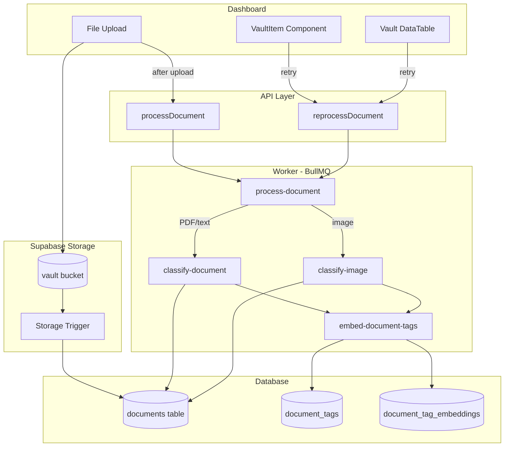
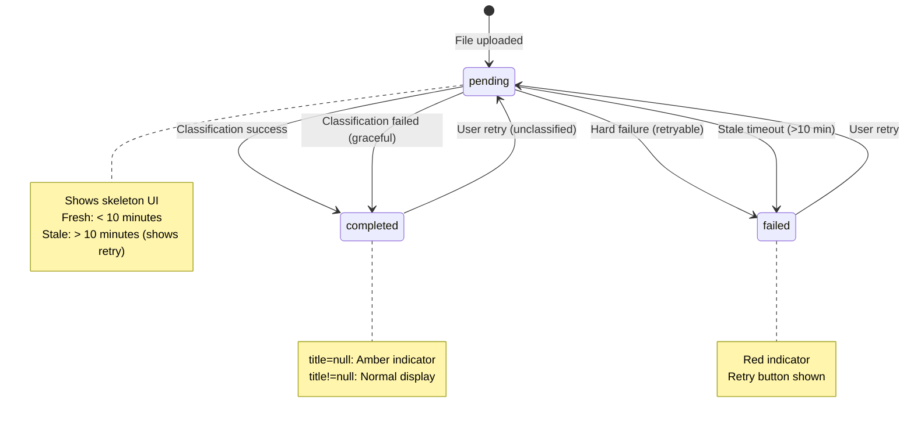
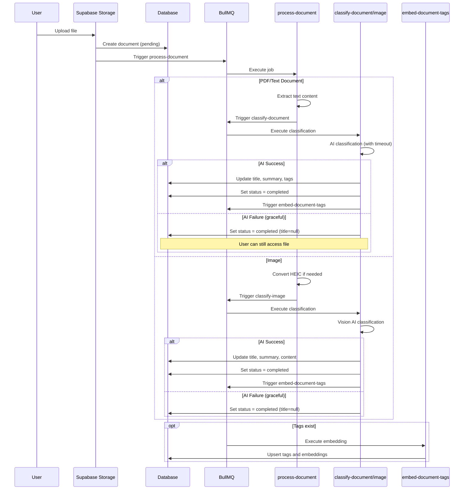
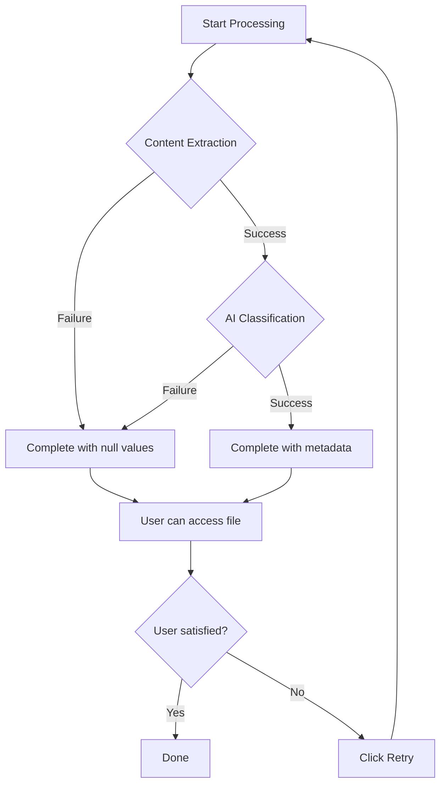
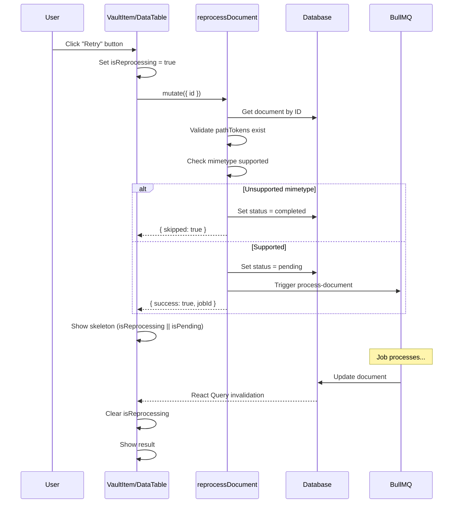
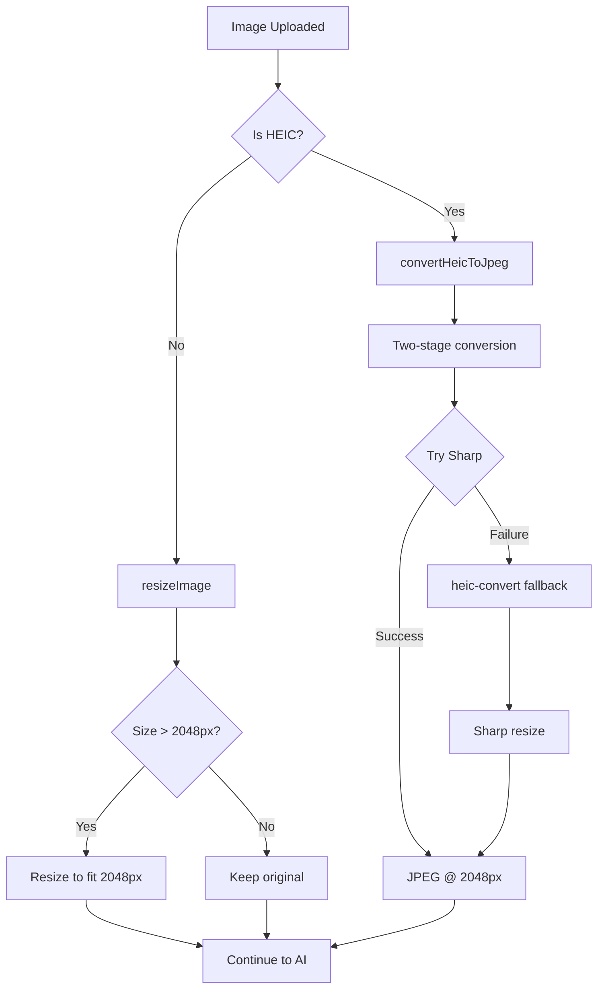

# Document Processing Pipeline

## Overview

The Document Processing Pipeline automatically processes files uploaded to the Vault, extracting content, classifying documents using AI, and generating searchable metadata. The system is designed with **graceful degradation** - documents always reach a usable state even if AI classification fails, and users can retry processing at any time.

### Key Features

- **🤖 AI-Powered Classification**: Uses vision and text models to extract titles, summaries, dates, and tags
- **🔄 Graceful Degradation**: Documents complete even if AI fails - users can always access files and retry
- **⏱️ Stale Detection**: Identifies documents stuck in processing (>10 minutes) and allows recovery
- **🔁 Retry Functionality**: Users can reprocess failed or unclassified documents with one click
- **🖼️ HEIC Conversion**: Automatically converts HEIC/HEIF images to JPEG for compatibility
- **🏷️ Tag Embeddings**: Generates semantic embeddings for document tags for better search
- **🔐 Job Deduplication**: Prevents duplicate processing using deterministic job IDs
- **📊 Status Tracking**: Real-time visual feedback for processing, failed, and completed states

## Architecture



## Data Model

### Document Processing Status

The `documents` table tracks processing state:

| Status | Description | UI Display |
|--------|-------------|------------|
| `pending` | Processing in progress | Skeleton loading state |
| `completed` | Successfully processed | Shows title/summary or filename |
| `failed` | Processing failed | Red indicator + retry button |

### Document States and Visual Indicators



### Classification States

| State | processingStatus | title | Visual | User Action |
|-------|-----------------|-------|--------|-------------|
| Processing | `pending` | - | Skeleton | Wait |
| Stale Processing | `pending` (>10 min) | - | Amber + Retry | Click retry |
| Fully Processed | `completed` | Set | Normal | None needed |
| Needs Classification | `completed` | `null` | Amber + Retry | Click retry |
| Failed | `failed` | - | Red + Retry | Click retry |

## Processing Flow



## Job Architecture

### Job Hierarchy

| Job | Parent | Purpose | Timeout |
|-----|--------|---------|---------|
| `process-document` | - | Orchestrates document processing | 10 min |
| `classify-document` | process-document | AI text classification | 90 sec |
| `classify-image` | process-document | AI vision classification | 90 sec + 60 sec download |
| `embed-document-tags` | classify-* | Generate tag embeddings | 30 sec |

### Job Deduplication

Jobs use deterministic IDs to prevent duplicate processing:

```typescript
// Pattern: {action}_{teamId}_{identifier}
jobId: `process-doc_${teamId}_${filePath.join("/")}`
jobId: `classify-doc_${teamId}_${fileName}`
jobId: `classify-img_${teamId}_${fileName}`
jobId: `embed-tags_${teamId}_${documentId}`
```

**Benefits:**
- Prevents race conditions when same file triggers multiple uploads
- Safe to retry - duplicate jobs are rejected by BullMQ
- Traceable job lineage in logs

### Queue Configuration

```typescript
const documentsQueueConfig = {
  name: "documents",
  concurrency: 10,            // Conservative for memory + API rate limits
  lockDuration: 660_000,      // 11 minutes (> process timeout)
  stalledInterval: 720_000,   // 12 minutes (> lock duration)
  limiter: {
    max: 20,                  // 20 jobs/second max - prevents API burst
    duration: 1000,
  },
};

// Sharp memory optimization (in image-processing.ts)
sharp.cache({ memory: 256, files: 20, items: 100 }); // 256MB cache limit
sharp.concurrency(2); // Limit internal parallelism

// File size limit for HEIC
const MAX_HEIC_FILE_SIZE = 15 * 1024 * 1024; // 15MB - larger files skip AI
```

**Why concurrency of 10?**
- HEIC conversion is memory-intensive (~50-100MB per 12MP image)
- AI classification (Gemini) has rate limits - avoid 429 errors
- Matches other API-heavy queues (customers: 5, teams: 5, accounting: 10)
- With 4GB worker memory, 10 concurrent jobs has plenty of headroom

## Error Handling

### Error Categories

| Category | Retryable | Retry Delay | Examples |
|----------|-----------|-------------|----------|
| `ai_content_blocked` | No | - | Content filtered by AI safety |
| `ai_quota` | Yes | 60 sec | Quota exceeded, model overloaded |
| `rate_limit` | Yes | 30 sec | Too many requests |
| `timeout` | Yes | 5 sec | Operation timed out |
| `network` | Yes | 5 sec | Connection failed |
| `validation` | No | - | Invalid input |
| `unsupported_file_type` | No | - | ZIP, video, etc. |

### Graceful Degradation Strategy

The pipeline is designed so documents **always reach a usable state**:



**Key Principle:** A document should never be stuck. Even if AI fails:
1. Document status → `completed`
2. Title → `null` (UI shows filename + amber indicator)
3. User can download/view file
4. User can click "Retry classification"

### Failure Handling

```typescript
// In documents.config.ts - onFailed handler
onFailed: async (job, err) => {
  // Handle unsupported file types (not a failure)
  if (err instanceof UnsupportedFileTypeError) {
    await markAsCompleted(job, filename);
    return;
  }
  
  // Only mark failed on final attempt
  if (job.attemptsMade >= job.opts.attempts) {
    await markAsFailed(job);
  }
}
```

## Reprocessing Flow

### User-Initiated Retry



### UI State Management

```typescript
// VaultItem component state management
const [isReprocessing, setIsReprocessing] = useState(false);

// Clear local state when document updates
useEffect(() => {
  if (isReprocessing) {
    if (isCompleted || isFailed || isLoading) {
      setIsReprocessing(false);
    }
  }
}, [isReprocessing, isLoading, isFailed, data.processingStatus]);

// Handle mutation errors
const reprocessMutation = useMutation({
  onSuccess: () => invalidateQueries(),
  onError: () => setIsReprocessing(false), // Allow retry
});
```

## Stale Document Detection

Documents pending >10 minutes are considered "stale" and show retry option in the UI:

```typescript
const isStaleProcessing =
  data.processingStatus === "pending" &&
  data.createdAt &&
  Date.now() - new Date(data.createdAt).getTime() > 10 * 60 * 1000;

// Show skeleton only for fresh pending (not stale)
const isLoading = data.processingStatus === "pending" && !isStaleProcessing;

// Show retry for stale processing
const showRetry = isFailed || needsClassification || isStaleProcessing;
```

This client-side detection allows users to manually retry documents that appear stuck without requiring a server-side cleanup job.

## Image Optimization

All images are resized before AI processing to optimize for speed, cost, and OCR quality.

### Why 2048px?

The `IMAGE_SIZES.MAX_DIMENSION` constant (2048px) was chosen based on research:

| Factor | Consideration |
|--------|---------------|
| **OCR Quality** | Text x-height ≥20px required for accurate OCR. 2048px preserves legibility for receipt small print (~400 DPI equivalent) |
| **AI Model Limits** | Within optimal ranges: Gemini (≤3072), GPT-4V (≤2048), Claude (≤1568) |
| **Performance** | Smaller images = fewer tokens = faster response + lower costs |
| **Aspect Ratio** | Uses `fit: "inside"` to maintain proportions without cropping |

### Image Processing Flow



### Implementation

```typescript
// image-processing.ts - Centralized image utilities

// Resize any image to fit within max dimensions
export async function resizeImage(
  inputBuffer: ArrayBuffer,
  mimetype: string,
  logger: Logger,
  options?: { maxSize?: number }
): Promise<{ buffer: Buffer; mimetype: string }> {
  const maxSize = options?.maxSize ?? IMAGE_SIZES.MAX_DIMENSION; // 2048px
  
  // Skip unsupported formats
  if (!RESIZABLE_MIMETYPES.has(mimetype)) {
    return { buffer: Buffer.from(inputBuffer), mimetype };
  }
  
  // Skip if already within size limits
  const metadata = await sharp(Buffer.from(inputBuffer)).metadata();
  if (metadata.width <= maxSize && metadata.height <= maxSize) {
    return { buffer: Buffer.from(inputBuffer), mimetype };
  }
  
  // Resize maintaining aspect ratio
  const buffer = await sharp(Buffer.from(inputBuffer))
    .rotate()
    .resize({ width: maxSize, height: maxSize, fit: "inside" })
    .toBuffer();
  
  return { buffer, mimetype };
}

// HEIC conversion with resize
export async function convertHeicToJpeg(
  inputBuffer: ArrayBuffer,
  logger: Logger,
  options?: { maxSize?: number }
): Promise<HeicConversionResult> {
  const maxSize = options?.maxSize ?? IMAGE_SIZES.MAX_DIMENSION; // 2048px
  
  // Try sharp first (handles HEIF/HEIC + mislabeled files)
  try {
    const buffer = await sharp(Buffer.from(inputBuffer))
      .rotate()
      .resize({ width: maxSize, height: maxSize, fit: "inside" })
      .toFormat("jpeg")
      .toBuffer();
    return { buffer, mimetype: "image/jpeg" };
  } catch (sharpError) {
    // Fall back to heic-convert for edge cases
    // Note: heic-convert decodes to raw pixels - memory intensive!
    // 12MP photo = ~48MB raw RGBA. Quality 0.8 reduces output size.
    const decodedImage = await convert({
      buffer: new Uint8Array(inputBuffer),
      format: "JPEG",
      quality: 0.8, // Reduced from 1.0 to save memory
    });
    
    const buffer = await sharp(Buffer.from(decodedImage))
      .rotate()
      .resize({ width: maxSize, height: maxSize, fit: "inside" })
      .toFormat("jpeg")
      .toBuffer();
    return { buffer, mimetype: "image/jpeg" };
  }
}

// In process-document.ts - graceful degradation for HEIC
// If conversion fails (e.g., OOM), document completes with fallback
try {
  const { buffer: image } = await convertHeicToJpeg(buffer, logger);
  // ... upload and continue
} catch (conversionError) {
  // Complete with fallback - user can still see file and retry
  await updateDocument({ title: filename, status: "completed" });
  return;
}
```

### Supported Image Types

| Mimetype | Resize | HEIC Conversion |
|----------|--------|-----------------|
| `image/jpeg` | ✅ | - |
| `image/png` | ✅ | - |
| `image/webp` | ✅ | - |
| `image/gif` | ✅ | - |
| `image/tiff` | ✅ | - |
| `image/heic` | Via conversion | ✅ |
| `image/heif` | Via conversion | ✅ |

## Timeout Configuration

```typescript
// timeout.ts - Centralized timeout constants
export const TIMEOUTS = {
  DOCUMENT_PROCESSING: 600_000,  // 10 minutes - full pipeline
  AI_CLASSIFICATION: 90_000,     // 90 seconds - AI calls
  CLASSIFICATION_JOB_WAIT: 180_000, // 3 minutes - parent waiting for child
  FILE_DOWNLOAD: 60_000,         // 1 minute - storage downloads
  FILE_UPLOAD: 60_000,           // 1 minute - storage uploads
  EMBEDDING: 30_000,             // 30 seconds - embedding generation
} as const;

// Image size constants
export const IMAGE_SIZES = {
  MAX_DIMENSION: 2048,  // Optimal for vision models + OCR
} as const;

// Usage with timeout wrapper
const result = await withTimeout(
  classifier.classifyDocument({ content }),
  TIMEOUTS.AI_CLASSIFICATION,
  `Classification timed out after ${TIMEOUTS.AI_CLASSIFICATION}ms`
);
```

**Timeout Hierarchy:**
```
CLASSIFICATION_JOB_WAIT (180s) > AI_CLASSIFICATION (90s) + FILE_DOWNLOAD (60s)
```

This ensures parent jobs don't timeout while child jobs are still valid.

## Key Files Reference

| File | Purpose |
|------|---------|
| [`apps/dashboard/src/components/vault/vault-item.tsx`](../apps/dashboard/src/components/vault/vault-item.tsx) | Document card with status indicators and retry button |
| [`apps/dashboard/src/components/tables/vault/columns.tsx`](../apps/dashboard/src/components/tables/vault/columns.tsx) | Table columns with status styling and dropdown retry |
| [`apps/dashboard/src/components/tables/vault/data-table.tsx`](../apps/dashboard/src/components/tables/vault/data-table.tsx) | Table with reprocess mutation |
| [`apps/api/src/trpc/routers/documents.ts`](../apps/api/src/trpc/routers/documents.ts) | tRPC router with reprocessDocument endpoint |
| [`apps/worker/src/processors/documents/process-document.ts`](../apps/worker/src/processors/documents/process-document.ts) | Main orchestrator job |
| [`apps/worker/src/processors/documents/classify-document.ts`](../apps/worker/src/processors/documents/classify-document.ts) | AI text classification with graceful degradation |
| [`apps/worker/src/processors/documents/classify-image.ts`](../apps/worker/src/processors/documents/classify-image.ts) | AI vision classification with graceful degradation |
| [`apps/worker/src/processors/documents/embed-document-tags.ts`](../apps/worker/src/processors/documents/embed-document-tags.ts) | Tag embedding generation |
| [`apps/worker/src/queues/documents.config.ts`](../apps/worker/src/queues/documents.config.ts) | Queue configuration and failure handlers |
| [`apps/worker/src/utils/image-processing.ts`](../apps/worker/src/utils/image-processing.ts) | Image resize and HEIC conversion utilities |
| [`apps/worker/src/utils/document-update.ts`](../apps/worker/src/utils/document-update.ts) | Document update with retry for race conditions |
| [`apps/worker/src/utils/error-classification.ts`](../apps/worker/src/utils/error-classification.ts) | Error categorization and retry strategies |
| [`apps/worker/src/utils/timeout.ts`](../apps/worker/src/utils/timeout.ts) | Timeout constants and wrapper utility |
| [`packages/documents/src/classifier.ts`](../packages/documents/src/classifier.ts) | AI classification implementation |

## Design Decisions

### Why graceful degradation?

Documents should **never** be stuck in an inaccessible state. Even if AI fails:
- Users can still view/download their files
- The filename is displayed (not "Processing...")
- A clear retry option is provided
- No data is lost

This prioritizes user access over perfect metadata.

### Why mark AI failures as "completed" instead of "failed"?

We distinguish between:
- **Hard failures**: File doesn't exist, unsupported format, storage errors → `failed`
- **Soft failures**: AI classification failed → `completed` with `title=null`

Soft failures still result in a usable document. The UI shows these with an amber indicator and "Retry classification" button, differentiating them from hard failures (red indicator, "Retry processing" button).

### Why use deterministic job IDs?

Without deduplication, the same file could be processed multiple times due to:
- Supabase storage trigger retry
- User clicking retry rapidly
- Network issues causing duplicate API calls

Deterministic IDs (`process-doc:${teamId}:${path}`) ensure BullMQ rejects duplicate jobs automatically.

### Why 10-minute stale threshold?

The processing pipeline has these timeouts:
- Full pipeline: 10 minutes
- AI classification: 90 seconds
- File operations: 60 seconds each

If a document is still "pending" after 10 minutes, something went wrong. The threshold gives ample time for legitimate processing while catching stuck jobs.

### Why separate classify-document and classify-image jobs?

Different processing requirements:
- **Documents**: Text extraction → AI text classification
- **Images**: Direct vision API classification (no text extraction)

Separating them allows:
- Different timeout configurations
- Different error handling
- Independent scaling
- Clearer job logs

### Why fire-and-forget for embed-document-tags?

Tag embedding is an **enrichment** step, not a critical path:
- Document is already classified and usable
- Tag embedding improves search but isn't required
- Failure shouldn't mark the document as failed
- Can be retried independently in the future

The failure handler explicitly skips status updates for `documentId`-based jobs (embed-document-tags).
