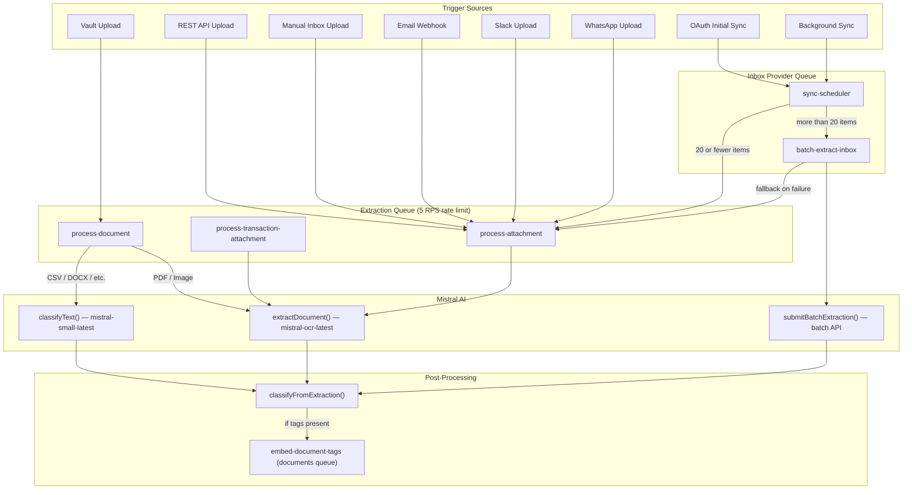

# Document Processing Pipeline

## Overview

The Document Processing Pipeline handles all file processing across Midday — vault uploads, inbox attachments, transaction receipts, and API uploads. All AI processing is consolidated through **Mistral AI**, with a rate-limited extraction queue to stay within API limits.

### Key Features

- **Unified AI Model**: All OCR and classification uses Mistral (no multi-model routing)
- **Rate-Limited Queue**: Dedicated extraction queue at 5 jobs/sec (under Mistral's 6 RPS limit)
- **Priority Scheduling**: Manual actions process first (priority 1), real-time second (5), background last (10)
- **Batch Processing**: Bulk operations use the Mistral Batch API for cost efficiency
- **Graceful Degradation**: Documents always reach a usable state, even if AI classification fails
- **Fault Isolation**: Classification failures never fail the parent extraction job

## Architecture

## Queue Architecture

### Extraction Queue

Rate-limited queue for all synchronous Mistral API calls.

| Setting | Value | Rationale |
|---------|-------|-----------|
| Rate limit | 5 jobs/sec | Stays under Mistral's 6 RPS API limit |
| Concurrency | 5 workers | Matches rate limit for throughput |
| Lock duration | 660s | Supports up to 10-minute processing jobs |
| Retries | 3 attempts | Exponential backoff (1s base delay) |

**Jobs:** `process-attachment`, `process-transaction-attachment`, `process-document`

**Source:** `apps/worker/src/queues/extraction.config.ts`

### Documents Queue

Unbounded queue for embedding operations (no rate limit needed).

| Setting | Value |
|---------|-------|
| Concurrency | 10 workers |
| Lock duration | 120s |
| Retries | 3 attempts |

**Jobs:** `embed-document-tags`

**Source:** `apps/worker/src/queues/documents.config.ts`

### Inbox Provider Queue

Manages sync scheduling and batch extraction.

**Jobs:** `sync-scheduler`, `batch-extract-inbox`

## Priority Strategy

BullMQ priority: lower number = higher priority.

| Priority | Usage | Examples |
|----------|-------|---------|
| 1 | Manual user actions | Vault upload, reprocess document, transaction attachment, API upload |
| 5 | Real-time automated | Email webhooks, inbox manual uploads, OAuth initial sync |
| 10 | Background | Scheduled sync, batch fallback items |

## Processors

### process-attachment

Handles real-time inbox document processing from email, Slack, WhatsApp, manual inbox, and API uploads.

**Flow:** HEIC conversion → signed URL → `DocumentClient.getInvoiceOrReceipt()` → update inbox → group related items → `classifyFromExtraction()` → embed inbox → trigger matching

**Source:** `apps/worker/src/processors/inbox/process-attachment.ts`

### process-transaction-attachment

Handles receipt/invoice attachments on transactions, extracting tax information.

**Flow:** HEIC conversion (with size check) → signed URL (with timeout) → `DocumentClient.getInvoiceOrReceipt()` (with timeout) → update transaction tax data → `classifyFromExtraction()`

**Source:** `apps/worker/src/processors/transactions/process-attachment.ts`

### process-document

Handles vault uploads and document reprocessing. Routes by file type.

**PDF/Image flow:** HEIC conversion → file type detection → signed URL → `extractDocument()` → `classifyFromExtraction()`

**Other file flow:** `loadDocument()` (langchain text extraction) → `classifyText()` (Mistral completion) → `classifyFromExtraction()`

**Source:** `apps/worker/src/processors/documents/process-document.ts`

### batch-extract-inbox

Processes large batches of inbox items using the Mistral Batch API for cost efficiency.

**Flow:** Chunk items (50 per batch) → submit batch jobs → poll for completion → download results → batch update inbox → `classifyFromExtraction()` per item → trigger batch embedding

Falls back to `process-attachment` for individual items that fail batch extraction.

**Source:** `apps/worker/src/processors/inbox/batch-extract-inbox.ts`

## AI Models

| Model | API | Usage |
|-------|-----|-------|
| `mistral-ocr-latest` | OCR API (`/v1/ocr`) | PDF and image extraction — structured data + raw text |
| `mistral-small-latest` | Completion API (`/v1/chat/completions`) | Text classification for non-PDF/image files |
| `mistral-ocr-latest` | Batch API (`/v1/batch`) | Bulk async extraction for large sync operations |
| `gemini-embedding-001` | Embeddings | Tag similarity search and inbox matching |
| `gemini-3-flash-preview` | Search Grounding | Vendor website/domain resolution |

## Schemas

### invoiceSchema

Used by Mistral OCR for structured extraction from PDFs and images. Extracts financial data (amounts, dates, vendor info, line items, tax details) plus classification metadata (title, summary, tags, language).

**Source:** `packages/documents/src/schema.ts`

### classificationSchema

Used by Mistral Completion API for text-based classification of non-PDF/image documents. Extracts title, summary, tags, date, and language from plain text content.

**Source:** `packages/documents/src/schema.ts`

## Shared Utilities

### classifyFromExtraction()

Central function that writes classification data to the documents table and triggers tag embedding. Used by all extraction processors after AI processing completes.

**Key behaviors:**
- Generates fallback titles from document type, vendor name, invoice number, or filename
- Truncates content to 10,000 words before storage
- Maps language codes to PostgreSQL text search configurations
- Triggers `embed-document-tags` job when tags are present
- Wrapped entirely in try/catch — classification failures never fail the parent job

**Source:** `apps/worker/src/utils/classify-from-extraction.ts`

### DocumentClient

Thin wrapper around `extractDocument()` that normalizes OCR results into a consistent `GetInvoiceOrReceiptResponse` shape consumed by all inbox processors.

**Source:** `packages/documents/src/client.ts`

## Document Processing Status

| Status | Description | UI Display |
|--------|-------------|------------|
| `pending` | Processing in progress | Skeleton loading state |
| `completed` | Successfully processed | Shows title/summary or filename |
| `failed` | Processing failed | Red indicator + retry button |

### Classification States

| State | processingStatus | title | Visual | User Action |
|-------|-----------------|-------|--------|-------------|
| Processing | `pending` | - | Skeleton | Wait |
| Stale Processing | `pending` (>10 min) | - | Amber + Retry | Click retry |
| Fully Processed | `completed` | Set | Normal | None needed |
| Needs Classification | `completed` | `null` | Amber + Retry | Click retry |
| Failed | `failed` | - | Red + Retry | Click retry |

## Error Handling

### Fault Isolation

Classification is non-critical. The `classifyFromExtraction()` helper wraps all operations in try/catch so a classification failure (DB write, tag embedding) never causes the parent extraction job to fail.

### Non-Retryable Errors

Validation errors (unsupported file type, empty file, file too large) use `NonRetryableError` to fail immediately without wasting retry attempts.

### Retry Strategy

- Extraction queue: 3 retries with exponential backoff
- Unsupported file types: marked as completed (not retried)
- Final failures on `process-document`: document status set to "failed"

### Timeout Protection

All external calls use `withTimeout()` wrapping:
- Signed URL creation: 600s expiration
- Document extraction: `TIMEOUTS.DOCUMENT_PROCESSING`
- HEIC download/upload: timeout-wrapped

### Graceful Degradation

Documents always reach a usable state:

1. AI succeeds → `completed` with full metadata (title, summary, tags)
2. AI fails → `completed` with `title=null` (UI shows filename + amber indicator + retry button)
3. Hard failure → `failed` (red indicator + retry button)

Users can always access their files and retry processing.

## Rate Limiting

The Mistral Completion API has a 6 requests/second limit. The extraction queue is configured at 5 jobs/second to stay safely under this limit while maximizing throughput.

For bulk operations (initial email sync, large imports), the Batch API is used instead. Batch jobs are submitted asynchronously and polled for completion, avoiding rate limit pressure entirely.

## HEIC Image Handling

HEIC/HEIF images require conversion to JPEG before OCR processing:

- Files > 15 MB (`MAX_HEIC_FILE_SIZE`) are rejected with `NonRetryableError`
- Conversion uses Sharp with heic-convert fallback
- Images resized to fit within 2048px for optimal OCR quality
- Memory-intensive: ~50-100MB per 12MP image during conversion

## Key Files

| File | Purpose |
|------|---------|
| `apps/worker/src/processors/inbox/process-attachment.ts` | Real-time inbox attachment processor |
| `apps/worker/src/processors/transactions/process-attachment.ts` | Transaction attachment processor |
| `apps/worker/src/processors/documents/process-document.ts` | Vault upload / reprocess processor |
| `apps/worker/src/processors/inbox/batch-extract-inbox.ts` | Batch extraction processor |
| `apps/worker/src/utils/classify-from-extraction.ts` | Shared classification + DB update logic |
| `apps/worker/src/queues/extraction.config.ts` | Extraction queue config (rate-limited) |
| `apps/worker/src/queues/documents.config.ts` | Documents queue config (embed-document-tags) |
| `packages/documents/src/ocr/extract.ts` | Synchronous Mistral OCR extraction |
| `packages/documents/src/ocr/batch.ts` | Batch Mistral OCR extraction |
| `packages/documents/src/ocr/classify-text.ts` | Mistral Completion text classification |
| `packages/documents/src/client.ts` | DocumentClient wrapper |
| `packages/documents/src/schema.ts` | invoiceSchema + classificationSchema |
| `apps/api/src/rest/routers/inbox.ts` | REST API inbox upload endpoint |
| `apps/api/src/trpc/routers/documents.ts` | tRPC document operations (process, reprocess) |

## Design Decisions

### Why a single AI provider (Mistral)?

Previously the pipeline routed between Gemini (classification), Mistral (OCR), and other models. This caused:
- Complex routing logic and multiple failure modes
- Inconsistent extraction quality across models
- Harder rate limit management across providers

Consolidating to Mistral simplifies the architecture and provides consistent results.

### Why a dedicated extraction queue?

All synchronous Mistral API calls (OCR + Completion) go through one rate-limited queue. This prevents any single trigger source (e.g. a bulk vault upload) from exhausting the rate limit and blocking real-time inbox processing.

### Why fire-and-forget for classification?

Classification (title, summary, tags, embeddings) is an enrichment step, not critical path:
- The document is already stored and accessible
- Classification improves search and organization but isn't required
- Failure should never prevent users from accessing their files

### Why batch vs sync?

| Scenario | API | Reason |
|----------|-----|--------|
| Manual upload, API upload | Sync | User is waiting for feedback |
| Email webhook, Slack, WhatsApp | Sync | Near-real-time processing |
| Initial OAuth sync (20+ items) | Batch | Cost-efficient, no urgency |
| Scheduled background sync (20+ items) | Batch | Cost-efficient, no urgency |
