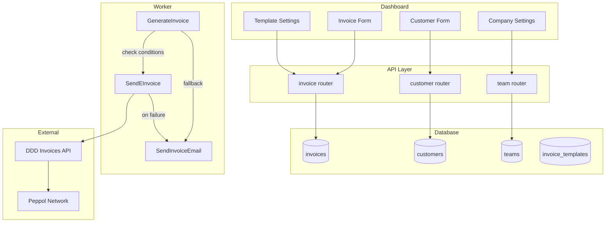
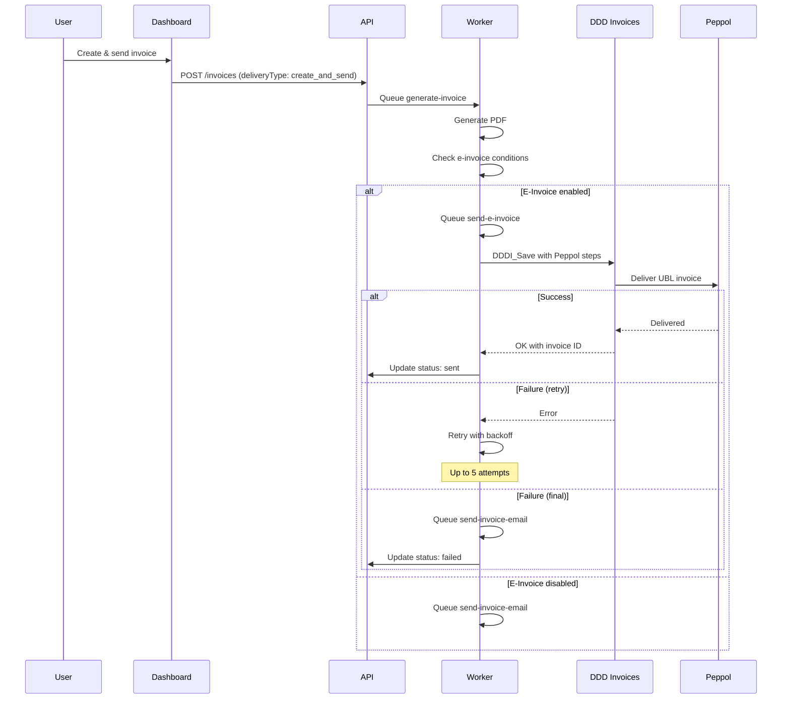
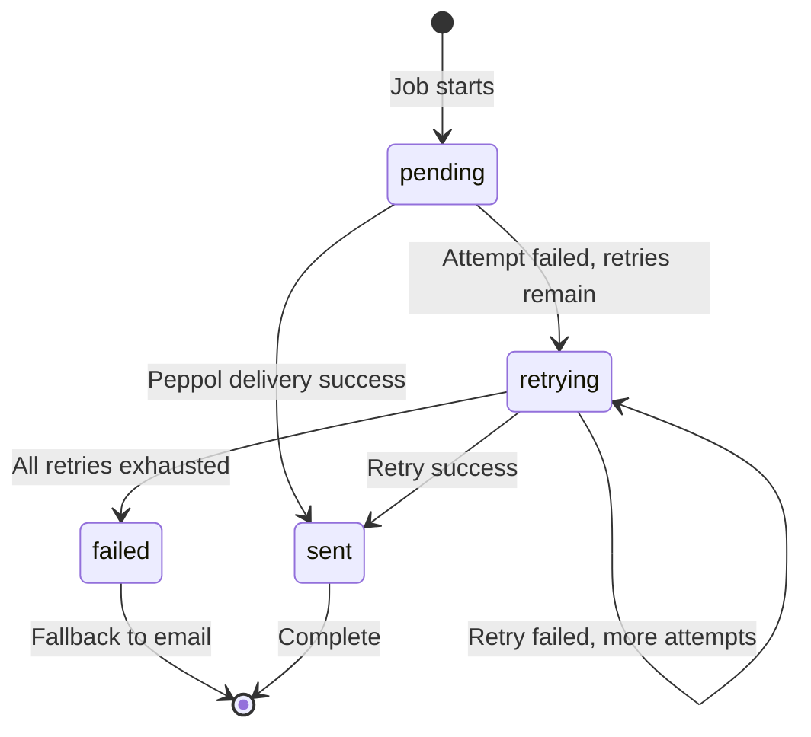

# E-Invoice System (Peppol)

## Overview

The e-invoice system enables sending invoices via the Peppol network for compliant electronic invoicing. It integrates with the DDD Invoices API to handle Peppol UBL conversion and network delivery.

### Key Concepts

- **Peppol Network**: Pan-European Public Procurement Online - a standardized network for B2B/B2G electronic document exchange
- **Peppol ID**: A unique identifier for participants on the network (format: `{scheme}:{identifier}`)
- **DDD Invoices**: Third-party API that handles Peppol UBL conversion and network delivery
- **Fallback**: Automatic email delivery when Peppol fails after retries

## Architecture



## Data Model

### E-Invoice Fields

Fields are distributed across multiple tables:

#### teams table

| Field | Type | Description |
|-------|------|-------------|
| `peppolId` | text | Seller's Peppol participant ID |
| `taxId` | text | VAT number (EU) or EIN (US) |
| `registrationNumber` | text | Company registration number |
| `addressLine1` | text | Company street address |
| `addressLine2` | text | Additional address line |
| `city` | text | City |
| `zip` | text | ZIP/postal code |

#### customers table

| Field | Type | Description |
|-------|------|-------------|
| `peppolId` | text | Buyer's Peppol participant ID |
| `registrationNumber` | text | Customer's registration number |
| `legalForm` | enum | `LegalEntity` or `NaturalPerson` |

#### invoice_templates table

| Field | Type | Description |
|-------|------|-------------|
| `eInvoiceEnabled` | boolean | Enable Peppol delivery for this template |
| `eInvoiceNotifyEmail` | boolean | Send notification email on Peppol delivery |

#### invoices table

| Field | Type | Description |
|-------|------|-------------|
| `eInvoiceId` | text | DDD Invoices document ID |
| `eInvoiceStatus` | enum | `pending`, `retrying`, `sent`, `delivered`, `failed` |
| `eInvoiceSentAt` | timestamp | When successfully sent via Peppol |
| `eInvoiceError` | text | Error message if failed |

## Peppol ID Validation

Peppol IDs follow the format `{scheme}:{identifier}` where scheme is a 4-digit ISO 6523 ICD code.

### Common Schemes

| Scheme | Country/Type | Identifier Format |
|--------|--------------|-------------------|
| 0007 | Sweden (org number) | 10 digits |
| 0088 | GLN (global) | 13 digits |
| 0060 | DUNS | 9 digits |
| 0151 | Australia (ABN) | 11 digits |
| 0192 | Norway (org number) | 9 digits |
| 9930 | Germany (VAT) | DE + 9 digits |

### Validation Rules

The `validatePeppolId()` function in `@midday/e-invoice` validates:

1. Format: Must contain colon separator
2. Scheme: Must be 4 digits
3. Identifier: Must be alphanumeric, non-empty
4. Scheme-specific: Length/format rules per scheme (GLN=13 digits, etc.)

## Invoice Delivery Flow



### E-Invoice Conditions

An invoice is sent via Peppol when ALL conditions are met:

1. `DDD_INVOICES_API_KEY` environment variable is set
2. Invoice template has `eInvoiceEnabled = true`
3. Customer has a valid `peppolId`

## Retry and Fallback

### Retry Configuration

E-invoice jobs use extended retry options (`EINVOICE_JOB_OPTIONS`):

| Setting | Value |
|---------|-------|
| Attempts | 5 |
| Backoff type | Exponential |
| Initial delay | 5 seconds |
| Delays | 5s → 25s → 125s → 625s → 3125s |

### Status Transitions



### Fallback to Email

When e-invoice delivery fails after all retries:

1. Invoice status set to `failed` with error message
2. `send-invoice-email` job is queued
3. Invoice delivered via traditional email with PDF

## DDD Invoices Integration

### API Client

The `@midday/e-invoice` package provides a client for the DDD Invoices API:

```typescript
import { createDDDClient, sendViaPeppol } from "@midday/e-invoice";

const client = createDDDClient({
  connectionKey: process.env.DDD_INVOICES_API_KEY,
});

const result = await sendViaPeppol(client, dddInvoice);
```

### Peppol Workflow Steps

The `PEPPOL_STEPS` constant defines the workflow:

| Step | Code | Description |
|------|------|-------------|
| Confirm | 35 | Lock invoice for processing |
| Generate UBL | 55 | Create Peppol XML format |
| Send to Peppol | 80 | Deliver via network |

### Data Transformation

`transformToDDDInvoice()` converts Midday invoice data to DDD format:

- Maps customer/team fields to Buyer/Seller
- Converts line items with unit codes
- Sets payment terms and document metadata
- Determines domestic vs foreign buyer type

## Environment Variables

| Variable | Required | Description |
|----------|----------|-------------|
| `DDD_INVOICES_API_KEY` | Yes | Platform-level API key for DDD Invoices |
| `DDD_INVOICES_API_URL` | No | API base URL (defaults to production) |

## Key Files Reference

| File | Purpose |
|------|---------|
| [`packages/e-invoice/src/client.ts`](../packages/e-invoice/src/client.ts) | DDD Invoices API client |
| [`packages/e-invoice/src/transform.ts`](../packages/e-invoice/src/transform.ts) | Data transformation and Peppol ID validation |
| [`packages/e-invoice/src/types.ts`](../packages/e-invoice/src/types.ts) | TypeScript types for DDD API and internal data |
| [`apps/worker/src/processors/invoices/send-e-invoice.ts`](../apps/worker/src/processors/invoices/send-e-invoice.ts) | Worker processor for Peppol delivery |
| [`apps/worker/src/processors/invoices/generate-invoice.ts`](../apps/worker/src/processors/invoices/generate-invoice.ts) | Invoice generation with e-invoice routing |
| [`apps/worker/src/config/job-options.ts`](../apps/worker/src/config/job-options.ts) | Job retry configuration |
| [`apps/dashboard/src/components/company-e-invoice.tsx`](../apps/dashboard/src/components/company-e-invoice.tsx) | Company Peppol ID settings UI |
| [`apps/dashboard/src/components/forms/customer-form.tsx`](../apps/dashboard/src/components/forms/customer-form.tsx) | Customer Peppol ID input |
| [`apps/dashboard/src/components/invoice/settings-menu.tsx`](../apps/dashboard/src/components/invoice/settings-menu.tsx) | Template e-invoice toggle |
| [`packages/db/src/schema.ts`](../packages/db/src/schema.ts) | Database schema with e-invoice fields |

## Design Decisions

### Why platform-level API key?

The DDD Invoices API key is stored as an environment variable rather than per-team:

- Simplifies customer onboarding (no external signup required)
- Enables bulk pricing negotiations
- Centralizes API management and monitoring

### Why retry before fallback?

Peppol delivery can fail due to transient issues (network, rate limits). Retrying with exponential backoff:

- Handles temporary outages gracefully
- Reduces unnecessary email fallbacks
- Provides time for recipient system recovery

### Why validate Peppol IDs?

Strict validation prevents:

- API errors from malformed identifiers
- Failed deliveries to invalid endpoints
- Wasted processing on obviously wrong data

Validation happens at input time (customer form) and before sending.
