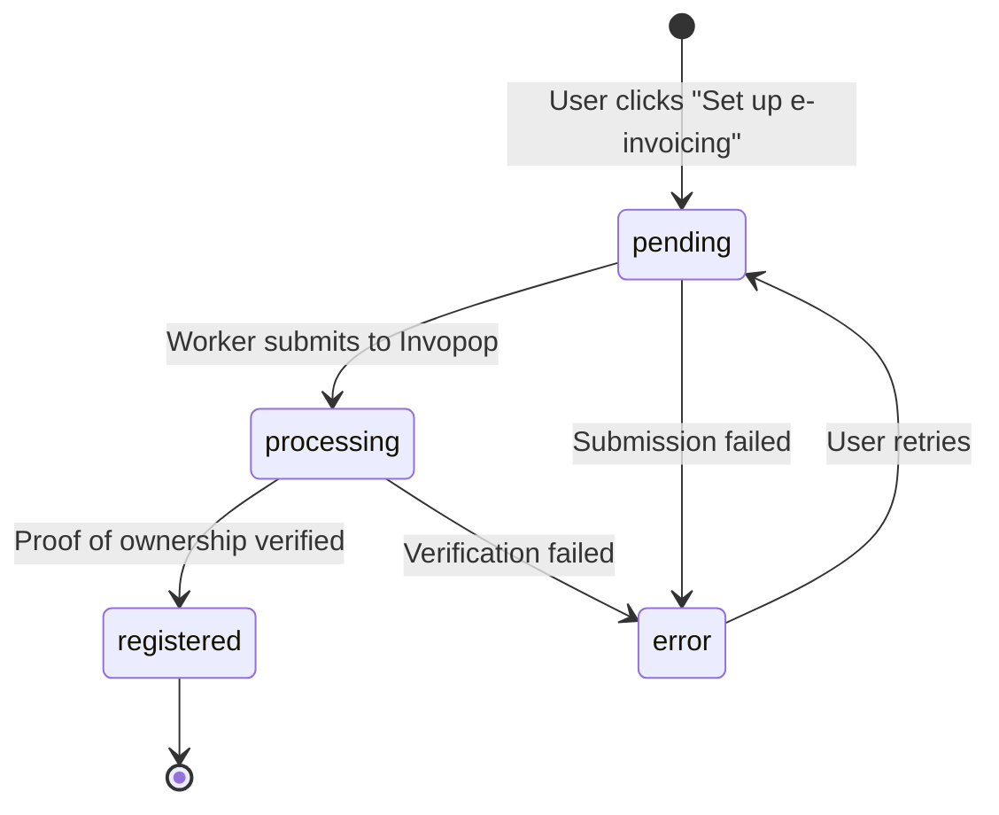
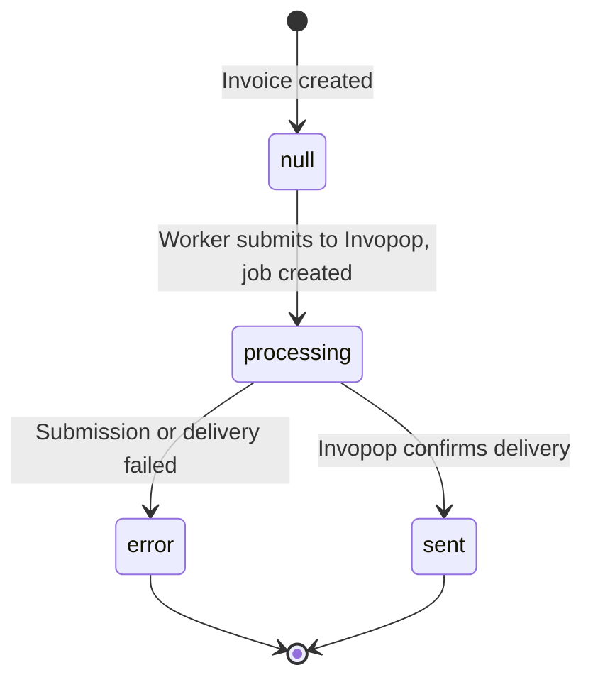

# E-Invoicing

Technical documentation for Midday's e-invoicing feature -- compliant electronic invoice delivery via the Peppol network, powered by Invopop and GOBL.

## Table of Contents

1. [Overview](#overview)
2. [User Flow](#user-flow)
3. [Registration Lifecycle](#registration-lifecycle)
4. [Invoice Submission Lifecycle](#invoice-submission-lifecycle)
5. [Webhook Handling](#webhook-handling)
6. [GOBL Format](#gobl-format)
7. [Key Design Decisions](#key-design-decisions)

---

## Overview

E-invoicing allows Midday users to send legally compliant electronic invoices through the [Peppol](https://peppol.org) network, which is mandatory or widely adopted for B2B invoicing in 30+ countries (Belgium, Norway, Finland, Singapore, Australia, and others).

### How It Works

Instead of building Peppol UBL/CII documents directly, Midday converts invoices into [GOBL](https://gobl.org) (Go Business Language) -- an open-source universal business document format. The GOBL document is submitted to [Invopop](https://invopop.com), which handles:

- Validation and calculation (tax totals, rounding, regime-specific rules)
- Conversion to the required format (UBL 3.0 for Peppol BIS Billing)
- Submission to the Peppol network
- Supplier registration with proof-of-ownership verification

This approach means Midday only integrates with one format (GOBL) and one API (Invopop), regardless of the destination country or format requirements.

### Components Involved

| Component | Location | Role |
|-----------|----------|------|
| `@midday/e-invoice` | `packages/e-invoice/` | GOBL transformation, Invopop client, parsers |
| Invoice tRPC router | `apps/api/src/trpc/routers/invoice.ts` | `eInvoiceReadiness` check |
| Team tRPC router | `apps/api/src/trpc/routers/team.ts` | Registration procedures |
| Webhook handler | `apps/api/src/rest/routers/webhooks/invopop/` | Status updates from Invopop |
| Submit processor | `apps/worker/src/processors/invoices/submit-e-invoice.ts` | Invoice submission job |
| Register processor | `apps/worker/src/processors/invoices/register-supplier.ts` | Supplier registration job |
| Dashboard UI | `apps/dashboard/src/components/e-invoice-registration.tsx` | Registration UI |
| Dashboard UI | `apps/dashboard/src/components/invoice/settings-menu.tsx` | Readiness checklist |

---

## User Flow

### 1. Company Setup

Before e-invoicing can be enabled, the team must provide:

- **Company address** (street, city, postal code) -- Settings > Company > Address
- **Company email** -- Settings > Company > Email
- **VAT number** -- Settings > Company > Tax Identification
- **Country** -- Settings > General > Country

The E-Invoice Registration card on the Company settings page shows a checklist of these requirements with links to each section.

### 2. Peppol Registration

Once all required fields are filled, the user clicks "Set up e-invoicing". This:

1. Creates a registration record in the database (`status: "pending"`)
2. Triggers the `register-supplier` worker job
3. The worker builds a GOBL `org.party` document and submits it to Invopop
4. Invopop runs the Peppol registration workflow

### 3. Proof of Ownership

Invopop's Peppol registration workflow requires proof of ownership (as mandated by Peppol's Internal Regulations). The workflow:

1. Generates a registration URL for the proof-of-ownership form
2. Fires a webhook with `event: "processing"` containing the URL
3. Midday stores the URL and shows it to the user in the dashboard
4. The user (or company representative) completes the verification
5. Invopop validates the submitted documents (up to 72 hours)

### 4. Sending E-Invoices

Once registered, e-invoices are sent automatically when an invoice is emailed:

1. User creates an invoice and clicks "Create & Send"
2. The invoice email is sent (existing flow)
3. After successful email delivery, the `submit-e-invoice` job is triggered
4. The worker validates the invoice, transforms it to GOBL, and submits to Invopop
5. Invopop validates, converts to UBL, and sends via Peppol
6. A webhook updates the invoice's `eInvoiceStatus` to `"sent"` or `"error"`

The e-invoice submission only happens when:
- `INVOPOP_API_KEY` and `INVOPOP_WORKFLOW_ID` are configured
- The team has complete company data (address, VAT, country)
- The team is registered for Peppol (`status: "registered"`)
- The invoice has a customer

---

## Registration Lifecycle



| Status | Description |
|--------|-------------|
| `pending` | Registration record created, waiting for worker to submit |
| `processing` | Submitted to Invopop, awaiting proof of ownership verification |
| `registered` | Peppol participant ID assigned, e-invoicing is active |
| `error` | Registration failed (faults stored for display) |

---

## Invoice Submission Lifecycle



The `eInvoiceStatus` column on the `invoices` table tracks this:

| Status | Description |
|--------|-------------|
| `null` | Not submitted for e-invoicing |
| `"processing"` | Submitted to Invopop, awaiting confirmation |
| `"sent"` | Successfully delivered via Peppol |
| `"error"` | Failed -- faults stored in `eInvoiceFaults` |

---

## Webhook Handling

Invopop sends webhooks to `POST /api/webhooks/invopop` at various stages. Authentication uses a Bearer token (`INVOPOP_WEBHOOK_SECRET`).

### Payload Structure

```json
{
  "id": "webhook-event-id",
  "event": "processing | error | (empty for success)",
  "transform_job_id": "job-uuid",
  "silo_entry_id": "entry-uuid",
  "key": "midday-invoice-{id} | midday-party-{teamId}",
  "faults": [{ "message": "...", "code": "...", "provider": "..." }]
}
```

### Routing

The webhook handler uses the `key` field to determine the callback type:

- `midday-invoice-{id}` -- Invoice submission callback (parsed by `parseInvoiceKey`)
- `midday-party-{teamId}` -- Supplier registration callback (parsed by `parsePartyKey`)

### Party Registration Callbacks

The Peppol registration workflow fires webhooks at multiple stages:

| Event | Handler | What happens |
|-------|---------|-------------|
| `"processing"` | `handlePartyProcessing` | Sets status to `processing`, extracts `registrationUrl` from silo entry meta |
| `"error"` | `handlePartyError` | Sets status to `error`, stores mapped faults |
| (success) | `handlePartyRegistered` | Sets status to `registered`, extracts `peppolId` and `peppolScheme` from silo entry inboxes |

### Invoice Callbacks

| Event | What happens |
|-------|-------------|
| `"error"` or faults present | Sets `eInvoiceStatus` to `"error"`, stores mapped faults |
| (success) | Sets `eInvoiceStatus` to `"sent"`, clears faults |

---

## GOBL Format

The `toGOBL()` function transforms Midday invoice data into a GOBL invoice document. Key fields:

```json
{
  "$schema": "https://gobl.org/draft-0/bill/invoice",
  "$regime": "SE",
  "$addons": ["eu-en16931-v2017"],
  "type": "standard",
  "currency": "SEK",
  "code": "INV-2025-001",
  "issue_date": "2025-03-15",
  "supplier": {
    "name": "Acme Corp",
    "tax_id": { "country": "SE", "code": "SE556123456701" },
    "addresses": [{ "street": "Kungsgatan 1", "locality": "Stockholm", "code": "111 22", "country": "SE" }],
    "emails": [{ "addr": "billing@acme.com" }],
    "inboxes": [{ "key": "peppol", "scheme": "0007", "code": "5567321234" }]
  },
  "customer": {
    "name": "Customer AB",
    "tax_id": { "country": "SE", "code": "SE559876543201" },
    "addresses": [{ "street": "Drottninggatan 10", "locality": "Gothenburg", "code": "411 03", "country": "SE" }],
    "emails": [{ "addr": "accounts@customer.se" }]
  },
  "lines": [{
    "i": 1,
    "quantity": "10",
    "item": { "name": "Consulting", "price": "150" },
    "taxes": [{ "cat": "VAT", "percent": "25%" }]
  }],
  "payment": {
    "terms": {
      "key": "due-date",
      "due_dates": [{ "date": "2025-04-15", "percent": "100%" }]
    }
  }
}
```

### Key Points

- **`$regime`** is set from the supplier's country code. This tells GOBL which tax rules apply.
- **`$addons`** includes `eu-en16931-v2017` whenever the supplier is registered for Peppol. This is required per Invopop docs to enable Peppol BIS 3.0 validations.
- **`inboxes`** with `key: "peppol"` carry the Peppol participant IDs for supplier and customer. The supplier inbox comes from the registration record; the customer inbox comes from the customer's `peppolId` field.
- **Totals are not included** -- Invopop calculates all totals, taxes, and rounding server-side to ensure compliance with regime-specific rules.
- **Dates** are in `YYYY-MM-DD` format as required by GOBL.

---

## Key Design Decisions

### Invopop as the Orchestration Layer

Rather than implementing Peppol UBL generation and network submission directly, Midday delegates this to Invopop. This means:

- Only one document format to maintain (GOBL)
- Invopop handles country-specific validation, calculation, and format conversion
- Automatic compliance with evolving regulations (Belgium 2026 mandate, etc.)
- Peppol access point management is handled by Invopop

### Idempotency Keys

Every silo entry and transform job uses an idempotency key:

- Invoices: `midday-invoice-{invoiceId}`
- Party registrations: `midday-party-{teamId}`

If the same key is submitted twice, Invopop returns a `409 Conflict` instead of creating duplicates. This protects against worker retries and race conditions.

### Silo Entry Folders

Silo entries are organized into folders (`"invoices"` and `"suppliers"`) to keep the Invopop console clean and make it easy to find entries by type.

### Fault Type Widening

The `eInvoiceFaults` and `faults` JSONB columns use `{ message: string; [key: string]: unknown }[]` rather than a strict `{ message: string }[]`. This allows storing extra metadata from Invopop (like `code` and `provider`) without losing information, while still requiring the `message` field that the UI depends on.

### Automatic Submission After Email

E-invoice submission is triggered automatically after successful email delivery (in `SendInvoiceEmailProcessor`), not as a separate user action. This matches the Peppol model where the e-invoice is a compliance requirement alongside the human-readable invoice, not a replacement for it.

### EU EN 16931 Addon

The `eu-en16931-v2017` GOBL addon is always added when the supplier has a Peppol registration, regardless of whether individual Peppol IDs are populated. This follows Invopop's documentation: "ensure you add the `eu-en16931-v2017` addon to enable validations and extensions needed for Peppol."

### Webhook Processing Stages

The Peppol registration workflow fires webhooks at multiple points. Rather than treating all non-error webhooks as "success", the handler checks the `event` field:

- `"processing"` -- mid-workflow callback after the approval form is generated (extracts the registration URL)
- `"error"` -- failure at any stage
- (no event / other) -- final success after full registration

This allows the dashboard to show the proof-of-ownership link during the verification period.
