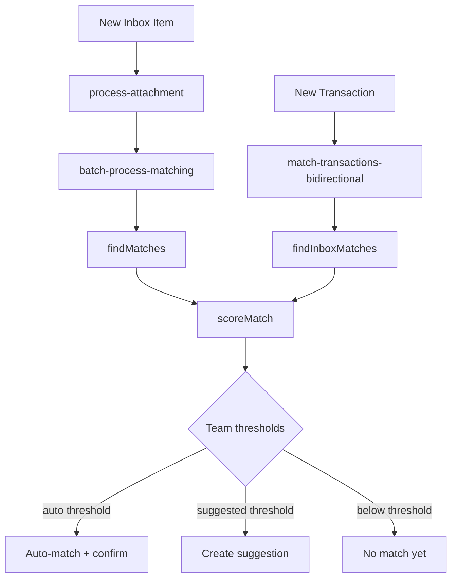

# Inbox Matching Algorithm (V2)

## Overview

The inbox matching system links inbox documents (receipts/invoices) to bank transactions using a deterministic scoring model optimized on real production feedback.

The current algorithm is **embedding-free for inbox matching**. It relies on:

- high-quality financial/date signals,
- robust name similarity,
- team-specific threshold calibration,
- historical alias learning,
- hard-negative memory from declines/unmatches.

This design keeps matching explainable, fast, and stable in production.

## Scope

This document covers:

- core matching in `packages/db/src/queries/transaction-matching.ts`,
- scoring utilities in `packages/db/src/utils/transaction-matching.ts`,
- orchestration from inbox processing jobs.

It does not cover unrelated transaction embedding features used elsewhere.

## High-Level Flow

```mermaid
graph TD
  A[New Inbox Item] --> B[process-attachment]
  B --> C[batch-process-matching]
  C --> D[findMatches]

  E[New Transaction] --> F[match-transactions-bidirectional]
  F --> G[findInboxMatches]

  D --> H[scoreMatch]
  G --> H
  H --> I{Team thresholds}
  I -->|auto threshold| J[Auto-match + confirm]
  I -->|suggested threshold| K[Create suggestion]
  I -->|below threshold| L[No match yet]
```

## Candidate Retrieval

Candidate search is SQL-first and efficient:

- Team-bounded (`team_id`) and status-bounded records.
- Date window filter around document/transaction date.
- Excludes already-attached and duplicate pending suggestion scenarios.
- Uses `pg_trgm` text similarity (`word_similarity`) for name-driven retrieval.
- Uses financial filters:
  - same-currency amount proximity, and/or
  - base-currency/base-amount proximity for cross-currency cases.

`pg_trgm` is used for retrieval speed and relevance, while final ranking is done by the custom scorer.

## Scoring Model

Final confidence is produced by `scoreMatch()` from:

- `nameScore` from normalized token similarity and containment logic,
- `amountScore` with strict same-currency behavior and base-amount cross-currency handling,
- `currencyScore` (same currency strongest; shared base currency next),
- `dateScore` with invoice/expense-aware timing logic.

Confidence receives additional guarded adjustments:

- exact-amount boosts (especially with supporting name/date evidence),
- cross-currency boost only when name+amount+date align,
- zero-name penalty,
- hard-negative penalty from decline memory.

## Learning Layers

### 1) Alias Memory

For a normalized `(inboxName, transactionName)` pair:

- if a team has repeated confirmations, alias score boosts name matching.

This improves recurring merchant variant matching (e.g. legal entity vs card statement name). Alias learning is scoped per-team — one team's data never influences another team's matching.

### 2) Hard Negative Memory

Declines/unmatches are converted into a **decayed penalty**:

- recent negatives weigh more than old negatives,
- unmatched contributes as a weaker negative than explicit decline,
- confirmations offset negatives,
- strong recent confirmations can override stale negatives,
- penalty is capped to avoid over-suppression.

This prevents repeated bad suggestions while remaining recoverable.

### 3) Dismissal Protection

Previously dismissed exact inbox/transaction pairs are not re-suggested.

## Team Calibration and Thresholding

Calibration is computed from recent labeled outcomes and cached briefly in memory.

- Uses team-specific recent history (confirmed/declined/unmatched).
- Computes baseline heuristics (accuracy/confidence gap).
- Runs threshold optimization sweep and blends with heuristics for stability.
- Produces:
  - `calibratedSuggestedThreshold`
  - `calibratedAutoThreshold` (strict, derived above suggested threshold)

This avoids one global threshold for all teams and improves precision/recall balance per team.

## Auto-Match Policy

Auto-match is conservative and requires both:

1) Confidence above calibrated auto threshold  
2) Pattern safety gate from historical pair behavior (not just one-off confidence)

Pattern gate expectations include repeated confirmations and high historical reliability, with low negative evidence.

If not eligible for auto-match but above suggested threshold, a pending suggestion is created instead.

## Status Model

Inbox:

`new -> analyzing -> pending -> suggested_match/done` (or later `no_match`)

Suggestion:

`pending -> confirmed/declined/unmatched/expired`

`unmatched` is treated as negative feedback for future calibration/penalties.

## Observability and Verification

### Read-Only Evaluation CLI

`packages/db/src/scripts/matching-eval-db.ts` provides safe verification against real DB data.

Key properties:

- read-only transaction (`BEGIN TRANSACTION READ ONLY`),
- statement timeout,
- forced rollback,
- no write path.

Main command:

`bun run eval:matching:db`

Useful options:

- `--team-id <uuid>`
- `--from-days-ago <n> --to-days-ago <n>`
- `--fixed-threshold <n>`
- `--show-review-list true --review-limit <n>`

Review list output highlights:

- likely false positives (declined/unmatched but scored high),
- likely false negatives (confirmed but scored low),
- IDs needed for quick in-app spot checks.

## Why This Version

Compared to the legacy embedding-driven matcher, V2 is:

- simpler to reason about,
- cheaper and faster at runtime,
- easier to debug and verify,
- better aligned with observed production feedback.

## Files of Interest

- `packages/db/src/queries/transaction-matching.ts`
- `packages/db/src/queries/inbox-matching.ts`
- `packages/db/src/queries/transactions.ts`
- `packages/db/src/queries/inbox.ts`
- `packages/db/src/utils/transaction-matching.ts`
- `packages/db/src/scripts/matching-eval-db.ts`