# Inbox Matching Algorithm

## Overview

The Inbox Matching System automatically matches incoming receipts, invoices, and other financial documents with corresponding bank transactions using AI embeddings, financial pattern recognition, and adaptive confidence calibration.

## Key Features

- **🤖 AI-Powered Semantic Matching**: Uses 768-dimensional embeddings to understand semantic similarity between transaction descriptions and document content
- **💰 Multi-Tier Financial Matching**: Sophisticated amount, currency, and date matching with accounting-specific logic
- **🎯 Adaptive Confidence Calibration**: Learns from user feedback to improve matching accuracy over time
- **🔄 Bidirectional Processing**: Matches new transactions against existing inbox items AND new inbox items against existing transactions
- **⚡ Auto-matching**: High-confidence matches are automatically processed
- **💡 Smart Suggestions**: Lower-confidence matches are presented as suggestions for user review
- **🌍 Cross-Currency Support**: Handles multi-currency transactions with base currency conversion

## Architecture Overview

### Core Components

1. **Embedding Generation**: Creates semantic vectors for transactions and inbox items using AI
2. **Multi-Tier Matching Algorithm**: Uses tiered queries to find candidates efficiently
3. **Confidence Scoring**: Calculates match confidence using weighted factors
4. **Calibration System**: Adapts thresholds based on user feedback patterns
5. **Job Orchestration**: Manages the processing pipeline through background jobs

### Data Flow

```mermaid
graph TD
    A[New Transaction] --> B[embed-transaction]
    C[New Inbox Item] --> D[process-attachment]
    
    B --> E[match-pending-inbox]
    D --> F[embed-inbox]
    F --> G[process-inbox-matching]
    
    E --> H[Batch process-inbox-matching]
    G --> I[Matching Algorithm]
    H --> I
    
    I --> J{Confidence Score}
    J -->|≥0.95| K[Auto-match]
    J -->|≥0.70| L[Suggestion]
    J -->|<0.70| M[No Match]
    
    K --> N[Update Status: done]
    L --> O[Update Status: suggested_match]
    M --> P[Update Status: pending]
```



## Task Flow Architecture

### 1. New Transaction Processing

**Flow**: `upsert-transactions` → `embed-transaction` → `match-pending-inbox` → `process-inbox-matching`

```typescript
// Entry Point: Bank sync creates new transactions
upsertTransactions({
  transactions: [...],
  teamId,
  bankAccountId
})
  ↓
// Step 1: Create embeddings for new transactions
await embedTransaction.triggerAndWait({
  transactionIds,
  teamId
})
  ↓
// Step 2: Check pending inbox items against new transactions
await tasks.trigger("match-pending-inbox", {
  teamId,
  newTransactionIds: transactionIds
})
  ↓
// Step 3: Batch process matching for relevant inbox items
await tasks.batchTrigger("process-inbox-matching", batchJobs)
```

### 2. New Inbox Item Processing

**Flow**: `process-attachment` → `embed-inbox` → `process-inbox-matching`

```typescript
// Entry Point: Gmail sync, email webhook, or manual upload
processAttachment({
  filePath,
  teamId,
  mimetype,
  size
})
  ↓
// Step 1: Process document (OCR, data extraction)
await updateInboxWithProcessedData(...)
  ↓
// Step 2: Create embeddings for inbox item
await embedInbox.triggerAndWait({
  inboxId,
  teamId
})
  ↓
// Step 3: Find matches against existing transactions
await processInboxMatching.trigger({
  teamId,
  inboxId
})
```

### 3. Job Responsibilities

| Job | Responsibility | Orchestration Level |
|-----|---------------|-------------------|
| `upsert-transactions` | **Orchestrator** - Manages entire transaction pipeline | High |
| `embed-transaction` | Creates transaction embeddings | Low |
| `match-pending-inbox` | **Orchestrator** - Finds relevant inbox items to recheck | Medium |
| `process-attachment` | **Orchestrator** - Manages entire inbox item pipeline | High |
| `embed-inbox` | Creates inbox item embeddings | Low |
| `process-inbox-matching` | Performs matching algorithm and creates suggestions | Low |

## Matching Algorithm

### Multi-Tier Query Strategy

The algorithm uses a sophisticated multi-tier approach to find candidate matches efficiently:

#### Tier 1: Perfect Financial Matches
- **Criteria**: Exact amount + currency match OR base currency match
- **Date Range**: Document-type aware (invoices vs expenses)
- **Embedding Filter**: Weak threshold (< 0.6 distance) to ensure semantic relevance
- **Limit**: Top 5 candidates

#### Tier 2: Base Currency Matches (if needed)
- **Criteria**: Base currency amounts within 15% tolerance
- **Purpose**: Handle cross-currency transactions
- **Limit**: Additional 5 candidates

#### Tier 3: Strong Semantic Matches (if needed)
- **Criteria**: Strong embedding similarity (< 0.35 distance)
- **Purpose**: Find semantically similar transactions even with amount variations
- **Limit**: Additional candidates up to total of 8

#### Tier 4: Conservative Semantic Matches (if needed)
- **Criteria**: Moderate embedding similarity (< 0.45 distance)
- **Date Range**: Extended conservative ranges
- **Purpose**: Catch edge cases and delayed transactions

### Confidence Scoring

The matching confidence is calculated using weighted factors with team-specific calibration:

```typescript
const confidenceScore = 
  (embeddingScore * 0.45) +      // Semantic similarity (45%)
  (amountScore * 0.35) +         // Financial accuracy (35%)
  (currencyScore * 0.15) +       // Currency alignment (15%)
  (dateScore * 0.05)             // Temporal alignment (5%)
```

### Scoring Components

#### 1. Embedding Score (45% weight)
- **Source**: Cosine similarity between transaction and inbox item embeddings
- **Range**: 0.0 to 1.0 (1 - cosine_distance)
- **Purpose**: Captures semantic similarity of merchant names, descriptions, and content
- **Fallback**: 0.5 when embeddings are unavailable

#### 2. Amount Score (35% weight)
- **Priority 1**: Exact currency and amount match (1.1x bonus)
- **Priority 2**: Base currency conversion match (1.05x bonus)
- **Priority 3**: Cross-currency base match (1.03x bonus)
- **Tolerance Levels**:
  - Exact match: 1.0
  - ≤1% difference: 0.98
  - ≤2% difference: 0.95
  - ≤5% difference: 0.85
  - ≤10% difference: 0.6
- **Cross-perspective**: Handles invoice (positive) to payment (negative) scenarios

#### 3. Currency Score (15% weight)
- **Same currency**: 1.0
- **Different currency**: 0.5 (assumes conversion capability exists)
- **Missing currency**: 0.5

#### 4. Date Score (5% weight)
- **Document-type aware**: Different logic for invoices vs expenses
- **Banking delay compensation**: Accounts for 3-day open banking delays

##### Invoice Date Logic
- **Payment after invoice** (normal flow):
  - Net 30 (27-35 days): 0.98
  - Net 60 (58-65 days): 0.96
  - Net 90 (88-95 days): 0.94
  - Net 15 (13-17 days): 0.95
  - Net 7 (6-8 days): 0.93
  - Immediate (0-6 days): 0.99
- **Advance payment** (before invoice): 0.85

##### Expense Date Logic
- **Receipt after transaction** (normal flow):
  - Same/next day: 0.99
  - Within week: 0.95
  - Within month: 0.9
  - Within 2 months: 0.8
- **Receipt before transaction**: 0.85 (accounting for banking delay)

### Enhanced Pattern Recognition

Beyond basic scoring, the algorithm applies additional logic:

#### Financial Pattern Bonuses
- **Perfect Financial Match**: Same currency + exact amount → confidence boost
- **Cross-Currency Excellence**: Different currencies but exact base amounts → confidence boost
- **Strong Combined Match**: High financial accuracy + good semantics → confidence boost

#### Confidence Boosting
- **Financial-first approach**: Prioritizes financial accuracy over semantic similarity
- **Recurring transaction bonus**: Boosts confidence for recognized patterns
- **Cross-perspective penalty**: Reduces confidence for opposite-sign matches (invoice vs payment)

### Thresholds and Match Types

#### Default Thresholds
- **Auto-match**: ≥ 0.95 confidence (very strict, automatically processed)
- **High-confidence suggestion**: ≥ 0.85 confidence
- **Regular suggestion**: ≥ 0.70 confidence
- **No match**: < 0.70 confidence

#### Team-Specific Calibration
Thresholds adapt based on user feedback:

```typescript
type TeamCalibrationData = {
  calibratedAutoThreshold: number;      // Learned auto-match threshold
  calibratedSuggestedThreshold: number; // Learned suggestion threshold
  totalSuggestions: number;             // Total suggestions made
  autoMatchAccuracy: number;            // Auto-match confirmation rate
  suggestedMatchAccuracy: number;       // Suggestion confirmation rate
  lastUpdated: string;                  // Last calibration update
}
```

#### Calibration Logic
- **Minimum samples**: 3 for auto-match, 5 for suggestions
- **Maximum adjustment**: 3% per calibration cycle
- **Conservative approach**: Higher accuracy requirements for aggressive adjustments
- **Feedback integration**: 
  - High confirmation rates → lower thresholds (more matches)
  - Low confirmation rates → higher thresholds (fewer false positives)

## Status Flow

### Inbox Item Status Progression
```
new → analyzing → pending → suggested_match/done
                     ↓
                 no_match (after 90 days)
```

### Transaction Match Suggestions Status
```
pending → confirmed/declined/expired
```

### Status Definitions
- **new**: Just created, not yet processed
- **analyzing**: Currently being processed (OCR, data extraction)
- **pending**: Processed but no matches found yet
- **suggested_match**: Match suggestion available for user review
- **done**: Successfully matched with a transaction
- **no_match**: No suitable matches found (set by scheduler after 90 days)
- **deleted**: Soft deleted by user

## Entry Points

### 1. Bank Transaction Sync
- **Trigger**: Bank connection sync (Plaid, GoCardless, Teller)
- **Entry Job**: `upsert-transactions`
- **Flow**: Transaction → Embedding → Match against inbox

### 2. Gmail Account Sync
- **Trigger**: Gmail API sync for attachments
- **Entry Job**: `sync-inbox-account` → `process-attachment`
- **Flow**: Attachment → Process → Embed → Match against transactions

### 3. Email Webhook
- **Trigger**: Email forwarded to team inbox
- **Entry Job**: `webhook/inbox/route.ts` → `process-attachment`
- **Flow**: Email attachment → Process → Embed → Match

### 4. Manual Upload
- **Trigger**: User uploads document via dashboard
- **Entry Job**: `process-attachment`
- **Flow**: Upload → Process → Embed → Match

### 5. Slack Integration
- **Trigger**: File shared in Slack channel
- **Entry Job**: `inbox-slack-upload`
- **Flow**: Slack file → Process → Embed → Match

## Performance Characteristics

### Efficiency Features

- **Multi-tier Query Strategy**: Prioritizes high-probability matches first
- **Smart Candidate Limiting**: Limits each tier to prevent performance issues
- **Embedding Reuse**: Embeddings cached and reused across matches
- **Batch Processing**: Multiple inbox items processed simultaneously
- **Calibrated Thresholds**: Reduces false positives over time

### Scalability Considerations

- **Concurrent Jobs**: Multiple matching jobs can run in parallel
- **Vector Similarity**: Efficient PostgreSQL vector operations using cosine distance
- **Query Optimization**: Complex queries split to avoid PostgreSQL limitations
- **Reasonable Limits**: 100 item batches prevent job overload
- **Database Indexing**: Optimized for embedding similarity searches

## Monitoring & Observability

### Key Metrics

- **Auto-match Accuracy**: Percentage of auto-matches confirmed by users
- **Suggestion Accuracy**: Percentage of suggestions confirmed by users  
- **Processing Time**: Time from inbox item creation to match completion
- **Calibration Effectiveness**: Improvement in accuracy over time
- **Tier Performance**: Success rates by query tier

### Logging

Each job provides structured logging with detailed match information:

```typescript
logger.info("Match completed", {
  inboxId,
  transactionId,
  confidence: 0.89,
  matchType: "suggested_match",
  teamId,
  scores: {
    embedding: 0.85,
    amount: 0.95,
    currency: 1.0,
    date: 0.90
  },
  tier: "perfect_financial",
  calibration: {
    autoThreshold: 0.95,
    suggestedThreshold: 0.70
  }
})
```

## Configuration

### Embedding Thresholds
```typescript
const EMBEDDING_THRESHOLDS = {
  PERFECT_MATCH: 0.15,  // Very similar embeddings
  STRONG_MATCH: 0.35,   // Strong semantic similarity  
  GOOD_MATCH: 0.45,     // Moderate similarity
  WEAK_MATCH: 0.6,      // Weak but possible match
}
```

### Calibration Limits
```typescript
const CALIBRATION_LIMITS = {
  MAX_ADJUSTMENT: 0.03,        // Max 3% threshold adjustment per cycle
  MIN_SAMPLES_AUTO: 3,         // Minimum samples for auto-match calibration
  MIN_SAMPLES_SUGGESTED: 5,    // Minimum samples for suggestion calibration
  MIN_SAMPLES_CONSERVATIVE: 8, // Higher threshold for aggressive adjustments
}
```

### Date Ranges by Document Type

#### Invoice Matching
- **Perfect range**: 0-33 days after invoice date
- **Conservative range**: 33-48 days after invoice date
- **Accounts for**: Payment terms (Net 7, 15, 30, 60, 90) + banking delays

#### Expense Matching  
- **Perfect range**: 7 days before to 30 days after transaction date
- **Conservative range**: 30-45 days after transaction date
- **Accounts for**: Receipt delays + banking processing time

## Error Handling

### Graceful Degradation
- **Missing embeddings**: Falls back to financial matching only
- **Currency conversion failures**: Uses raw amounts with penalties
- **Date parsing errors**: Uses neutral date scores
- **Database timeouts**: Retries with simpler queries

### Retry Logic
- **Embedding failures**: Retry up to 3 times with exponential backoff
- **Query timeouts**: Fall back to simpler tier-by-tier approach
- **Calibration errors**: Use default thresholds as fallback

## Future Enhancements

### Planned Improvements
- **Machine Learning**: Train custom models on user feedback patterns
- **Enhanced Cross-Currency**: Better exchange rate integration
- **Recurring Pattern Detection**: Improved recognition of subscription patterns
- **Performance Optimization**: Further query optimization for large datasets
- **Multi-language Support**: Enhanced embedding models for international documents