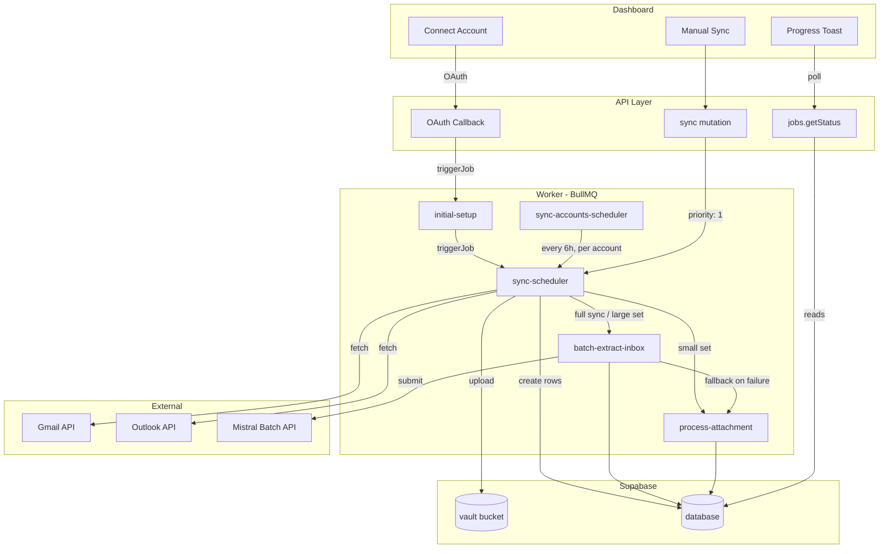
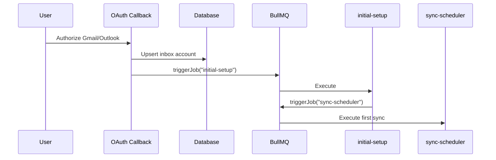
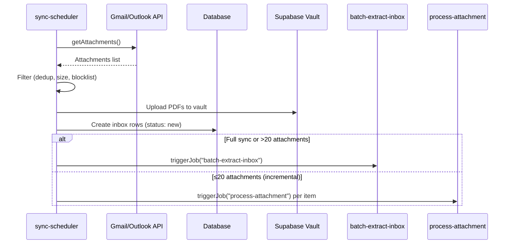
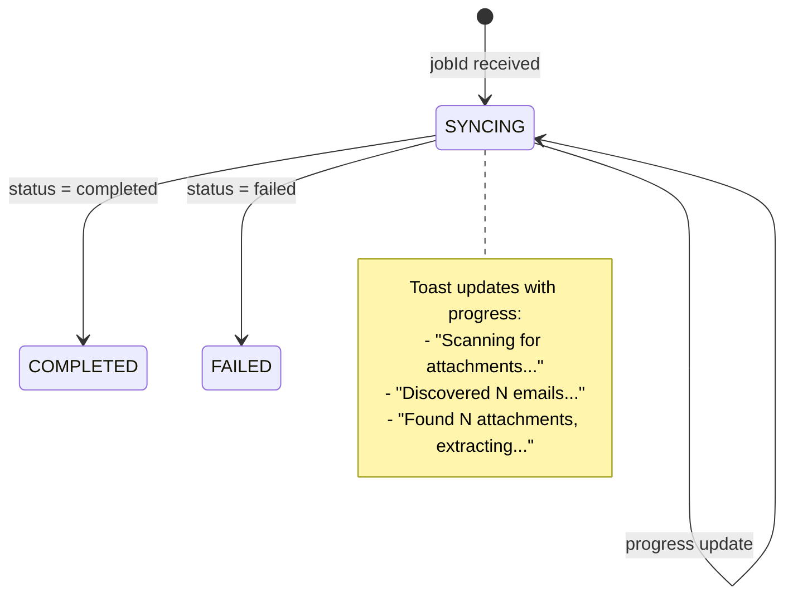

# Inbox Sync Pipeline

## Overview

The Inbox Sync Pipeline connects Gmail and Outlook accounts to automatically discover, download, and process PDF attachments and receipts from email. It handles OAuth authentication, periodic background syncing, batch document extraction via the Mistral API, and real-time progress feedback to the dashboard.

## Key Features

- **Multi-Provider Support**: Gmail and Outlook via OAuth2 with automatic token refresh
- **Centralized Scheduling**: Single static scheduler dispatches syncs for all eligible accounts every 6 hours
- **Priority-Based Queuing**: Manual syncs jump ahead of background work via BullMQ priority ordering
- **Batch Extraction**: Full syncs and large attachment sets route to the Mistral Batch API for cost-efficient processing
- **Live Progress**: Dashboard polls job progress (discovered → uploaded → extracting → complete) via tRPC
- **Blocklist Filtering**: Domain and email-based blocklists prevent unwanted attachments from processing
- **Graceful Fallback**: If batch extraction times out or fails, items fall back to real-time per-item processing

## Architecture

## Data Flow

### 1. Account Connection

**Flow**: User → OAuth → `initial-setup` → `sync-scheduler`

### 2. Periodic Background Sync

**Flow**: Static scheduler → `sync-accounts-scheduler` → `sync-scheduler` (per account)

The `sync-accounts-scheduler` runs every 6 hours as a BullMQ job scheduler. It queries all eligible accounts (connected + on a paid or trial plan) and dispatches individual `sync-scheduler` jobs spread evenly across the 6-hour window using delayed jobs. Background syncs use priority 10, ensuring manual syncs (priority 1) are picked up first.

### 3. Manual Sync

**Flow**: Dashboard → `sync` tRPC mutation → `sync-scheduler` (priority 1)

The dashboard triggers a sync via `trpc.inboxAccounts.sync`, which enqueues a `sync-scheduler` job with `priority: 1`. The returned job ID is passed to `useSyncStatus`, which polls `trpc.jobs.getStatus` every 2 seconds for live progress updates.

### 4. Sync Execution

**Flow**: `sync-scheduler` → filter → upload → route to batch or real-time extraction

### 5. Batch Extraction

**Flow**: `batch-extract-inbox` → Mistral Batch API → poll → update DB

The batch processor downloads PDFs from Supabase, base64-encodes them, and submits them to the Mistral Batch API. It polls with escalating intervals (5s → 10s → 20s → 30s) until the batch completes or the 30-minute timeout is reached. On timeout, it cancels the batch and falls back to per-item `process-attachment` jobs.

## Job Architecture

### Job Hierarchy

| Job | Queue | Purpose | Trigger |
|-----|-------|---------|---------|
| `initial-setup` | inbox-provider | Triggers first sync after OAuth | OAuth callback |
| `sync-accounts-scheduler` | inbox-provider | Dispatches syncs for all eligible accounts | Static cron (every 6h) |
| `sync-scheduler` | inbox-provider | Syncs a single inbox account | Scheduler or manual |
| `batch-extract-inbox` | inbox-provider | Batch document extraction via Mistral | sync-scheduler |
| `process-attachment` | inbox | Per-item document extraction | sync-scheduler or fallback |

### Queue Configuration

| Queue | Concurrency | Lock Duration | Stalled Interval | Rate Limiter |
|-------|-------------|---------------|-------------------|--------------|
| `inbox-provider` | 5 | 30 min | 35 min | None (priority-aware) |
| `inbox` | 100 | 11 min | 12 min | 200/sec |

The `inbox-provider` queue has no rate limiter by design. BullMQ limiters are priority-blind, so a global limiter would let background scheduler traffic block manual syncs even with higher priority. Concurrency alone caps external API pressure while priority ordering ensures manual syncs are serviced first.

### Priority Scheme

| Source | Priority | Behavior |
|--------|----------|----------|
| Manual sync (user-initiated) | 1 | Picked up as soon as a slot opens |
| Background scheduler | 10 | Processed after all higher-priority jobs |

## Sync Filtering

Each sync run filters attachments through several layers:

| Filter | Description |
|--------|-------------|
| **Deduplication** | Skips attachments whose `referenceId` already exists in the inbox table |
| **Size limit** | Rejects attachments over 10 MB |
| **Domain blocklist** | Skips attachments from blocked sender domains |
| **Email blocklist** | Skips attachments from blocked sender addresses |

Filtering statistics are logged per sync for monitoring.

## Full Sync vs Incremental Sync

| | Full Sync | Incremental Sync |
|--|-----------|------------------|
| **When** | Manual sync or first sync (`lastAccessed` is null) | Background scheduler syncs |
| **Date range** | From fiscal year start or 3 months ago (whichever is earlier) | Since `lastAccessed` |
| **Extraction path** | Always batch (Mistral Batch API) | Real-time if ≤20 attachments, batch if >20 |

## Dashboard Progress Feedback

The `useSyncStatus` hook polls `trpc.jobs.getStatus` every 2 seconds and maps BullMQ job progress to UI states:

Progress metadata reported by `sync-scheduler` via `job.updateProgress()`:

| Field | Description |
|-------|-------------|
| `discoveredCount` | Total attachments found from provider |
| `uploadedCount` | Attachments uploaded to vault |
| `status` | `discovering` → `extracting` → `complete` |

## Error Handling

### Provider Auth Errors

| Error Type | Action |
|------------|--------|
| Requires reauth (revoked token, expired refresh) | Mark account as `disconnected`, stop sync |
| Transient auth error (rate limit, temporary failure) | Let BullMQ retry (up to 2 attempts) |

### Batch Extraction Errors

| Scenario | Action |
|----------|--------|
| Batch times out (>30 min) | Cancel batch, fall back to `process-attachment` per item |
| Batch completes with partial failures | Process successful results, queue `process-attachment` for failed items |
| Batch fails entirely | Fall back to `process-attachment` for all items |

### Notification Failures

Notification job failures (e.g., `inbox_new`) are caught and logged but do not fail the sync.

## Key Files Reference

| File | Purpose |
|------|---------|
| [`apps/api/src/trpc/routers/inbox-accounts.ts`](../apps/api/src/trpc/routers/inbox-accounts.ts) | tRPC router for connect, delete, sync |
| [`apps/api/src/rest/routers/apps/gmail/oauth-callback.ts`](../apps/api/src/rest/routers/apps/gmail/oauth-callback.ts) | Gmail OAuth callback, triggers initial setup |
| [`apps/api/src/rest/routers/apps/outlook/oauth-callback.ts`](../apps/api/src/rest/routers/apps/outlook/oauth-callback.ts) | Outlook OAuth callback, triggers initial setup |
| [`apps/dashboard/src/hooks/use-sync-status.ts`](../apps/dashboard/src/hooks/use-sync-status.ts) | Polls job status for live progress |
| [`apps/dashboard/src/components/inbox/inbox-connected-accounts.tsx`](../apps/dashboard/src/components/inbox/inbox-connected-accounts.tsx) | Account list with sync button and progress toast |
| [`apps/worker/src/processors/inbox/initial-setup.ts`](../apps/worker/src/processors/inbox/initial-setup.ts) | Triggers first sync after account creation |
| [`apps/worker/src/processors/inbox/sync-accounts-scheduler.ts`](../apps/worker/src/processors/inbox/sync-accounts-scheduler.ts) | Centralized scheduler, dispatches per-account syncs |
| [`apps/worker/src/processors/inbox/sync-scheduler.ts`](../apps/worker/src/processors/inbox/sync-scheduler.ts) | Core sync logic: fetch, filter, upload, route |
| [`apps/worker/src/processors/inbox/batch-extract-inbox.ts`](../apps/worker/src/processors/inbox/batch-extract-inbox.ts) | Batch extraction via Mistral Batch API |
| [`apps/worker/src/processors/inbox/process-attachment.ts`](../apps/worker/src/processors/inbox/process-attachment.ts) | Per-item extraction (real-time path) |
| [`apps/worker/src/queues/inbox.config.ts`](../apps/worker/src/queues/inbox.config.ts) | Queue and worker configuration |
| [`apps/worker/src/schedulers/inbox.config.ts`](../apps/worker/src/schedulers/inbox.config.ts) | Static scheduler definitions (6h cron) |
| [`packages/db/src/queries/inbox-accounts.ts`](../packages/db/src/queries/inbox-accounts.ts) | DB queries: CRUD, eligibility check |
| [`packages/inbox/src/connector.ts`](../packages/inbox/src/connector.ts) | Provider abstraction (Gmail/Outlook) |

## Design Decisions

### Why a centralized scheduler instead of per-account schedulers?

Per-account BullMQ job schedulers (or Trigger.dev schedules) required registering and cleaning up individual repeatable jobs for each account. This created operational overhead: orphaned schedulers on account deletion, Redis clutter, and complex setup logic.

The centralized `sync-accounts-scheduler` runs a single cron job that queries all eligible accounts and dispatches individual sync jobs with staggered delays. This is simpler to operate, naturally handles account creation/deletion (the DB query is the source of truth), and spreads load evenly.

### Why no rate limiter on the inbox-provider queue?

BullMQ rate limiters are priority-blind -- they throttle jobs in FIFO order regardless of priority. A global limiter would let a burst of background scheduler jobs consume the rate budget, blocking a manual sync (priority 1) until the limiter window resets. With concurrency-only limiting (5 slots), manual syncs are picked up as soon as any slot opens.

### Why batch extraction for full syncs?

Full syncs can discover hundreds of attachments. Processing each one in real-time would saturate the AI extraction API and take a long time. The Mistral Batch API processes items in bulk at lower cost and higher throughput. The 30-minute timeout with automatic fallback ensures no items are left unprocessed.

### Why create inbox rows before extraction?

The `sync-scheduler` creates inbox DB rows (status: `new`) during the upload phase, before routing to extraction. This ensures:
- Attachments are visible in the UI immediately (even before extraction completes)
- The batch extractor receives stable `inboxItemId` references
- If extraction fails, the inbox row exists for retry
