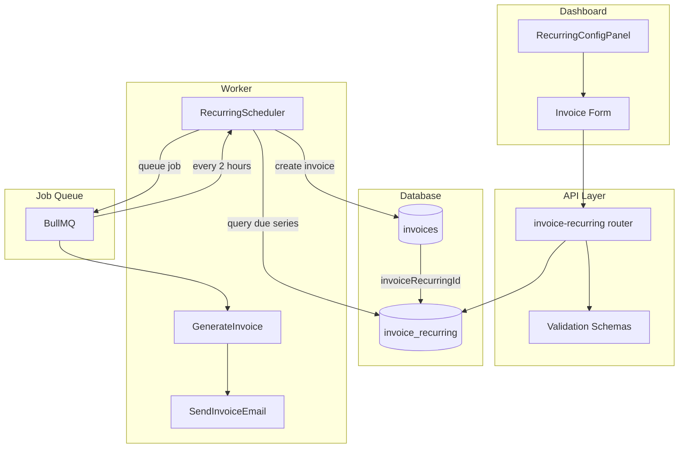
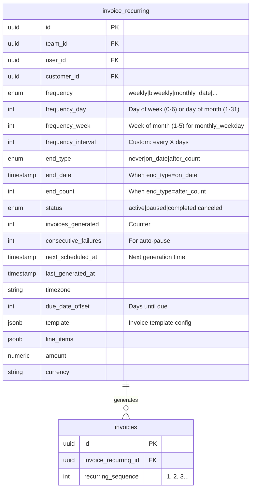
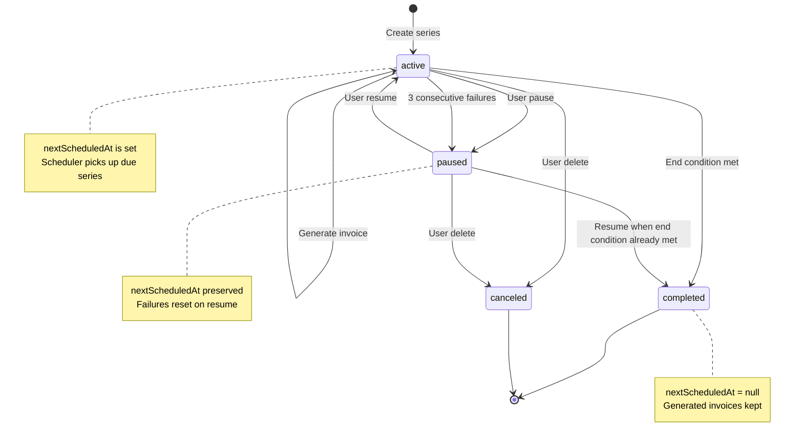
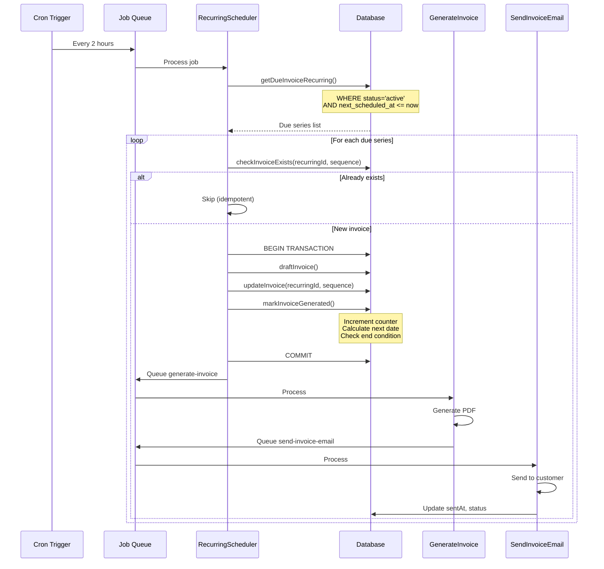
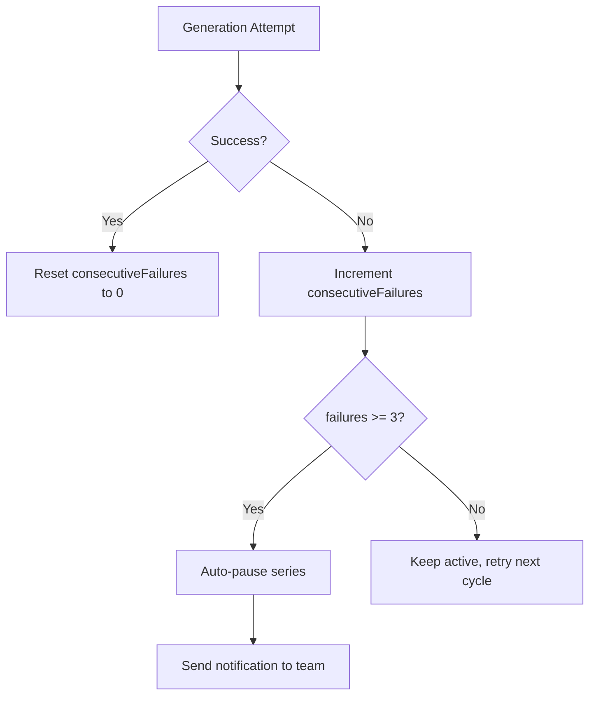
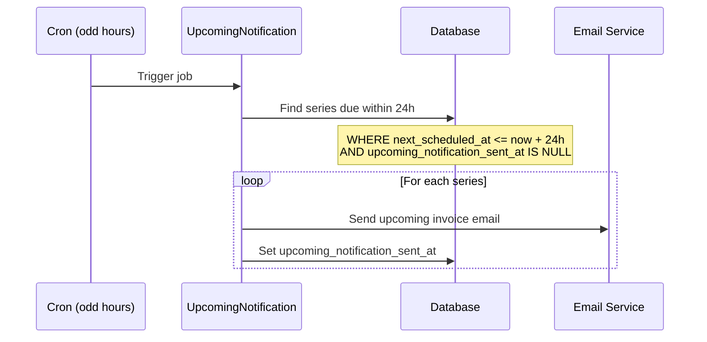

# Invoice Recurring System

## Overview

The recurring invoice system automates the generation and delivery of invoices on a scheduled basis. Unlike one-time invoices (created manually) or scheduled invoices (sent once at a future date), recurring invoices represent an ongoing series that generates new invoices automatically based on a defined frequency until an end condition is met.

### Key Concepts

- **Recurring Series**: A configuration that defines how and when invoices should be generated
- **Generated Invoices**: Individual invoices created from the series, each linked back via `invoiceRecurringId`
- **Sequence Number**: Each generated invoice has a unique sequence number within its series for idempotency

## Architecture



## Data Model

### invoice_recurring Table

The `invoice_recurring` table stores the configuration and state for each recurring series:



### Frequency Options

| Frequency | Description | Fields Used |
|-----------|-------------|-------------|
| `weekly` | Same day each week | `frequencyDay` (0=Sun, 6=Sat) |
| `biweekly` | Every 2 weeks | `frequencyDay` |
| `monthly_date` | Same date each month | `frequencyDay` (1-31) |
| `monthly_weekday` | Nth weekday of month | `frequencyDay` + `frequencyWeek` |
| `monthly_last_day` | Last day of month | - |
| `quarterly` | Every 3 months | `frequencyDay` |
| `semi_annual` | Every 6 months | `frequencyDay` |
| `annual` | Once per year | `frequencyDay` |
| `custom` | Every X days | `frequencyInterval` |

### End Conditions

| End Type | Description | Fields Used |
|----------|-------------|-------------|
| `never` | Runs indefinitely | - |
| `on_date` | Stops after date | `endDate` |
| `after_count` | Stops after N invoices | `endCount` |

## State Machine



### State Transitions

| From | To | Trigger | Notes |
|------|-----|---------|-------|
| - | `active` | Series created | Initial state, `nextScheduledAt` calculated |
| `active` | `active` | Invoice generated | Counter incremented, next date calculated |
| `active` | `paused` | User action | Manual pause via API |
| `active` | `paused` | 3 failures | Auto-pause after consecutive failures |
| `active` | `completed` | End condition | Date passed or count reached |
| `active` | `canceled` | User delete | Soft delete, invoices preserved |
| `paused` | `active` | User resume | Next date recalculated from now |
| `paused` | `completed` | Resume attempt | If end condition met while paused |
| `paused` | `canceled` | User delete | Soft delete |

## Generation Flow



### Idempotency Guarantees

The system prevents duplicate invoice generation through multiple mechanisms:

1. **Scheduler Level**: BullMQ's `upsertJobScheduler` ensures only one scheduler job runs
2. **Invoice Level**: `checkInvoiceExists(recurringId, sequence)` check before creation
3. **Transaction**: Invoice creation and counter update are atomic

### Failure Handling



### Kill Switch

The scheduler respects an environment variable for emergency disable:

```
DISABLE_RECURRING_INVOICES=true
```

When set, the scheduler returns immediately without processing any series.

### Batch Limits

To prevent overwhelming the system when many invoices are due at once, processing is batched:

| Processor | Batch Size | Description |
|-----------|------------|-------------|
| Recurring invoice generation | 50 | Max invoices generated per scheduler run |
| Upcoming notifications | 100 | Max notifications sent per scheduler run |

**Design rationale:**
- Prevents memory pressure from processing thousands of series at once
- Distributes load over time (scheduler runs every 2 hours)
- Older due invoices are processed first (ordered by `nextScheduledAt`)
- Jobs return `hasMore: true` when additional items remain for the next run

## Notifications

### Upcoming Invoice Notification

A separate scheduler runs every 2 hours (offset from the main scheduler) to send 24-hour advance notifications:



The `upcoming_notification_sent_at` field prevents duplicate notifications and is reset when a new invoice is generated.

### Activity Notifications

The system creates in-app activity notifications for:

| Event | Activity Type | Priority |
|-------|---------------|----------|
| Series created | `recurring_series_started` | 3 |
| Series completed | `recurring_series_completed` | 3 |
| Series auto-paused | `recurring_series_paused` | 4 (higher) |
| Upcoming invoice | `recurring_invoice_upcoming` | 3 |

## API Endpoints

The `invoice-recurring` tRPC router exposes these procedures:

| Procedure | Type | Description |
|-----------|------|-------------|
| `create` | Mutation | Create new recurring series |
| `update` | Mutation | Update series configuration |
| `delete` | Mutation | Cancel series (soft delete) |
| `getById` | Query | Get series details |
| `getList` | Query | List series with pagination |
| `pause` | Mutation | Pause an active series |
| `resume` | Mutation | Resume a paused series |
| `getUpcoming` | Query | Preview upcoming invoices |

### Creating a Recurring Series

When creating a recurring series from a draft invoice:

1. Validate customer has email (required for auto-send)
2. Create `invoice_recurring` record
3. Link the draft invoice as sequence #1
4. Calculate `nextScheduledAt` from the invoice's issue date
5. Send notification to team

## Key Files Reference

| File | Purpose |
|------|---------|
| [`apps/dashboard/src/components/invoice/recurring-config.tsx`](../apps/dashboard/src/components/invoice/recurring-config.tsx) | UI panel for configuring frequency, end conditions, and preview |
| [`apps/dashboard/src/components/invoice/submit-button.tsx`](../apps/dashboard/src/components/invoice/submit-button.tsx) | Invoice form submission with recurring option |
| [`apps/dashboard/src/components/sheets/edit-recurring-sheet.tsx`](../apps/dashboard/src/components/sheets/edit-recurring-sheet.tsx) | Sheet for editing existing recurring series |
| [`apps/api/src/trpc/routers/invoice-recurring.ts`](../apps/api/src/trpc/routers/invoice-recurring.ts) | tRPC router with all API endpoints |
| [`apps/api/src/schemas/invoice-recurring.ts`](../apps/api/src/schemas/invoice-recurring.ts) | Zod validation schemas |
| [`apps/worker/src/processors/invoices/generate-recurring.ts`](../apps/worker/src/processors/invoices/generate-recurring.ts) | Scheduled job that generates invoices |
| [`apps/worker/src/processors/invoices/upcoming-notification.ts`](../apps/worker/src/processors/invoices/upcoming-notification.ts) | 24-hour advance notification scheduler |
| [`packages/db/src/queries/invoice-recurring.ts`](../packages/db/src/queries/invoice-recurring.ts) | Database queries (CRUD, state transitions) |
| [`packages/db/src/utils/invoice-recurring.ts`](../packages/db/src/utils/invoice-recurring.ts) | Date calculation utilities |
| [`packages/invoice/src/utils/recurring.ts`](../packages/invoice/src/utils/recurring.ts) | Shared utilities (labels, preview calculations, date handling) |

## Date Handling and Timezone Considerations

### Storage Format

All date-only fields (issue date, due date, end date) are stored as **UTC midnight timestamps** in `TIMESTAMPTZ` columns. For example, "January 15, 2024" is stored as `2024-01-15T00:00:00.000Z`.

This approach provides a canonical, timezone-agnostic representation while working with the existing database schema.

### The Timezone Problem

When a user in a timezone behind UTC (e.g., EST = UTC-5) has a date stored as UTC midnight:

```
Stored: 2024-01-15T00:00:00.000Z (January 15 at midnight UTC)
```

If we naively convert this to local time:
- In EST (UTC-5): This becomes `2024-01-14T19:00:00` (January 14!)
- The calendar would show the wrong date

### Solution: TZDate for Display

We use `TZDate` from `@date-fns/tz` to interpret stored UTC dates correctly:

```typescript
import { TZDate } from "@date-fns/tz";

// Display: Interpret the stored UTC date for calendar display
const selectedDate = new TZDate(dueDate, "UTC");
// "2024-01-15T00:00:00.000Z" → Shows January 15 in calendar ✓
```

### Solution: localDateToUTCMidnight for Storage

When a user selects a date in a calendar picker, the browser returns a `Date` object at local midnight. We convert this to UTC midnight using the **local** date components:

```typescript
import { localDateToUTCMidnight } from "@midday/invoice/recurring";

// Storage: Convert local date selection to UTC midnight
const handleSelect = (date: Date) => {
  setValue("dueDate", localDateToUTCMidnight(date));
};
```

**How it works:**

```typescript
export function localDateToUTCMidnight(date: Date): string {
  return new Date(
    Date.UTC(date.getFullYear(), date.getMonth(), date.getDate()),
  ).toISOString();
}
```

This extracts the **local** year/month/day and creates UTC midnight for that date.

### Why Not Use getStartOfDayUTC?

The codebase has two similar-looking functions with different purposes:

| Function | Purpose | Uses |
|----------|---------|------|
| `getStartOfDayUTC(date)` | Normalize UTC date to UTC midnight | `date.getUTCFullYear()`, `date.getUTCMonth()`, `date.getUTCDate()` |
| `localDateToUTCMidnight(date)` | Convert local selection to UTC midnight | `date.getFullYear()`, `date.getMonth()`, `date.getDate()` |

**Example showing the difference:**

```
User in UTC+14 selects January 15
Calendar returns: new Date(2024, 0, 15) → 2024-01-14T10:00:00.000Z (UTC)

getStartOfDayUTC():       2024-01-14T00:00:00.000Z ✗ (wrong date!)
localDateToUTCMidnight(): 2024-01-15T00:00:00.000Z ✓ (correct!)
```

### Timezone Handling in Invoice Generation

When the scheduler generates invoices, dates are calculated in the **user's configured timezone**:

1. The `timezone` field on `invoice_recurring` stores the user's IANA timezone (e.g., `America/New_York`)
2. Date calculations (next invoice date, due date) respect this timezone
3. Generated invoice dates are stored as UTC midnight

### Date Comparison (Due Date Status)

The `getDueDateStatus()` function in `apps/dashboard/src/utils/format.ts` compares due dates to the current date:

```typescript
// Parse due date as UTC (it's stored as UTC midnight)
const due = new TZDate(dueDate, "UTC");

// Get current date in UTC for consistent comparison
const now = new Date();
const nowUTC = new TZDate(now.toISOString(), "UTC");

// Compare at the day level in UTC
const diffDays = differenceInDays(startOfDay(due), startOfDay(nowUTC));
```

### Recurring Config Date Calculations

When determining recurring patterns from the issue date, we use UTC methods:

```typescript
// Use UTC methods since issue date is stored as UTC midnight
const dayOfWeek = issueDate.getUTCDay();
const dayOfMonth = issueDate.getUTCDate();
```

### Files Implementing Date Handling

| File | Purpose |
|------|---------|
| [`packages/invoice/src/utils/recurring.ts`](../packages/invoice/src/utils/recurring.ts) | `localDateToUTCMidnight()`, `getStartOfDayUTC()` utilities |
| [`apps/dashboard/src/components/invoice/due-date.tsx`](../apps/dashboard/src/components/invoice/due-date.tsx) | Due date picker with correct display/storage |
| [`apps/dashboard/src/components/invoice/issue-date.tsx`](../apps/dashboard/src/components/invoice/issue-date.tsx) | Issue date picker with correct display/storage |
| [`apps/dashboard/src/components/invoice/recurring-config.tsx`](../apps/dashboard/src/components/invoice/recurring-config.tsx) | End date picker for recurring series + UTC day calculations |
| [`apps/dashboard/src/components/invoice/submit-button.tsx`](../apps/dashboard/src/components/invoice/submit-button.tsx) | Schedule date handling with `localDateToUTCMidnight()` |
| [`apps/dashboard/src/components/sheets/edit-recurring-sheet.tsx`](../apps/dashboard/src/components/sheets/edit-recurring-sheet.tsx) | Edit recurring end date with `TZDate` display |
| [`apps/dashboard/src/components/invoice-details.tsx`](../apps/dashboard/src/components/invoice-details.tsx) | Invoice details display with `TZDate` |
| [`apps/dashboard/src/components/invoice-success.tsx`](../apps/dashboard/src/components/invoice-success.tsx) | Invoice success display with `TZDate` |
| [`apps/dashboard/src/components/tables/invoices/columns.tsx`](../apps/dashboard/src/components/tables/invoices/columns.tsx) | Invoice table columns with `formatDateUTC()` helper |
| [`apps/dashboard/src/components/customer-details.tsx`](../apps/dashboard/src/components/customer-details.tsx) | Customer invoice list with `TZDate` |
| [`apps/dashboard/src/components/select-attachment.tsx`](../apps/dashboard/src/components/select-attachment.tsx) | Invoice attachment display with `TZDate` |
| [`apps/dashboard/src/utils/format.ts`](../apps/dashboard/src/utils/format.ts) | `getDueDateStatus()` with UTC comparison |
| [`apps/worker/src/processors/invoices/generate-recurring.ts`](../apps/worker/src/processors/invoices/generate-recurring.ts) | Server-side generation using `getStartOfDayUTC()` |

## Design Decisions

### Why soft delete?

Recurring series are "canceled" rather than hard-deleted to preserve the relationship with generated invoices. This maintains audit history and allows querying which series an invoice came from.

### Why auto-pause after 3 failures?

Consecutive failures typically indicate a systemic issue (customer email invalid, template broken, etc.). Auto-pausing prevents:
- Accumulating failed jobs in the queue
- Spamming error notifications
- Wasting processing resources

The team is notified so they can fix the issue and resume manually.

### Why calculate next date from now on resume?

When a paused series resumes, the next invoice generates based on the current date, not the missed schedule. This prevents a flood of "catch-up" invoices and maintains predictable billing cycles going forward.

### Why require customer email?

Recurring invoices auto-send via email. Without a valid email destination, the invoice would generate but fail to deliver. Validating upfront provides immediate user feedback rather than silent failures.

