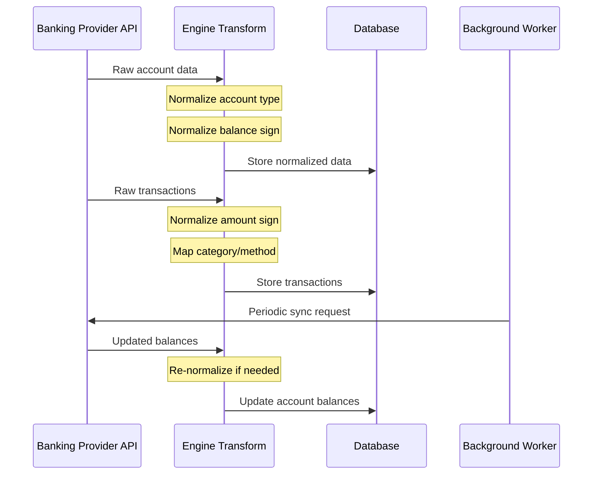
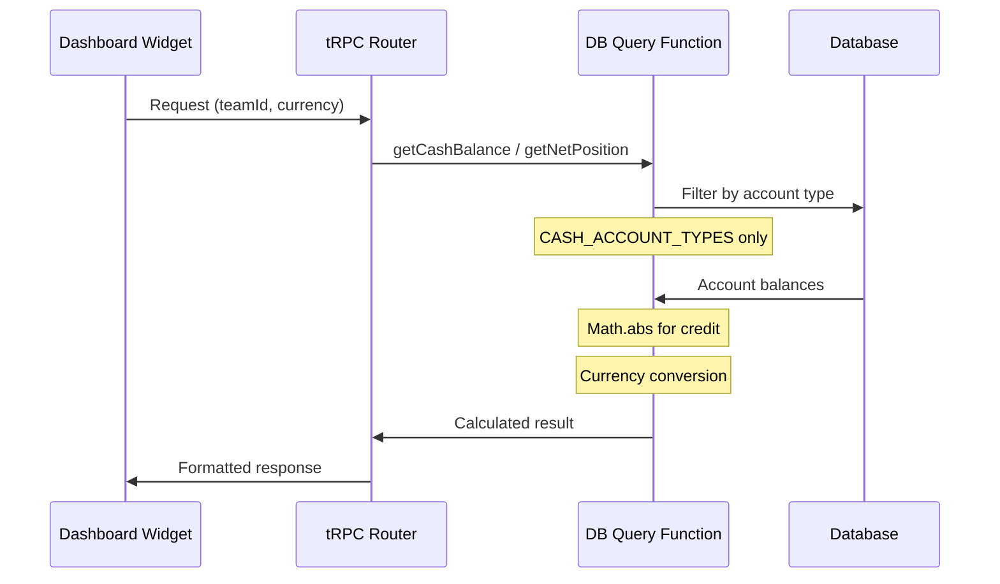

# Financial Calculations

## Data Flow

### Provider Sync Flow

When a bank account is connected, data flows through the following pipeline:



### Query Flow (Dashboard)

When displaying financial metrics:



---

## Account Types

| Type | Description | Examples |
|------|-------------|----------|
| `depository` | Liquid cash accounts | Checking, Savings |
| `other_asset` | Other liquid assets | Treasury, Money Market |
| `credit` | Credit card debt | Credit cards |
| `loan` | Loan accounts | Business loans, Lines of credit |
| `other_liability` | Other liabilities | - |

---

## Runway

```
Runway (months) = Cash Balance / Average Monthly Burn Rate
```

**Cash Balance includes:**
- `depository` ✅
- `other_asset` ✅
- `credit` ❌
- `loan` ❌

**Rationale:** Runway shows how long you can operate with available cash. Debt is not cash.

---

## Burn Rate

Sum of expenses (negative transactions) per month.

**Excluded from burn rate:**
- `internal: true` transactions
- `status: 'excluded'` transactions
- Categories with `excluded: true`:
  - `internal-transfer`
  - `credit-card-payment`

**Why `credit-card-payment` is excluded:**

When a credit card is synced, both card transactions AND payments from checking are synced:

```
CC purchase: $5k (expense on CC account)
CC payment:  $5k (expense on checking)
```

Actual spending is $5k, not $10k. Excluding payments prevents double-counting.

---

## Net Position

```
Net Position = Cash - Credit Card Debt
```

**Cash includes:**
- `depository` ✅
- `other_asset` ✅

**Debt includes:**
- `credit` ✅
- `loan` ❌ (shown separately in Balance Sheet)

**Design decision:** Net Position provides a simple "cash vs credit card" view. Loans are handled separately in Balance Sheet for a complete picture.

**Provider balance conventions:**

| Provider | Raw API Response | Stored In Database |
|----------|------------------|-------------------|
| Plaid | Positive (`1000` = $1000 owed) | Positive |
| GoCardless | Negative (`-1500` = $1500 owed) | **Normalized to positive** |
| EnableBanking | Positive (ISO 20022 `current`) | Positive (normalized as safety) |
| Teller | Positive | Positive (normalized as safety) |

**Normalization Strategy:**

1. **Ingestion-time normalization (all providers):** All provider transforms normalize negative credit balances to positive at sync time.
2. **Query-time safety net:** `Math.abs()` ensures any legacy data with inconsistent signs is handled correctly.

This dual approach ensures data consistency while maintaining backwards compatibility.

---

## Balance Sheet

Full financial picture including all account types:

**Assets:**
- Cash (depository + other_asset accounts)
- Accounts Receivable (unpaid invoices)

**Liabilities:**
- Credit Card Debt (credit accounts) - uses `Math.abs()`
- Loan Account Debt (loan accounts) - uses `Math.abs()`
- Short-term Loans (loan-proceeds < 12 months)
- Long-term Loans (loan-proceeds > 12 months)

---

## Account Type Usage by Report

| Report | depository | other_asset | credit | loan |
|--------|------------|-------------|--------|------|
| Runway (cash) | ✅ | ✅ | ❌ | ❌ |
| Cash Balance | ✅ | ✅ | ❌ | ❌ |
| Net Position (cash) | ✅ | ✅ | - | - |
| Net Position (debt) | - | - | ✅ | ❌ |
| Balance Sheet | ✅ | ✅ | ✅ | ✅ |
| Burn Rate | Via transactions | Via transactions | Via transactions | Via transactions |
| Cash Flow | Via transactions | Via transactions | Via transactions | Via transactions |

---

## Provider Account Type Mapping

Each banking provider returns account types differently. The engine normalizes them:

| Provider | Source Type | Maps To |
|----------|-------------|---------|
| **Plaid** | `depository` | `depository` |
| | `credit` | `credit` |
| | `loan` | `loan` |
| | `investment`, `brokerage`, other | `other_asset` |
| **GoCardless** (ISO 20022) | `CACC`, `SVGS`, `TRAN`, `CASH` | `depository` |
| | `CARD` | `credit` |
| | `LOAN` | `loan` |
| **Enable Banking** (ISO 20022) | `CACC`, `SVGS`, `CASH` | `depository` |
| | `CARD` | `credit` |
| | `LOAN` | `loan` |
| **Teller** | `depository` | `depository` |
| | `credit` | `credit` |

Mapping logic: `apps/engine/src/utils/account.ts`

---

## Shared Constants

Account type constants ensure consistent classification across the codebase:

```typescript
// packages/banking/src/utils/account.ts
import { CASH_ACCOUNT_TYPES, DEBT_ACCOUNT_TYPES } from "@midday/banking/account";

export const CASH_ACCOUNT_TYPES = ["depository", "other_asset"] as const;
export const DEBT_ACCOUNT_TYPES = ["credit", "loan"] as const;
```

Use these constants instead of hardcoding account type strings.

---

## Key Files

| File | Functions / Exports |
|------|-----------|
| `apps/engine/src/utils/account.ts` | `getType()`, `CASH_ACCOUNT_TYPES`, `DEBT_ACCOUNT_TYPES` |
| `apps/engine/src/providers/gocardless/transform.ts` | `transformAccountBalance()` - normalizes negative credit balances |
| `apps/engine/src/providers/enablebanking/transform.ts` | `transformBalance()` - normalizes credit balances (safety) |
| `apps/engine/src/providers/teller/transform.ts` | `transformAccountBalance()` - normalizes credit balances (safety) |
| `apps/engine/src/providers/plaid/transform.ts` | `transformAccountBalance()` - uses `current` for credit (Plaid returns positive) |
| `packages/db/src/queries/reports.ts` | `getRunway()`, `getBurnRate()`, `getBalanceSheet()`, `getCashFlow()` |
| `packages/db/src/queries/bank-accounts.ts` | `getNetPosition()`, `getCashBalance()` |
| `packages/categories/src/categories.ts` | Category definitions with `excluded` flag |

---

## Troubleshooting

### Runway Shows 0 or Incorrect Value

**Symptoms:** Runway widget displays 0 months or a value that doesn't match expectations.

**Possible Causes:**

1. **No burn rate data**
   - Check that transactions exist in the selected date range
   - Verify transactions are categorized (uncategorized expenses still count)

2. **All accounts disabled**
   - Check that at least one cash account (`depository` or `other_asset`) is enabled
   - Verify accounts are synced and have balance data

3. **Currency mismatch**
   - Ensure `baseBalance` is populated for foreign currency accounts
   - Check team's base currency is set correctly

**Debug Query:**

```sql
-- Check cash accounts
SELECT name, type, balance, enabled 
FROM bank_accounts 
WHERE team_id = 'YOUR_TEAM_ID' 
  AND type IN ('depository', 'other_asset');
```

---

### Credit Card Balance Shows as Positive (Expected Negative)

**This is correct behavior.** Credit card balances are stored as positive values representing amount owed.

**How it works:**
- Plaid returns positive values natively
- GoCardless returns negative values, normalized to positive at ingestion
- `Math.abs()` is used as a safety net in queries

**If you see unexpected values:**
1. Check the raw `balance` column in `bank_accounts` table
2. Verify the `type` is `credit` (not `depository`)
3. For legacy data, `Math.abs()` handles both conventions

---

### Net Position Shows Wrong Cash Amount

**Symptoms:** Net Position cash doesn't match sum of bank accounts.

**Check these:**

1. **Account types** - Only `depository` and `other_asset` count as cash

```sql
SELECT name, type, balance 
FROM bank_accounts 
WHERE team_id = 'YOUR_TEAM_ID' AND enabled = true;
```

2. **Disabled accounts** - Disabled accounts are excluded
   
3. **Treasury/Money Market** - Should be `other_asset` type, not `depository`

4. **Credit accounts incorrectly typed** - Verify credit cards have `type = 'credit'`

---

### Double-Counted Expenses in Burn Rate

**Symptoms:** Burn rate appears ~2x higher than expected.

**Root Cause:** Credit card payments not excluded.

**Verify exclusion is working:**

1. Check `credit-card-payment` category has `excluded: true`:

```sql
SELECT slug, excluded 
FROM transaction_categories 
WHERE slug = 'credit-card-payment';
```

2. Check transactions are categorized correctly:

```sql
SELECT name, category_slug, amount 
FROM transactions 
WHERE category_slug = 'credit-card-payment' 
  AND team_id = 'YOUR_TEAM_ID';
```

3. Verify `internal-transfer` is also excluded for internal movements

---

### Provider Sync Issues

**GoCardless showing negative balances after sync:**
- This was fixed with ingestion-time normalization
- Legacy data is handled by `Math.abs()` in queries
- Re-syncing won't update existing records (upsert ignores duplicates)

**Plaid loan accounts showing as assets:**
- Fixed: `getType()` now correctly maps `loan` to `loan`
- Legacy data may need manual type correction

**To force re-sync balance normalization:**

```sql
-- Update legacy negative credit balances
UPDATE bank_accounts 
SET balance = ABS(balance) 
WHERE type = 'credit' AND balance < 0;
```

---

### Widget Not Updating

1. Check browser console for API errors
2. Verify tRPC endpoint is returning data
3. Check widget polling is enabled (see `WIDGET_POLLING_CONFIG`)
4. Clear browser cache and refresh