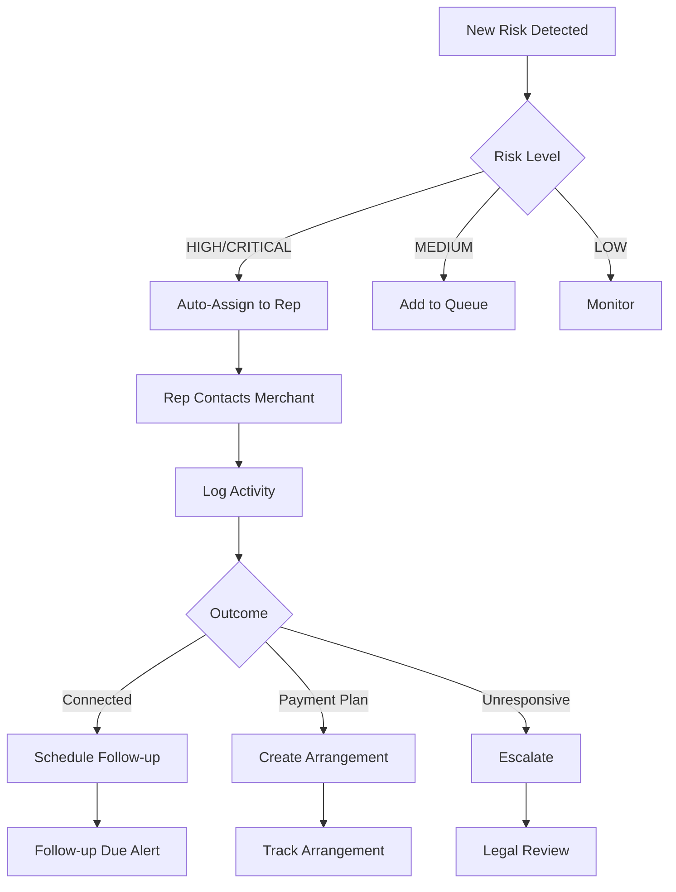
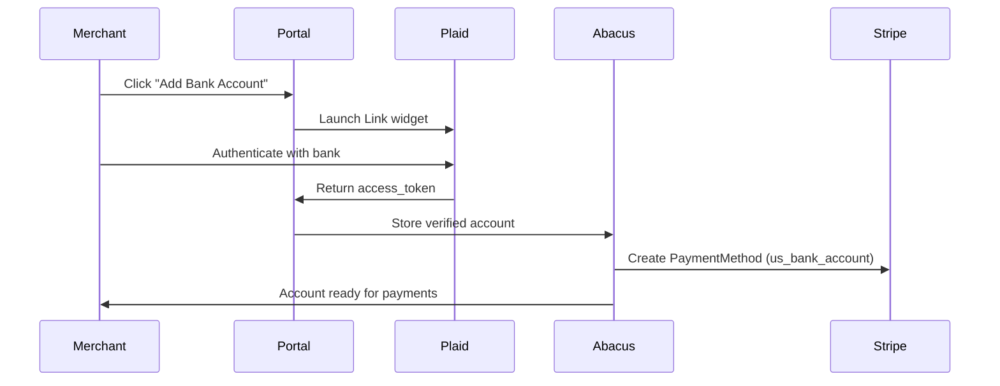
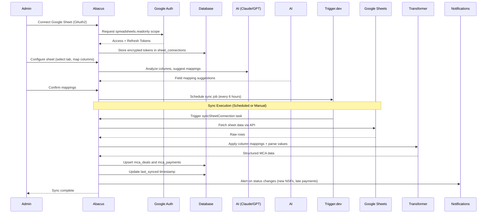

# Abacus Feature Parity Analysis

## Executive Summary

Based on comprehensive analysis of the Honest Funding codebase at `C:\Users\stwee\dev\honest-funding`, this document provides a complete feature inventory for Abacus migration.

| Metric | Count |
|--------|-------|
| **Total Features Identified** | 62 |
| **P0 Features (Launch Blockers)** | 16 |
| **P1 Features (Must-Have)** | 26 |
| **P2 Features (Nice-to-Have)** | 20 |

### Source Codebase Analysis
- **Frontend**: 15+ pages in `src/app/`, 30+ components
- **Backend**: 34 API routes in `src/app/api/`
- **Data Models**: 7 core Prisma models with 100+ fields on Loan model
- **Email Templates**: 5 Supabase email templates
- **Sync Logic**: 2,800+ lines in `src/lib/sync.ts`

---

## AI Provider Strategy

Abacus uses a **multi-provider AI architecture** built on Vercel AI SDK. Different providers are suited for different tasks, with Claude recommended as the default for reasoning tasks.

### Provider Selection Matrix

| Use Case | Recommended Provider | Alternatives | Rationale |
|----------|---------------------|--------------|-----------|
| **Chat/Reasoning** | Claude (sonnet) | OpenAI (gpt-4o) | Superior reasoning, safer outputs |
| **Complex Analysis** | Claude (opus) | OpenAI (gpt-4o) | Best-in-class for deep reasoning |
| **Fast Summaries** | Claude (haiku) | OpenAI (gpt-4o-mini) | Low latency, cost-effective |
| **Embeddings** | Google (gemini-embedding-001) | OpenAI (text-embedding-3) | Cost-effective, high quality |
| **Vision/OCR** | Claude (sonnet) | Google (gemini-flash) | Excellent document analysis |
| **Underwriting** | Claude (opus) | - | Complex financial reasoning |

### Configuration Pattern

Providers are configurable via:
1. **Environment variables** - System-wide provider selection
2. **Per-workflow config** - Different providers for different features

### Environment Variables

```env
# Provider API Keys
OPENAI_API_KEY=
ANTHROPIC_API_KEY=
GOOGLE_GENERATIVE_AI_API_KEY=

# Default Provider Selection
AI_CHAT_PROVIDER=anthropic        # anthropic | openai | google
AI_EMBEDDING_PROVIDER=google      # google | openai
AI_VISION_PROVIDER=anthropic      # anthropic | google | openai
AI_SUMMARY_PROVIDER=anthropic     # Fast summaries (haiku)

# Fallback Configuration
AI_ENABLE_FALLBACK=true           # Fall back to alternate provider on failure
```

### Feature-Specific Provider Mapping

| Feature | Default Provider | Configurable | Notes |
|---------|-----------------|--------------|-------|
| Collections AI Summary | Claude (haiku) | Yes | Fast, good reasoning |
| Risk Analysis | Claude (sonnet) | Yes | Superior reasoning |
| Document Classification | Claude (sonnet) | Yes | Excellent vision |
| Underwriting Analysis | Claude (opus) | Yes | Complex financial reasoning |
| Chat Agents | Claude (sonnet) | Yes | Strong tool use, safer |
| Embeddings | Google (gemini) | Yes | Cost-effective, Claude doesn't offer embeddings |

---

## Feature Inventory

### Category: Portal (Borrower/Merchant Dashboard)

| Feature | Phase | Priority | Description | Key Files |
|---------|-------|----------|-------------|-----------|
| **Borrower Dashboard** | 1 | P0 | Main view showing loans, payments, portfolio overview with summary cards (total loans, payable, paid %, remaining) | `src/app/dashboard/page.tsx` |
| **Loan List View** | 1 | P0 | Table of all loans with status, principal, payable, paid, remaining, days past due, NSF counts | `src/app/dashboard/page.tsx` |
| **Payment Ledger** | 1 | P0 | Payment history with loan selector, date, amount, description, status, running balance | `src/app/dashboard/page.tsx` |
| **Pay Run PDF Download** | 1 | P0 | Generate and download payment history as PDF | `/api/loan/[loan_code]/pay-run-pdf/route.ts` |
| **Multi-Business Support** | 2 | P1 | Single email linked to multiple businesses; unified view across all deals | `src/app/dashboard/page.tsx` |
| **Defaulted Loan Access Block** | 1 | P0 | Redirect to `/access-denied` if user has ANY loan with status=DEFAULT | `src/lib/accessControl.ts` |
| **Access Revoked Page** | 1 | P0 | Graceful access denial page when user removed from sheet or revoked | `src/app/access-revoked/page.tsx` |
| **Balance Burndown Chart** | 2 | P2 | Visual chart showing balance reduction over time | `BalanceBurndownChart.tsx` |
| **User Menu & Profile** | 2 | P2 | User dropdown with account options, logout | `src/components/UserMenu.tsx` |
| **Real-time Data Updates** | 2 | P1 | WebSocket-based live loan/payment updates | `src/lib/supabase-realtime.ts` |

### Category: Admin Dashboard

| Feature | Phase | Priority | Description | Key Files |
|---------|-------|----------|-------------|-----------|
| **Admin Dashboard** | 1 | P0 | Main admin interface with portfolio stats, loan list, charts, tables | `src/app/admin/page.tsx` |
| **Portfolio Summary Stats** | 1 | P0 | Active loan count, total outstanding, total repaid, repaid % | `src/app/admin/page.tsx` |
| **Merchant View (Impersonation)** | 1 | P0 | Admin/Rep views portal as borrower sees it (critical for support) | `src/app/merchant-view/` |
| **Merchant Selector** | 1 | P0 | Searchable dropdown of all merchants with loan counts | `src/app/merchant-view/page.tsx` |
| **Loan Charts** | 2 | P1 | Revenue trends, delinquency trends, pie charts for status distribution | Lazy-loaded components |
| **Almost Finished Table** | 2 | P1 | Loans at 90-100% repaid with customizable thresholds | `src/app/admin/page.tsx` |
| **Upcoming Renewals Table** | 2 | P1 | Loans at 50-90% repaid for renewal targeting | `src/app/admin/page.tsx` |
| **Delinquency Buckets** | 2 | P1 | Visualization: 0-7, 7-30, 30+ days late buckets | `src/app/admin/page.tsx` |
| **Delinquency Table** | 2 | P1 | Loans with NSF issues, sorted by severity | `src/app/admin/page.tsx` |
| **Document Upload System** | 2 | P1 | Upload files to Supabase storage (loan docs, receipts, borrower docs) | `/api/documents/upload/route.ts` |
| **Adoption Dashboard** | 2 | P1 | Track user engagement and system adoption metrics | `src/app/admin/adoption/page.tsx` |
| **Card Threshold Settings** | 2 | P2 | Customize almost-finished and renewal percentage ranges | Admin preferences |
| **Sync Status Display** | 1 | P1 | Last sync timestamp, manual sync trigger | `SyncButton` component |
| **Version Checker** | 2 | P2 | Client-side version verification for hot reload | `src/components/VersionChecker.tsx` |

### Category: Rep Dashboard

| Feature | Phase | Priority | Description | Key Files |
|---------|-------|----------|-------------|-----------|
| **Rep Dashboard** | 2 | P1 | Funder rep view filtered to assigned deals only | `src/app/rep/page.tsx` |
| **Rep Filtering** | 2 | P1 | Deals filtered by `funder_rep` matching `linked_funder_reps` | `src/lib/loanAuthorization.ts` |
| **Rep-Specific Preferences** | 2 | P2 | Different threshold settings per rep (e.g., John gets 80-100%) | `src/app/rep/page.tsx` |

### Category: Letter Generation

| Feature | Phase | Priority | Description | Key Files |
|---------|-------|----------|-------------|-----------|
| **Payoff Letter** | 1 | P1 | Generate payoff amount letters with company letterhead | `src/components/dashboard/LetterGenerator.tsx` |
| **Zero Balance Letter** | 1 | P1 | Confirmation letter when loan is fully paid | `LetterGenerator.ts: generateZeroBalanceLetter()` |
| **Payoff Discount Modal** | 1 | P1 | Calculate discounted payoff amounts | `src/components/dashboard/PayoffDiscountModal.tsx` |
| **Renewal Letter** | 2 | P1 | Automated renewal offer letters | `LetterGenerator.ts: generateRenewalLetter()` |
| **Congratulations Letter** | 2 | P2 | Thank you letter for completed loans | `LetterGenerator.ts: generateCongratulationsLetter()` |

### Category: Collections

| Feature | Phase | Priority | Description | Key Files |
|---------|-------|----------|-------------|-----------|
| **Collections Dashboard** | 2 | P1 | Specialized view for delinquency management | `src/app/collections/page.tsx` |
| **Collections Deal List** | 2 | P1 | Enhanced table with assignee, risk level, UCC status, notes | `src/app/collections/page.tsx` |
| **Follow-Up Modal** | 2 | P1 | Create collection actions with contact info, timestamps | `FollowUpModal` component |
| **Notes Drawer** | 2 | P1 | View/edit collection notes with history timeline | `NotesDrawer` component |
| **Risk Level Assignment** | 2 | P1 | Low/Medium/High risk categorization per deal | `collections_deal_meta` table |
| **Assignee Management** | 2 | P1 | Assign deals to collectors (configurable per org) | `collections_deal_meta` table |
| **Performance Calculation** | 2 | P1 | Daily/weekly payer performance vs expected pace | `src/lib/performanceCalculator.ts` |
| **Renewal/Lump Sum Detection** | 2 | P1 | Detect renewals and lump sum payments for performance calc | `src/lib/renewalDetection.ts` |
| **Last Payment Tracking** | 2 | P1 | Most recent successful payment per deal | `/api/collections/last-payment` |
| **Recent Updates Feed** | 2 | P1 | Recent notes, changelog, deal updates (last N days) | `/api/collections/recent-updates` |
| **Collections Changelog** | 2 | P1 | Audit trail of field changes on deals | `collections_changelog` table |
| **UCC Filed Tracking** | 2 | P2 | Boolean flag for UCC filing status | `collections_deal_meta` table |
| **AI Note Summarization** | 2 | P2 | AI-powered summary of collection notes (configurable provider) | `/api/collections/notes/summarize` |

### Category: Authentication & Access Control

| Feature | Phase | Priority | Description | Key Files |
|---------|-------|----------|-------------|-----------|
| **Borrower Login** | 1 | P0 | Email + password login via Supabase | `src/app/login/page.tsx` |
| **First-Time Login (Magic Link)** | 1 | P0 | Email claim flow with magic link for new borrowers | `src/app/login/first-time/page.tsx` |
| **Password Reset** | 1 | P0 | Self-service password recovery via email | `src/app/forgot-password/page.tsx` |
| **Role-Based Access** | 1 | P0 | ADMIN/REP/BORROWER roles with different permissions | `src/lib/loanAuthorization.ts` |
| **Admin Email Domain Check** | 1 | P1 | `@honestfundingllc.com` = automatic ADMIN | Role detection |
| **Access Revocation** | 1 | P1 | Flag to disable portal access without deleting account | `users.access_revoked` |

### Category: Data Sync

| Feature | Phase | Priority | Description | Key Files |
|---------|-------|----------|-------------|-----------|
| **Google Sheets Full Sync** | 1 | P0 | MainSheet + PMT sheet → Database sync | `src/lib/sync.ts` |
| **Sync Lock Mechanism** | 1 | P0 | PostgreSQL advisory locks prevent concurrent syncs (data corruption prevention) | `src/lib/sync-lock.ts` |
| **Payment-Only Sync** | 1 | P1 | Fast sync of PMT sheet only | `/api/admin/sync-payments` |
| **Sync Logging** | 1 | P1 | Audit trail of all sync operations | `sync_logs` table |
| **Email Extraction** | 1 | P1 | Auto-detect email from any "email" column in sheet | `src/lib/sync.ts` |
| **Removed Borrower Detection** | 1 | P1 | Mark borrowers removed from sheet, revoke access | `src/lib/sync.ts` |
| **Clear Sync Lock API** | 1 | P1 | Manual lock release for stuck syncs | `/api/admin/clear-sync-lock` |
| **Force Release Lock API** | 1 | P1 | Force release stuck advisory locks | `/api/admin/force-release-lock` |
| **Sync Progress Streaming** | 1 | P2 | Real-time progress updates during sync | `/api/admin/sync-sheets` |
| **Discrepancy Detection** | 2 | P2 | Compare ledger vs spreadsheet balances | `/api/admin/discrepancies` |

### Category: Reporting & Calculations

| Feature | Phase | Priority | Description | Key Files |
|---------|-------|----------|-------------|-----------|
| **Ledger Balance Calculation** | 1 | P0 | NSF fees ($35), refund detection, running balance | `src/lib/ledgerCalculation.ts` |
| **NSF Fee Application** | 1 | P0 | $35 fee for failed payments with chargeback indicators | `src/lib/ledgerCalculation.ts` |
| **Paid Percentage** | 1 | P0 | `repaid_amount / payback_amount` | Loan model |
| **Days Past Due Calculation** | 1 | P1 | `today - due_date` for late tracking | Loan model |
| **Alert Service** | 2 | P1 | Triggered during sync for risk events (NSF, late, balance) | `src/lib/alerts.ts` |

### Category: Core API Endpoints

| Endpoint | Phase | Priority | Description |
|----------|-------|----------|-------------|
| `/api/me` | 1 | P0 | Get current authenticated user info with borrower details |
| `/api/my-loans` | 1 | P0 | Get all loans for authenticated borrower (role-aware) |
| `/api/auth/claim` | 1 | P0 | Magic link claim endpoint for first-time login |
| `/api/loan/[loan_code]` | 1 | P0 | Get loan details with payment data |
| `/api/loan/[loan_code]/payments` | 1 | P0 | Get all payments with ledger calculations |
| `/api/loans/search` | 1 | P1 | Search loans by status (admin only) |
| `/api/borrower/[id]` | 1 | P1 | Get borrower details |
| `/api/borrower/[id]/loans` | 1 | P1 | Get all loans for a borrower |
| `/api/lookup-borrower` | 1 | P1 | Lookup borrower by email/identifier |
| `/api/admin/merchants` | 1 | P1 | Admin merchant list API |
| `/api/admin/loans` | 1 | P1 | Admin loan list API (paginated) |
| `/api/health/prisma` | 1 | P2 | Database health check |

### Category: Event Tracking

| Feature | Phase | Priority | Description | Key Files |
|---------|-------|----------|-------------|-----------|
| **Auth Event Tracking** | 1 | P1 | Track login, logout, failed attempts | `/api/events/auth`, `src/lib/authEvents.ts` |
| **Borrower Activity Tracking** | 2 | P1 | Track portal views, actions | `/api/events/borrower-activity`, `src/lib/borrowerActivityEvents.ts` |
| **Dashboard View Tracking** | 2 | P1 | Record when borrowers view their dashboard | `BorrowerDashboardViewedTracker` component |

### Category: Communications

| Feature | Phase | Priority | Description | Key Files |
|---------|-------|----------|-------------|-----------|
| **Confirm Signup Email** | 1 | P0 | Welcome email with verification link | `email-templates/01-confirm-signup.html` |
| **Invite User Email** | 1 | P0 | Admin invite email with acceptance link | `email-templates/02-invite-user.html` |
| **Magic Link Email** | 1 | P0 | Passwordless login link (24hr expiry) | `email-templates/03-magic-link.html` |
| **Password Reset Email** | 1 | P0 | Reset link with security warnings | `email-templates/04-reset-password.html` |
| **Email Change Email** | 2 | P2 | Confirm email change with old/new display | `email-templates/05-change-email.html` |

---

## Data Model Requirements

### Core Tables (from Prisma schema)

| Model | Purpose | Key Fields |
|-------|---------|------------|
| **Borrower** | Merchant/borrower records | `business_name`, `borrower_code`, `primary_email`, `sheet_email`, `phone`, `state`, `removed_from_sheet` |
| **Loan** | MCA funding records (100+ fields) | `loan_code` (unique), `status`, `principal_amount`, `payback_num`, `paid_pct_num`, `bal_w_nsf_fee_num`, `nsf_7d_count`, `total_nsf_count`, `funder_rep`, `isos_value`, `contract_term_days`, `lifecycle_stage` |
| **Payment** | Payment ledger entries | `loan_id`, `payment_date`, `amount`, `balance`, `description`, `status` (posted/failed), `sync_order` |
| **User** | Portal accounts | `email`, `role`, `borrower_id`, `auth_user_id`, `access_revoked`, `linked_funder_reps` |
| **SyncLog** | Sync audit trail | `sync_type`, `triggered_by`, `records_processed`, `errors`, `error_details`, `duration_ms` |
| **collections_notes** | Collection activities | `deal_id`, `note_text`, `channel`, `outcome`, `follow_up_date`, `activity_type` |
| **collections_deal_meta** | Deal state tracking | `deal_id`, `assignee`, `risk`, `ucc_filed`, `ai_summary` |

### Critical Field Mappings (Google Sheet → Database)

| Sheet Column | Database Field | Business Meaning |
|--------------|----------------|------------------|
| Code | `loan_code` | Unique loan identifier |
| Merchant | `sheet_merchant`, `borrower.business_name` | Business name |
| Status | `status` | IN PROGRESS, LATE, PAUSED, DEFAULT, etc. |
| Principal | `principal_amount`, `principal_num` | Amount funded |
| Payback | `payback_num`, `total_payable` | Total due (factor × principal) |
| Balance | `bal_w_nsf_fee_num`, `amount_remaining` | Remaining balance w/ NSF fees |
| Repaid | `repaid_num`, `amount_paid_to_date` | Cumulative payments |
| Paid% | `paid_pct_num` | Percentage complete |
| 7 Day NSF# | `nsf_7d_count` | Recent NSF indicator |
| Total NSF# | `total_nsf_count` | Lifetime NSF count |
| Funder/Rep | `funder_rep`, `sheet_funder_rep` | Assigned representative |
| ISOS | `isos_value`, `sheet_isos` | ISO/broker |
| Contract Term | `contract_term_days`, `sheet_contract_term` | Deal duration |

---

## User Roles & Permissions Matrix

| Role | Dashboard | Admin | Collections | Rep | Merchant View | Edit Collections |
|------|-----------|-------|-------------|-----|---------------|------------------|
| **BORROWER** | Own loans | - | - | - | - | - |
| **ADMIN** | All | Full | Full | - | Full | Full |
| **REP** | - | - | Filtered | Own deals | Filtered | Limited |
| **ISO** | - | - | - | - | Limited columns | - |

### Role Detection Hierarchy
1. Prisma `user.role` field (most authoritative)
2. Supabase `app_metadata.role`
3. Email domain check: `@honestfundingllc.com` → ADMIN
4. Specific emails: `reconcile@honestfundingllc.com` → RECONCILE

---

## Push Notification Opportunities

These features align with Abacus's "Push, Don't Pull" philosophy:

| Feature | Current State | Push Opportunity |
|---------|---------------|------------------|
| **NSF Alert** | Displayed in dashboard | Email/SMS when NSF occurs; badge count |
| **Delinquency Alert** | Admin table | Daily digest of loans entering 7/30/60+ DPD |
| **Almost Finished** | Manual table review | Email when loan reaches 85% paid |
| **Renewal Opportunity** | Manual table review | Automated renewal email at 70% paid |
| **Payment Received** | Ledger update | Merchant notification on payment clearing |
| **Sync Failure** | Manual check | Admin alert on sync errors |
| **Follow-Up Due** | Collections dashboard | Morning digest of today's follow-ups |
| **Risk Level Change** | Manual assessment | Alert when performance drops |
| **Balance Update** | Dashboard display | Weekly summary to merchant |

---

## Multi-Tenant Considerations

Current Honest Funding is **single-tenant**. For Abacus multi-tenant:

| Aspect | Current | Abacus Requirement |
|--------|---------|-------------------|
| **Data Isolation** | None | Add `org_id` to all models with RLS |
| **Column Mappings** | Hardcoded | Per-org configuration table |
| **Branding** | Single brand | Per-org logo, colors, support email |
| **Email Templates** | Hardcoded URLs | Dynamic branding injection |
| **Google Sheet** | Single sheet ID | Per-org sheet configuration |
| **Funder Reps** | Global list | Per-org rep management |
| **Collections Assignees** | Hardcoded names | Per-org team configuration |
| **Admin Domain** | `@honestfundingllc.com` | Per-org admin domains |

---

## Phase Alignment Summary

### Phase 1: Wedge (Core Portal)
- Borrower dashboard with loan list & payment ledger
- Admin dashboard with portfolio stats
- Google Sheets sync (full + payment-only)
- Authentication flows (login, magic link, reset)
- Role-based access control
- Ledger balance calculation with NSF fees
- Email templates (signup, invite, magic link, reset)

### Phase 2: Stickiness (Engagement)
- Collections dashboard with notes, follow-ups
- Risk assessment and assignee management
- Charts and visualizations
- Rep dashboard with filtered access
- Almost Finished / Upcoming Renewals tables
- Performance calculation
- Multi-business support

### Phase 3: Payments (Future)
- Payment processing integration
- Automated payment reminders
- Payment scheduling

### Phase 4: Underwriting (Future)
- Deal scoring
- Underwriting workflows
- Risk modeling

---

## Implementation Priority

### P0 - Launch Blockers (16 features)
Must have for MVP launch:

**Portal Core:**
1. Borrower Dashboard with Summary Cards
2. Loan List View
3. Payment Ledger with Running Balance
4. Pay Run PDF Download
5. Defaulted Loan Access Block (`/access-denied`)
6. Access Revoked Page (`/access-revoked`)

**Admin Core:**
7. Admin Dashboard with Portfolio Stats
8. Merchant View (Impersonation)
9. Merchant Selector

**Authentication:**
10. Borrower Login (email + password)
11. First-Time Login (Magic Link)
12. Password Reset Flow
13. Role-Based Access Control

**Data Sync:**
14. Google Sheets Full Sync
15. Sync Lock Mechanism (prevents data corruption)

**Calculations:**
16. Ledger Balance Calculation with NSF Fees

**APIs:**
17. `/api/me`, `/api/my-loans`, `/api/auth/claim`
18. `/api/loan/[loan_code]`, `/api/loan/[loan_code]/payments`

**Communications:**
19. Email Templates (4 core: signup, invite, magic link, reset)

### P1 - Must-Have (26 features)
Important for daily operations:
- Letter Generation (Payoff, Zero Balance, Payoff Discount)
- Collections Dashboard, Deal List, Follow-Ups, Notes
- Risk/Assignee Management, Performance Calculation
- Loan Charts, Almost Finished, Upcoming Renewals
- Document Upload, Adoption Dashboard
- Real-time Data Updates, Event Tracking
- Rep Dashboard, Rep Filtering
- Sync Lock APIs, Sync Logging, Email Extraction

### P2 - Nice-to-Have (20 features)
Enhances UX but not critical:
- AI Note Summarization, UCC Filed Tracking
- Discrepancy Detection, Sync Progress Streaming
- Balance Burndown Chart, Version Checker
- Card Threshold Settings, Rep-Specific Preferences
- Congratulations Letter, Email Change template

---

## Critical Implementation Files

These are the most important source files to reference during Abacus implementation:

| File | Lines | Purpose |
|------|-------|---------|
| `src/lib/sync.ts` | ~2,800 | Core Google Sheets sync logic |
| `src/lib/ledgerCalculation.ts` | ~300 | NSF fee and balance calculation |
| `src/lib/performanceCalculator.ts` | ~200 | Daily/weekly payer performance |
| `src/lib/loanAuthorization.ts` | ~150 | Role-based access control patterns |
| `src/lib/accessControl.ts` | ~100 | Portal access verification |
| `src/lib/renewalDetection.ts` | ~100 | Renewal/lump sum detection |
| `src/components/dashboard/LetterGenerator.tsx` | ~400 | Letter generation templates |
| `prisma/schema.prisma` | ~500 | Complete data model reference |

---

## Verification Plan

1. **Sync Verification**: Import test Google Sheet, verify all 100+ fields map correctly
2. **Auth Flow Testing**: Test all 4 auth flows (login, magic link, reset, invite)
3. **Role Access Testing**: Verify BORROWER/ADMIN/REP see correct data
4. **Calculation Verification**: Compare ledger balances with source spreadsheet
5. **Collections Workflow**: Create notes, assign deals, set follow-ups
6. **Multi-Business**: Test borrower with multiple businesses sees all deals
7. **Letter Generation**: Generate payoff letter, verify data injection
8. **API Testing**: Test all core endpoints with role-based responses

---

## Migration Concerns

### Hardcoded Values Requiring Extraction
- Company address, bank wiring info (LetterGenerator)
- Admin email domain (`@honestfundingllc.com`)
- Collector names (Melissa, Isabel, Sebastian)
- NSF fee amount ($35)

### Architecture Differences
- Honest Funding uses **Prisma** + **Supabase Client** (dual)
- Abacus (Midday fork) likely uses **Supabase Client** exclusively
- Need to consolidate during migration

### Real-time Features
- `supabase-realtime.ts` provides live updates
- Requires Supabase Pro tier
- Evaluate for Abacus hosting strategy

---

## Emmy Capital Delta Analysis

**Analyzed by**: Agent 18 - Emmy Capital Comparison
**Source**: `C:\Users\stwee\dev\emmy-capital`
**Date**: 2025-01-25

### Executive Summary

Emmy Capital is a sister app to Honest Funding with nearly identical architecture. This section documents only the **differences** - features that vary between the two codebases.

### Feature Comparison Matrix

| Feature | Emmy Capital | Honest Funding | Recommendation for Abacus |
|---------|--------------|----------------|---------------------------|
| Rep Portal (`/rep`) | **MISSING** | Full implementation | Adopt from Honest Funding |
| Adoption Dashboard (`/admin/adoption`) | **MISSING** | Full implementation | Adopt from Honest Funding |
| AI Summaries | Gemini (`gemini-3-flash-preview`) | Gemini (same) | Adopt from Emmy, add to multi-provider options |
| PDF Generation | **Puppeteer** (server-side) | jsPDF (client-side) | Evaluate both approaches |
| Document Management | Full (Supabase Storage) | Full (same) | Adopt from either |
| Collections Assignees | John DeSimone, Robert Procida, Empire | Melissa, Isabel, Sebastian, Empire, RSG | Make configurable per-org |

### Detailed Delta Analysis

#### 1. Rep Portal (Honest Funding → Adopt)

**Status**: Emmy Capital is MISSING this feature

**Honest Funding Implementation**:
- Location: `src/app/rep/page.tsx` (~240 LOC)
- Filters deals by `linked_funder_reps` field on User model
- Custom threshold settings per rep (John: 80-100%, others: 90-100%)
- Reuses `AdminDashboardClient` with `isRep=true` flag
- Rep contact info for letter generation

**Abacus Enhancement**:
- Make thresholds configurable per-organization (not hardcoded per email)
- Store rep preferences in database, not code
- Add rep performance metrics on their own dashboard

#### 2. Adoption Dashboard (Honest Funding → Adopt)

**Status**: Emmy Capital is MISSING this feature

**Honest Funding Implementation**:
- Location: `src/app/admin/adoption/page.tsx` (~730 LOC)
- Tracks: accounts created, engaged borrowers, signups, active users
- Week-over-week comparisons with trend indicators
- Activity metrics: logins, dashboard views, PDF downloads, letter downloads (by type)
- Top users list with visit counts
- Pending signups with email invite action
- Rep performance tab: logins, notes added, activity by day

**Abacus Enhancement**:
- Add cohort analysis (retention by signup week)
- Funnel visualization (invited → signed up → engaged → retained)
- Automated weekly adoption report email to admins
- Segment engagement by MCA type/size

#### 3. AI-Powered Deal Summaries (Emmy Capital → Adopt)

**Status**: Both apps have this, but Emmy's implementation is reference

**Emmy Capital Implementation**:
- Location: `src/lib/generate-ai-summary.ts` (~225 LOC)
- Uses Google Gemini (`gemini-3-flash-preview`)
- Generates 2-3 sentence summaries (max 250 chars)
- Automatic regeneration when notes/risk/status change
- Smart caching based on note count + risk + status
- Stores in `collections_deal_meta.ai_summary`

**CRITICAL for Abacus**:
- **Add to AI provider options** - Claude (recommended for reasoning), Gemini, or OpenAI
- Provider selection via environment variables (see AI Provider Strategy section)
- Add automatic summary generation on sync ("Push, Don't Pull" philosophy)
- Store summaries for historical comparison
- Leverage Claude's superior reasoning for risk pattern detection (when Claude selected)

#### 4. PDF Letter Generation (Evaluate Both)

| Aspect | Emmy (Puppeteer) | Honest (jsPDF) |
|--------|------------------|----------------|
| Rendering | Full HTML/CSS | Programmatic |
| Quality | Higher fidelity | Basic |
| Server Load | Higher (Chrome) | Lower (client-side) |
| Fonts | Full web fonts | Limited |
| Complex Layouts | Excellent | Limited |
| Vercel Compatibility | Requires config | Native |

**Emmy Capital Stack**:
- Puppeteer Core + Sparticuz Chromium (serverless)
- 30-second Vercel function timeout
- HTML templates with Google Fonts (Inter, Playfair Display)

**Recommendation**: Evaluate React-PDF as modern alternative, or use hybrid approach

#### 5. Collections Assignee Configuration

**Emmy Capital**: John DeSimone, Robert Procida, Empire
**Honest Funding**: Melissa, Isabel, Sebastian, Empire, RSG

**Abacus Requirement**: Make this configurable per-organization in admin settings, not hardcoded

### Files Unique to Emmy Capital

| File | Purpose | Abacus Action |
|------|---------|---------------|
| `src/lib/generate-ai-summary.ts` | AI summary generation | Adopt, add to multi-provider options |
| `src/app/api/generate-pdf/route.ts` | Puppeteer PDF generation | Evaluate vs jsPDF |

### Files Unique to Honest Funding

| File | Purpose | Abacus Action |
|------|---------|---------------|
| `src/app/rep/page.tsx` | Rep portal | Adopt |
| `src/app/admin/adoption/page.tsx` | Adoption dashboard | Adopt |
| `src/app/api/admin/adoption/route.ts` | Adoption metrics API | Adopt |
| `src/lib/borrowerActivityEvents.ts` | Activity event tracking | Adopt |

### Database Schema Differences

Both apps share the same collections tables, but assignee values differ:

```sql
-- collections_deal_meta.assignee values
-- Emmy: 'John DeSimone', 'Robert Procida', 'Empire'
-- Honest: 'Melissa', 'Isabel', 'Sebastian', 'Empire', 'RSG'

-- Abacus: Should be configurable per team_id
```

### Implementation Priority

1. **Phase 1**: Adopt Rep Portal + Adoption Dashboard from Honest Funding
2. **Phase 2**: Adopt AI Summaries from Emmy, integrate with multi-provider AI strategy
3. **Phase 3**: Evaluate PDF generation approach (Puppeteer vs jsPDF vs React-PDF)

---

## Collections & Risk Management Specification

**Analyzed by**: Agent 21 - Collections & Risk Management
**Phase**: 2 (Stickiness)
**Priority**: P1
**Status**: Specification Complete

Collections is CRITICAL for MCA operators - it's how they recover funds and manage portfolio risk. This specification consolidates the collections workflow and risk scoring into a unified system following Abacus's "Push, Don't Pull" philosophy.

### Risk Scoring Model

| Indicator | Weight | Threshold | Alert Trigger |
|-----------|--------|-----------|---------------|
| NSF (7-day) | High | ≥2 | Immediate |
| Days Past Due | High | ≥7 | Daily digest |
| Total NSF Count | Medium | ≥5 | Weekly summary |
| Late Count (7-day) | Medium | ≥3 | Daily digest |

### Risk Levels

| Level | Criteria | Visual | Action |
|-------|----------|--------|--------|
| LOW | No NSFs, current | Green badge | Monitor |
| MEDIUM | 1-2 NSFs or 1-7 DPD | Yellow badge | Review |
| HIGH | 3+ NSFs or 7+ DPD | Red badge | Contact |
| CRITICAL | Default or 14+ DPD | Red/Pulsing | Escalate |

### Risk Score Calculation

```
Score (0-100) = NSF_7d_Points + DPD_Points + NSF_Total_Points + Late_7d_Points

NSF (7-day):     1=15pts, 2=25pts, 3+=30pts (max 30)
Days Past Due:   1-6=10pts, 7-13=20pts, 14+=30pts (max 30)
Total NSF:       3-4=10pts, 5-9=15pts, 10+=20pts (max 20)
Late (7-day):    1-2=5pts, 3-4=15pts, 5+=20pts (max 20)

Risk Level:
- LOW: score < 20
- MEDIUM: score 20-39 OR 1+ NSF OR 1-6 DPD
- HIGH: score 40-59 OR 3+ NSF OR 7-13 DPD
- CRITICAL: score 60+ OR 14+ DPD
```

### Collections Workflow



### Collections Actions

| Action | Description | Outcome Options |
|--------|-------------|-----------------|
| Phone Call | Direct contact | Connected, Voicemail, No Answer, Wrong Number |
| Email | Written outreach | Sent, Bounced, Replied |
| Text/WhatsApp | Quick message | Delivered, Read, Replied |
| Payment Arrangement | Negotiate plan | Accepted, Declined, Pending |
| Escalation | Send to legal | Filed, Pending Review |

### Push Notifications (Proactive Alerts)

| Event | Channel | Recipients | Timing |
|-------|---------|------------|--------|
| First NSF | Email + In-App | Assigned Rep, Admin | Immediate |
| 2+ NSFs in 7 days | Email + In-App | Admin | Immediate |
| Loan goes 7 DPD | Email | Admin | 9 AM daily digest |
| High-risk status | Slack/SMS | Admin | Immediate |
| Follow-up due | In-App | Assigned Rep | Morning |
| Payment arrangement due | Email | Assigned Rep | Day before |
| Weekly Summary | Email | All Admins | Monday 8 AM |

### Database Schema

#### `merchant_risk` Table

| Field | Type | Description |
|-------|------|-------------|
| `id` | UUID | Primary key |
| `customer_id` | UUID | FK to customers |
| `team_id` | UUID | FK to teams |
| `nsf_7d_count` | INTEGER | NSFs in last 7 days |
| `nsf_total_count` | INTEGER | Total NSFs all time |
| `late_7d_count` | INTEGER | Late payments in last 7 days |
| `days_past_due` | INTEGER | Current days past due |
| `last_payment_date` | DATE | Most recent payment |
| `last_nsf_date` | DATE | Most recent NSF |
| `risk_level` | TEXT | low, medium, high, critical |
| `risk_score` | INTEGER | 0-100 numeric score |
| `risk_factors` | JSONB | Array of contributing factors |
| `ai_summary` | TEXT | Claude-generated summary |
| `ai_suggested_action` | TEXT | Recommended next steps |
| `ai_priority_score` | INTEGER | AI urgency ranking (1-100) |
| `ai_sentiment` | TEXT | positive, neutral, negative, unresponsive |
| `ai_escalation_probability` | NUMERIC | 0.000-1.000 legal probability |
| `collections_status` | TEXT | monitoring, active, payment_plan, escalated, resolved |
| `assigned_collector_id` | UUID | FK to users |
| `last_contact_date` | DATE | Most recent contact |
| `last_contact_outcome` | TEXT | Outcome of last contact |
| `next_follow_up_date` | DATE | Scheduled follow-up |

#### `payment_arrangements` Table

| Field | Type | Description |
|-------|------|-------------|
| `id` | UUID | Primary key |
| `customer_id` | UUID | FK to customers |
| `team_id` | UUID | FK to teams |
| `created_by_id` | UUID | FK to users |
| `status` | TEXT | pending, active, completed, defaulted, cancelled |
| `original_balance` | NUMERIC | Balance at arrangement start |
| `remaining_balance` | NUMERIC | Current remaining balance |
| `payment_amount` | NUMERIC | Per-payment amount |
| `payment_frequency` | TEXT | daily, weekly, biweekly, monthly |
| `start_date` | DATE | Arrangement start |
| `next_payment_date` | DATE | Next expected payment |
| `payments_made` | INTEGER | Successful payments count |
| `payments_missed` | INTEGER | Missed payments count |
| `total_collected` | NUMERIC | Sum of payments received |
| `terms_notes` | TEXT | Arrangement terms |

#### New Activity Types

Add to `activityTypeEnum`:
- `collection_call` - Phone call logged
- `collection_email` - Email sent
- `collection_text` - SMS/WhatsApp sent
- `collection_note` - General collection note
- `collection_escalation` - Account escalated
- `risk_level_changed` - Risk level changed (system)
- `nsf_detected` - NSF detected (system)
- `payment_arrangement_created` - Payment plan created
- `payment_arrangement_updated` - Payment plan modified
- `payment_received` - Payment received on arrangement

### AI Integration (Multi-Provider)

AI features use the configurable provider strategy (see AI Provider Strategy section). Claude is recommended for reasoning tasks but any supported provider can be used.

| Feature | Description | Recommended Provider | Configurable |
|---------|-------------|---------------------|--------------|
| **Auto-Summary** | Generate deal summary from notes history | Claude (haiku) | Yes |
| **Suggested Action** | Recommend next steps based on patterns | Claude (sonnet) | Yes |
| **Priority Score** | AI-calculated urgency ranking | Claude (sonnet) | Yes |
| **Sentiment Analysis** | Analyze note history for responsiveness | Claude (haiku) | Yes |
| **Escalation Prediction** | Predict likelihood of legal action | Claude (sonnet) | Yes |

**Provider Selection**: Set via `AI_SUMMARY_PROVIDER` environment variable. Supported: `anthropic`, `openai`, `google`.

#### AI Prompt Template (Summary Generation)

This prompt is provider-agnostic and works with any LLM:

```
You are a collections analyst for an MCA portfolio. Generate a 2-3 sentence summary (max 250 chars) for this merchant:

Merchant: {business_name}
Risk Level: {risk_level}
Days Past Due: {days_past_due}
NSF Count (7d): {nsf_7d_count}
Total NSF: {nsf_total_count}

Recent Activity:
{collection_notes_last_5}

Summarize the current situation and recommended next action.
```

### Background Jobs

| Job | Schedule | Description |
|-----|----------|-------------|
| `risk-scheduler` | Every 6 hours | Recalculate risk scores for all merchants |
| `nsf-detector` | On transaction | Update NSF counts, trigger alerts |
| `followup-reminder` | 9 AM daily | Notify collectors of due follow-ups |
| `weekly-summary` | Monday 8 AM | Email portfolio summary to admins |
| `ai-insights-generator` | On demand | Generate AI-powered summaries |

### API Endpoints

```typescript
collectionsRouter = {
  // Queue Management
  getQueue(filters, sort, pagination)    // Get prioritized collections queue
  getRiskSummary(customerId)             // Full risk profile for merchant
  recalculateRisk(customerId)            // Manual risk recalculation

  // Collection Actions
  logActivity(customerId, type, outcome, notes)  // Log call/email/text
  updateStatus(customerId, status)               // Change collections status
  assignCollector(customerId, userId)            // Assign team member
  scheduleFollowUp(customerId, date)             // Set follow-up date

  // Payment Arrangements
  createArrangement(customerId, terms)   // Create payment plan
  updateArrangement(id, changes)         // Modify arrangement
  recordPayment(arrangementId, amount)   // Record payment received

  // AI (provider configurable via AI_SUMMARY_PROVIDER)
  generateAiSummary(customerId)          // Trigger AI summary
  getSuggestedAction(customerId)         // Get AI recommendation

  // Analytics
  getCollectionsMetrics()                // Dashboard metrics
}
```

### UI Components

#### Collections Page Structure
```
/collections
├── CollectionsHeader
│   ├── Search (merchant name/code)
│   ├── Filters (risk level, status, assigned)
│   └── Bulk Actions (assign, update status)
├── Summary Cards
│   ├── TotalAtRisk (count + amount)
│   ├── CriticalAccounts (needs immediate attention)
│   ├── FollowUpsToday (due today count)
│   └── ActiveArrangements (count + collecting amount)
└── CollectionsDataTable
    └── Columns: Merchant | Risk | DPD | Last Contact | Follow-up | Assigned | Actions
```

#### Risk Badge Component

```typescript
const riskBadgeVariants = {
  low: "bg-green-100 text-green-800",
  medium: "bg-yellow-100 text-yellow-800",
  high: "bg-red-100 text-red-800",
  critical: "bg-red-600 text-white animate-pulse"
};
```

### Implementation Files

| File | Action | Purpose |
|------|--------|---------|
| `packages/db/src/schema.ts` | Modify | Add merchant_risk, payment_arrangements tables |
| `packages/db/src/queries/collections.ts` | Create | Collections queries |
| `apps/api/src/trpc/routers/collections.ts` | Create | TRPC router |
| `apps/dashboard/src/app/[locale]/(app)/(sidebar)/collections/page.tsx` | Create | Collections page |
| `packages/ui/src/components/risk-badge.tsx` | Create | Risk level badge |
| `packages/jobs/src/tasks/collections/` | Create | Background jobs |
| `packages/notifications/src/types/nsf-detected.ts` | Create | NSF notification |

### Verification Checklist

- [ ] Database: `merchant_risk` and `payment_arrangements` tables created with RLS
- [ ] API: All TRPC endpoints functional
- [ ] UI: `/collections` page loads with demo data
- [ ] Workflow: Can log activity, appears in timeline
- [ ] Jobs: Risk recalculation updates `risk_level`
- [ ] Notifications: NSF event triggers notification
- [ ] AI: Claude generates summary for merchant

---

## Rep Portal Specification

**Analyzed by**: Agent 24 - Rep Portal & Multi-Role Views
**Phase**: 2 (Stickiness)
**Priority**: P1
**Status**: Specification Complete
**Source**: Honest Funding (`src/app/rep/page.tsx`)

The Rep Portal provides funder representatives with a filtered view of their originated deals. This is unique to Honest Funding (Emmy Capital lacks this feature).

### Role Comparison

| Capability | Admin | Rep | Merchant |
|------------|-------|-----|----------|
| View all loans | ✓ | - | - |
| View own loans | ✓ | ✓ | ✓ |
| View portfolio metrics | ✓ | Filtered | - |
| Manage users | ✓ | - | - |
| Access collections | ✓ | Limited | - |
| Generate letters | ✓ | Own deals | - |
| Adjust thresholds | ✓ | Own prefs | - |
| Merchant impersonation | ✓ | Own deals | - |

### Rep Data Scoping

- Loans filtered by: `funder_rep IN user.linked_funder_reps`
- Metrics calculated only for scoped loans
- Cannot see other reps' deals
- Case-insensitive matching on both `funder_rep` and `sheet_funder_rep` fields

#### Filtering Logic (from Honest Funding)

```typescript
const repOrFilters = repNames.flatMap(name => ([
  { funder_rep: { equals: name, mode: 'insensitive' } },
  { sheet_funder_rep: { equals: name, mode: 'insensitive' } },
  { funder_rep: { contains: name, mode: 'insensitive' } },
  { sheet_funder_rep: { contains: name, mode: 'insensitive' } },
]));
```

### Database Schema Requirements

| Field | Table | Type | Purpose |
|-------|-------|------|---------|
| `linked_funder_reps` | users | text[] | Rep names user can access |
| `funder_rep` | mcas | text | Assigned rep on deal (parsed) |
| `sheet_funder_rep` | mcas | text | Original sheet value |

#### Migration SQL

```sql
-- Add linked_funder_reps to users table
ALTER TABLE public.users
ADD COLUMN linked_funder_reps TEXT[] DEFAULT '{}';

-- Add funder_rep fields to mcas table (if not exists)
ALTER TABLE public.mcas
ADD COLUMN funder_rep TEXT,
ADD COLUMN sheet_funder_rep TEXT;

-- Index for efficient filtering
CREATE INDEX idx_mcas_funder_rep ON public.mcas (funder_rep);
CREATE INDEX idx_users_linked_funder_reps ON public.users USING GIN (linked_funder_reps);
```

### Rep Portal Features

1. **Filtered Dashboard**: Same UI as admin, scoped to rep's deals
   - Portfolio summary (active loans, outstanding, repaid %)
   - Loan list with all standard columns
   - Charts filtered to rep's deals only

2. **Letter Generation**: Pre-filled with rep contact info
   - Payoff letters with rep signature
   - Zero balance letters
   - Renewal letters

3. **Threshold Customization**: Per-rep display preferences
   - "Almost Finished" range (default: 90-100%)
   - "Upcoming Renewals" range (default: 50-90%)
   - Stored in rep preferences, not hardcoded

4. **Performance Metrics** (Phase 2 enhancement)
   - Rep-specific KPIs
   - Deal origination volume
   - Collection success rate

### Rep Contact Configuration

Honest Funding hardcodes rep contacts - Abacus should make this configurable:

```typescript
// Current (hardcoded in Honest Funding)
const REP_CONTACTS: Record<string, LetterContactInfo> = {
  'john@honestfundingllc.com': {
    name: 'John Baiano',
    signature: 'John Baiano',
    title: 'Account Manager',
    phone: '646-620-7815',
    email: 'john@honestfundingllc.com'
  },
  // ...
};

// Abacus: Store in database per team
interface RepContactInfo {
  user_id: string;
  team_id: string;
  display_name: string;
  signature: string;
  title: string;
  phone: string;
  email: string;
}
```

### Future: ISO/Broker Portal

| Feature | Rep | ISO |
|---------|-----|-----|
| View funded deals | ✓ | ✓ |
| View deal status | ✓ | ✓ |
| Submit new deals | - | ✓ |
| Commission tracking | - | ✓ |
| View merchant details | ✓ | Limited |
| Generate letters | ✓ | - |
| Collections access | Limited | - |

### Implementation Files

| File | Action | Purpose |
|------|--------|---------|
| `packages/db/src/schema.ts` | Modify | Add `linked_funder_reps` to users, `funder_rep` to mcas |
| `apps/api/src/trpc/routers/rep.ts` | Create | Rep-specific TRPC router |
| `apps/dashboard/src/app/[locale]/(app)/(sidebar)/rep/page.tsx` | Create | Rep dashboard page |
| `packages/db/src/queries/rep.ts` | Create | Rep-filtered queries |

### Verification Checklist

- [ ] Database: `linked_funder_reps` field added to users table
- [ ] Database: `funder_rep` and `sheet_funder_rep` fields added to mcas table
- [ ] API: Rep can only fetch deals matching their `linked_funder_reps`
- [ ] UI: `/rep` page renders filtered dashboard
- [ ] Letters: Rep contact info auto-fills from database
- [ ] Preferences: Rep can customize threshold ranges

---

## Abacus Gap Analysis

**Analyzed by**: Agent 19 - Abacus Implementation Analysis
**Source**: `C:\Users\stwee\dev\abacus`
**Date**: 2025-01-25

### Executive Summary

Abacus is forked from Midday (a freelancer platform) and requires transformation to achieve MCA feature parity.

| Status | Count | Percentage |
|--------|-------|------------|
| **COMPLETE** | 8 | 13% |
| **PARTIAL** | 15 | 24% |
| **TRANSFORMABLE** | 18 | 29% |
| **NOT STARTED** | 21 | 34% |

### Current Abacus Capabilities

| Layer | Assets |
|-------|--------|
| **Frontend** | 72 UI components, customer tables, merchant portal at `/p/[portalId]` |
| **Backend** | 40+ tRPC routers, 50+ REST endpoints, MCP server |
| **Database** | 43 tables, 10 demo merchants seeded, RLS configured |
| **Integrations** | Plaid, GoCardless, Teller, EnableBanking, Stripe, Xero, QuickBooks |

### Gap Matrix Summary

#### P0 Features (Launch Blockers)

| Feature | Status | Gap |
|---------|--------|-----|
| Borrower Dashboard | TRANSFORMABLE | Transform customer detail to MCA view |
| Loan List View | TRANSFORMABLE | Transform invoice table to MCA list |
| Payment Ledger | NOT STARTED | No running balance component |
| Admin Dashboard | TRANSFORMABLE | Overview exists; needs MCA widgets |
| Merchant View | PARTIAL | Portal exists; adapt for admin |
| Borrower Login | COMPLETE | Supabase Auth exists |
| Magic Link | COMPLETE | Flow exists |
| Password Reset | COMPLETE | Flow exists |
| Role-Based Access | PARTIAL | Need ADMIN/REP/BORROWER roles |
| Google Sheets Sync | NOT STARTED | **CRITICAL - 2,800 LOC needed** |
| Sync Lock | NOT STARTED | No advisory locks |
| Ledger Calculation | NOT STARTED | **CRITICAL - No NSF fee logic** |
| NSF Fee Application | NOT STARTED | No $35 fee logic |

#### P1 Features

| Feature | Status | Gap |
|---------|--------|-----|
| Collections Dashboard | NOT STARTED | Build from scratch (spec above) |
| Rep Dashboard | NOT STARTED | Build from scratch (spec above) |
| Letter Generation | NOT STARTED | No templates |
| Adoption Dashboard | NOT STARTED | No engagement metrics |
| Almost Finished Table | NOT STARTED | No percentage filtering |
| Delinquency Buckets | NOT STARTED | No DPD visualization |

### Critical Path

1. **Namespace Migration** - 956 @midday/* files → @abacus/*
2. **Database Schema** - Add loans, payments, collections tables
3. **Google Sheets Sync** - Port 2,800 LOC from Honest Funding
4. **Ledger Calculation** - Port 300 LOC with NSF fees
5. **Domain Transform** - customers → merchants
6. **Collections Dashboard** - Per spec above
7. **Rep Dashboard** - Per spec above

### Quick Wins

| Feature | Effort | Impact |
|---------|--------|--------|
| Access Revoked Page | S | P0 |
| Defaulted Loan Block | S | P0 |
| Email Branding | S | P0 |
| NSF Fee Constant | S | P0 |
| Paid % Transform | S | P0 |

### Technical Debt

| Item | Count |
|------|-------|
| @midday/* imports | 956 files |
| cdn.midday.ai URLs | 17 refs |
| @midday.ai emails | 8 files |
| RLS policy gaps | 7 tables |

### Key Files to Create

```
apps/dashboard/src/app/[locale]/(app)/(sidebar)/collections/page.tsx
apps/dashboard/src/app/[locale]/(app)/(sidebar)/rep/page.tsx
apps/dashboard/src/app/[locale]/(public)/access-revoked/page.tsx
apps/api/src/trpc/routers/loans.ts
apps/api/src/trpc/routers/collections.ts
apps/dashboard/src/lib/sync.ts
apps/dashboard/src/lib/ledgerCalculation.ts
```

### Architecture Notes

| Aspect | Honest Funding | Abacus |
|--------|----------------|--------|
| ORM | Prisma | Drizzle |
| Auth | Supabase | Supabase |
| Jobs | None | Trigger.dev |
| Email | Supabase | Resend |
| Multi-Tenant | Single | Multi (team_id) |

### AI Provider Abstraction (Existing)

Abacus ALREADY has multi-provider AI support via Vercel AI SDK:

| Component | Location | Current Provider |
|-----------|----------|------------------|
| Chat Agents | `apps/api/src/ai/agents/` | OpenAI |
| Embeddings | `packages/documents/src/embed/` | Google Gemini |
| Classification | `packages/documents/src/classifier/` | Google Gemini |

**To add Claude support:**
1. Install: `bun add @ai-sdk/anthropic`
2. Import: `import { anthropic } from '@ai-sdk/anthropic'`
3. Use: `anthropic("claude-sonnet-4-20250514")`

**No major architectural changes needed** - the Vercel AI SDK abstracts provider selection. Just add the provider package and configure via environment variables.

---

*Cross-references: [MIGRATION_MASTER.md](./MIGRATION_MASTER.md)*

---

## Reporting & Analytics Specification

**Analyzed by**: Agent 25 - Reporting, Analytics & Export
**Date**: 2025-01-25

This section documents the current state of reporting, analytics, and export capabilities in Abacus (inherited from Midday) and specifies what needs to be built for MCA-specific features.

### Dashboard Visualizations

#### Current State (Generic Business Analytics)

**Chart Library**: Recharts 2.15.3
**Polling**: 5-minute refetch, 2-minute stale time via TanStack React Query
**Widgets**: 21 widget types with drag-and-drop reordering

| Chart | Data Source | Purpose | MCA Relevance |
|-------|-------------|---------|---------------|
| RevenueChart | reports.revenue | Track revenue vs targets | Low |
| ProfitChart | reports.profit | Monthly profit tracking | Low |
| BurnRateChart | reports.burnRate | Cash burn monitoring | Medium |
| CashFlowChart | reports.cashFlow | Inflow/outflow analysis | Medium |
| RunwayChart | reports.runway | Months of runway | Medium |
| GrowthRateChart | reports.growth | Business growth % | Low |
| CategoryExpenseDonutChart | reports.expenses | Expense breakdown | Low |
| InvoicePaymentChart | reports.invoices | Payment rate, DTP | TRANSFORMABLE |

#### MCA-Specific Visualizations (TO BUILD)

| Chart | Data | Purpose | Priority |
|-------|------|---------|----------|
| Balance Burndown | payments by MCA | Track repayment progress | P0 |
| Delinquency Buckets | MCAs by DPD range | Identify risk distribution | P0 |
| Payment Velocity | payment frequency | Detect slowdowns | P1 |
| Portfolio Status | MCAs by status | Overall health | P0 |
| NSF Trend | NSF events over time | Track payment failures | P1 |
| At-Risk Heatmap | risk scores | Visual risk distribution | P2 |

### Payment Ledger Features

#### Current State

**Transaction Methods**: `payment | card_purchase | card_atm | transfer | other | unknown | ach | interest | deposit | wire | fee`
**Transaction Statuses**: `posted | pending | excluded | completed | archived | exported`

| Feature | Status | Implementation |
|---------|--------|----------------|
| Transaction display | COMPLETE | Rich table with 14+ columns |
| Running balance | PARTIAL | Stored but imported, not calculated |
| NSF tracking | NOT STARTED | Would use tagging workaround |
| Transaction categories | COMPLETE | Hierarchical with seeded MCA categories |
| Date range filtering | COMPLETE | Calendar picker with presets |
| Multi-account view | COMPLETE | Filter across bank accounts |

#### MCA-Specific Features (TO BUILD)

| Feature | Description | Priority |
|---------|-------------|----------|
| Multi-MCA selector | View all MCAs or select specific | P0 |
| Running balance calc | Balance after each transaction per MCA | P0 |
| NSF tracking | Dedicated fields, not just tagging | P1 |
| Transaction categories | ACH Success, ACH NSF, Adjustment, Fee, Reversal | P0 |
| Payment schedule view | Expected vs actual payments | P0 |
| Burndown per MCA | Visual repayment progress | P1 |

### Export Capabilities

#### Current State

| Format | Content | Branding | Library |
|--------|---------|----------|---------|
| PDF (Invoice) | Invoices with full customization | Logo, company, custom labels | @react-pdf/renderer |
| PDF (Statement) | HTML-based reports | Limited | jsPDF + html2canvas |
| CSV | Transactions (18+ columns) | None | PapaParse |
| Excel | Transactions | None | node-xlsx |
| ZIP | CSV + XLSX + attachments | None | archiver |

#### MCA-Specific Exports (TO BUILD)

| Format | Content | Branding | Priority |
|--------|---------|----------|----------|
| PDF Ledger | Full payment history per MCA | Logo, company name | P1 |
| Pay Run PDF | Batch ACH report for submission | Logo, bank details | P1 |
| Funder Report PDF | Performance by funder | Configurable | P2 |
| Monthly Statement | Per-merchant balance summary | Logo | P2 |

### Automated Reports (Push Philosophy)

#### Current State

| Report | Status | Notes |
|--------|--------|-------|
| Weekly Summary | NOT STARTED | Infrastructure exists (Trigger.dev + email templates) |
| Monthly Statement | NOT STARTED | Template framework available |
| Funder Report | NOT STARTED | No implementation |
| Export Notification | COMPLETE | Email on export completion |

#### MCA-Specific Automated Reports (TO BUILD)

| Report | Frequency | Recipients | Content | Priority |
|--------|-----------|------------|---------|----------|
| Weekly Summary | Monday 8 AM | All admins | Portfolio health, alerts, at-risk | P1 |
| Monthly Statement | 1st of month | Per merchant | Balance, payments, next due | P2 |
| Funder Report | Weekly | Configurable | Performance by funder, IRR | P2 |
| NSF Alert Digest | Daily | Collections team | All NSF events from prior day | P1 |

### Implementation Dependencies

1. **MCA Database Schema** (from Gap Analysis P0)
   - `mcas` table with funded_amount, factor_rate, payback_amount, balance, status
   - `payment_schedule` table for expected vs actual

2. **Payment Monitoring** (from Gap Analysis P0)
   - NSF detection logic
   - Payment reconciliation

3. **Risk Scoring** (from Gap Analysis P0)
   - risk_score field and algorithm
   - At-risk categorization thresholds

### Effort Estimates

| Feature Category | Size | Dependencies |
|------------------|------|--------------|
| Delinquency Buckets Widget | M | MCA schema, risk scoring |
| Balance Burndown Chart | M | MCA schema, payment tracking |
| Payment Velocity Chart | S | Payment tracking |
| PDF Ledger Export | M | MCA schema |
| Pay Run PDF | L | MCA schema, payment schedule |
| Weekly Portfolio Email | M | MCA schema, metrics calculation |
| Funder Report | L | MCA schema, funder assignments |

### Technical Implementation Notes

#### Reusable Infrastructure (from Midday)
- **Recharts** library and chart components
- **Widget system** with drag-and-drop (DnD Kit)
- **Canvas system** for detailed analysis views
- **PDF generation** (two approaches: @react-pdf, jsPDF)
- **CSV/Excel export** pipeline
- **Trigger.dev** job framework
- **React Email** templates
- **TanStack Query** caching/polling

#### Key Files to Create

| File | Purpose |
|------|---------|
| `apps/dashboard/src/components/charts/balance-burndown.tsx` | MCA balance burndown chart |
| `apps/dashboard/src/components/charts/delinquency-buckets.tsx` | DPD bucket visualization |
| `apps/dashboard/src/components/widgets/portfolio-summary.tsx` | MCA portfolio widget |
| `packages/jobs/src/tasks/reports/weekly-summary.ts` | Weekly report job |
| `packages/jobs/src/tasks/reports/funder-report.ts` | Funder report job |
| `packages/email/emails/portfolio-summary.tsx` | Weekly email template |

### Verification Checklist

- [ ] Charts: Balance burndown renders with MCA data
- [ ] Charts: Delinquency buckets categorize by DPD correctly
- [ ] Ledger: Running balance calculated per MCA
- [ ] Export: PDF ledger generates with branding
- [ ] Export: Pay run PDF includes all required fields
- [ ] Jobs: Weekly summary email delivers to admins
- [ ] Jobs: NSF digest triggers daily with events

---

## Payments & Banking Specification (Phase 3)

**Analyzed by**: Agent 27 - Payments & Banking Integration
**Date**: 2025-01-25

### Overview

Phase 3 enables payment collection through the merchant portal with automatic reconciliation. This puts Abacus in the center of money movement for MCA operators.

**Strategic Value (from PRODUCT_VISION.md):**
> "Merchants pay through Abacus, auto-reconciliation"
> Target: Growing MCAs ($25-100M)
> We become the central hub for money movement

### Current Infrastructure

| Component | Status | Location |
|-----------|--------|----------|
| Stripe Connect | Active | `apps/api/src/rest/routers/invoice-payments.ts` |
| Payment Modal | Active | `apps/dashboard/src/components/invoice/payment-modal.tsx` |
| Plaid Integration | Active | `apps/engine/src/providers/plaid/` |
| Bank Account Tables | Active | `packages/db/src/schema.ts` |
| Transaction Sync | Active | `packages/jobs/src/tasks/bank/` |
| Merchant Portal | Partial | `apps/dashboard/src/app/[locale]/(public)/p/[portalId]/` |
| Invoice Matching | Active | `packages/jobs/src/tasks/invoice/operations/check-status.ts` |

### Payment Collection Methods

| Method | Provider | Use Case | Fees |
|--------|----------|----------|------|
| ACH Debit | Stripe | Daily/weekly collections | ~$0.80/tx |
| Card | Stripe | One-time payments | 2.9% + $0.30 |
| Wire | Manual | Large payoffs | Bank fees |

### Merchant Payment Portal Features

| Feature | Description | Priority |
|---------|-------------|----------|
| Authorize ACH | Link bank account via Plaid | P0 |
| View scheduled payments | Upcoming payment calendar | P0 |
| Make one-time payment | Pay any amount | P1 |
| Request payoff | Calculate and pay full balance | P1 |
| Payment history | All transactions with status | P0 |

### Bank Account Verification Flow



### Automated Reconciliation

| Event | Detection | Action | AI Enhancement |
|-------|-----------|--------|----------------|
| Payment received | Bank webhook | Match to expected | Fuzzy match on amount/date |
| Payment failed | ACH return code | Mark NSF, apply fee | Predict retry success |
| Unexpected payment | Amount mismatch | Flag for review | Suggest explanation |

### Push Notifications

| Event | Recipients | Channel | Timing |
|-------|------------|---------|--------|
| Payment due tomorrow | Merchant | Email + SMS | 24h before |
| Payment successful | Merchant + Admin | Email | Immediate |
| Payment failed | Admin | Email + In-App | Immediate |
| Weekly payment summary | Admin | Email | Monday 8 AM |

### Database Schema Extensions

```sql
-- Add to existing bank_accounts table
ALTER TABLE bank_accounts ADD COLUMN stripe_payment_method_id TEXT;
ALTER TABLE bank_accounts ADD COLUMN verification_status TEXT; -- 'unverified', 'pending', 'verified'
ALTER TABLE bank_accounts ADD COLUMN verification_method TEXT; -- 'microdeposit', 'instant'

-- New table for payment schedules
CREATE TABLE payment_schedules (
  id UUID PRIMARY KEY DEFAULT gen_random_uuid(),
  team_id UUID REFERENCES teams(id),
  merchant_id UUID REFERENCES customers(id),
  mca_id UUID,
  bank_account_id UUID REFERENCES bank_accounts(id),
  frequency TEXT, -- 'daily', 'weekly', 'biweekly', 'monthly'
  amount DECIMAL(10,2),
  next_payment_date DATE,
  status TEXT DEFAULT 'active', -- 'active', 'paused', 'completed', 'failed'
  created_at TIMESTAMP DEFAULT NOW()
);

-- Payment transaction history
CREATE TABLE mca_payments (
  id UUID PRIMARY KEY DEFAULT gen_random_uuid(),
  team_id UUID REFERENCES teams(id),
  merchant_id UUID REFERENCES customers(id),
  mca_id UUID,
  payment_schedule_id UUID REFERENCES payment_schedules(id),
  amount DECIMAL(10,2),
  status TEXT DEFAULT 'pending', -- 'pending', 'processing', 'succeeded', 'failed', 'nsf'
  stripe_payment_intent_id TEXT,
  failure_reason TEXT,
  nsf_fee DECIMAL(10,2),
  processed_at TIMESTAMP,
  created_at TIMESTAMP DEFAULT NOW()
);
```

### Compliance Requirements

- [ ] NACHA compliance for ACH processing
- [ ] Money transmission licensing (defer to Stripe as licensed provider)
- [ ] PCI-DSS for card data (use Stripe Elements)
- [ ] Bank account data encryption (existing infrastructure)
- [ ] Payment authorization records (audit trail in mca_payments)

### AI Integration Opportunities

*Note: Provider is configurable (see AI Provider Strategy section). Claude recommended as default.*

| Capability | Use Case | Recommended Provider |
|------------|----------|---------------------|
| Reconciliation Matching | Fuzzy-match payments when amount/date don't align | Claude (sonnet) |
| Anomaly Detection | Flag unusual patterns (sudden stops, irregular amounts) | Claude (sonnet) |
| Payment Prediction | Forecast likely NSFs from bank balance patterns | Claude (sonnet) |
| Smart Scheduling | Suggest optimal payment dates per merchant cash flow | Claude (sonnet) |

### Files to Implement

| File | Purpose |
|------|---------|
| `apps/dashboard/src/components/portal/add-bank-account.tsx` | Plaid Link integration |
| `apps/dashboard/src/components/portal/payment-schedule.tsx` | Payment calendar view |
| `apps/dashboard/src/components/portal/make-payment.tsx` | One-time ACH payment |
| `apps/dashboard/src/components/portal/request-payoff.tsx` | Payoff calculation and letter |
| `packages/jobs/src/tasks/mca/reconcile-payments.ts` | Payment matching job |
| `packages/jobs/src/tasks/mca/detect-nsf.ts` | NSF detection and handling |
| `packages/jobs/src/tasks/mca/retry-payment.ts` | Payment retry logic |
| `packages/db/migrations/XXXX_add_payment_scheduling.sql` | Database migration |

### Key Files Reference

| Category | Files |
|----------|-------|
| Stripe Integration | `apps/api/src/rest/routers/invoice-payments.ts` |
| Plaid Provider | `apps/engine/src/providers/plaid/plaid-api.ts` |
| Bank Jobs | `packages/jobs/src/tasks/bank/` |
| Portal | `apps/dashboard/src/app/[locale]/(public)/p/[portalId]/` |
| Payment Modal | `apps/dashboard/src/components/invoice/payment-modal.tsx` |
| Webhooks | `apps/api/src/rest/routers/webhooks/stripe/index.ts` |

### Verification Checklist

- [ ] Database: `payment_schedules` and `mca_payments` tables created with RLS
- [ ] Database: Bank account fields extended for Stripe payment method
- [ ] API: Plaid Link flow works in portal (sandbox)
- [ ] API: ACH payment intent creation works (test mode)
- [ ] UI: Merchant can add bank account in portal
- [ ] UI: Merchant can view payment schedule
- [ ] UI: Merchant can make one-time payment
- [ ] Jobs: Payment reconciliation matches transactions
- [ ] Jobs: NSF detection triggers notification
- [ ] Webhooks: ACH payment events handled correctly

---

## Email Communications Specification

**Analyzed by**: Agent 26 - Email Communications & Notifications
**Date**: 2025-01-25

**Phase**: 1-2 (Transactional in Phase 1, Proactive in Phase 2)
**Priority**: P0-P1
**Status**: Infrastructure Complete, MCA-Specific Notifications NOT IMPLEMENTED

Email is a primary channel for the "Push, Don't Pull" philosophy. Both transactional and proactive communications are critical for MCA operations.

### Summary

| Category | Count | Status |
|----------|-------|--------|
| Supabase Auth Emails | 5 | Default templates (not customized) |
| Transactional Emails (Abacus) | 17 | 15/17 need branding updates |
| Notification Types | 22 | Functional (from Midday) |
| MCA-Specific Notifications | 10 | NOT IMPLEMENTED |

### Email Infrastructure

| Component | Technology | Location |
|-----------|------------|----------|
| Email Delivery | Resend | `RESEND_API_KEY` |
| Template Framework | React Email | `packages/email/` |
| From Address | `Abacus <noreply@abacuslabs.co>` | Various jobs |
| Rendering | `@react-email/render` | `packages/email/render.ts` |
| Background Jobs | Trigger.dev | `packages/jobs/src/tasks/` |
| Notification System | Custom | `packages/notifications/` |

### Transactional Emails (Existing)

All templates located in `packages/email/emails/`:

| Template | File | Trigger | Recipients | Channels | Priority |
|----------|------|---------|------------|----------|----------|
| **Welcome** | `welcome.tsx` | User signup | New user | Email | P0 |
| **Team Invite** | `invite.tsx` | Admin invites member | Invited user | Email | P0 |
| **API Key Created** | `api-key-created.tsx` | API key creation | User | Email | P1 |
| **Transactions Digest** | `transactions.tsx` | New transactions detected | Team owners | Email | P1 |
| **Transactions Exported** | `transactions-exported.tsx` | Export complete | User | Email | P1 |
| **Invoice** | `invoice.tsx` | Invoice issued | Customer | Email | P1 |
| **Invoice Paid** | `invoice-paid.tsx` | Payment received | Team owners | Email, In-app | P1 |
| **Invoice Overdue** | `invoice-overdue.tsx` | Past due date | Team owners | Email, In-app | P1 |
| **Invoice Reminder** | `invoice-reminder.tsx` | Reminder sent | Customer | Email | P1 |
| **Upcoming Invoices** | `upcoming-invoices.tsx` | Recurring due tomorrow | Team owners | Email, In-app | P1 |
| **Connection Expiring** | `connection-expire.tsx` | Bank connection expiring | Team owners | Email | P1 |
| **Connection Issue** | `connection-issue.tsx` | Sync failure | Team owners | Email | P1 |
| **App Installed** | `app-installed.tsx` | Integration added | Team owners | In-app | P2 |
| **App Review Request** | `app-review-request.tsx` | Feedback request | User | Email | P2 |
| **Trial Expiring** | `trial-expiring.tsx` | Trial ending soon | User | Email | P1 |
| **Trial Ended** | `trial-ended.tsx` | Trial over | User | Email | P1 |
| **Get Started** | `get-started.tsx` | Onboarding component | User | Email | P1 |

### Supabase Auth Email Mapping

| Auth Event | Supabase Template | Abacus Implementation | Status |
|------------|-------------------|----------------------|--------|
| Email Confirmation | `confirm_signup` | Default Supabase | NOT CUSTOMIZED |
| Magic Link Login | `magic_link` | Default Supabase | NOT CUSTOMIZED |
| Password Reset | `reset_password` | Default Supabase | NOT CUSTOMIZED |
| Email Change | `change_email` | Default Supabase | NOT CUSTOMIZED |
| User Invite | `invite_user` | Uses `invite.tsx` | CUSTOM |

**Recommendation**: Create branded Abacus templates at `supabase/templates/` for consistent branding across all auth flows.

### Proactive Notifications (NEW for Abacus)

These MCA-specific notifications align with the "Push, Don't Pull" philosophy:

| Notification | Event | Recipients | Channels | Priority | Phase |
|--------------|-------|------------|----------|----------|-------|
| **NSF Detected** | Bank transaction marked NSF | Team owners, Assigned rep | Email, In-app | P0 | 1 |
| **Merchant Late** | DPD threshold crossed (7/30/60 days) | Team owners, Assigned rep | Email, In-app | P0 | 1 |
| **Bank Disconnected** | Plaid connection lost | Team owners | Email, In-app | P0 | 1 |
| **Payment Received** | Merchant payment confirmed | Merchant (optional) | In-app | P1 | 1 |
| **Weekly Portfolio Summary** | Scheduled (Monday 8 AM) | Team owners | Email | P1 | 1 |
| **Renewal Eligible** | Loan reaches 70% payback | Team owners | Email, In-app | P1 | 2 |
| **Risk Score Changed** | Performance calculation triggers alert | Team owners | In-app | P1 | 2 |
| **Almost Finished** | Loan reaches 90% payback | Team owners | In-app | P2 | 2 |
| **Payment Confirmation** | Payment processed | Merchant | Email | P1 | 3 |
| **Stacking Detected** | Multiple MCAs detected | Team owners | Email, In-app | P1 | 4 |

### Email Branding

#### Current State

| Element | Location | Status |
|---------|----------|--------|
| Logo | `packages/email/components/logo.tsx` | Alt text says "Midday" - NEEDS UPDATE |
| Footer | `packages/email/components/footer.tsx` | Contains Midday references - NEEDS REWRITE |
| Theme | `packages/email/components/theme.tsx` | Good (light/dark mode support) |
| From Address | Various jobs | Some still say "Midday" |
| Onboarding Job | `packages/jobs/src/tasks/team/onboarding.ts` | Subject: "Welcome to Midday" - NEEDS UPDATE |

#### Branding Elements

| Element | Customizable | Current Value |
|---------|--------------|---------------|
| Logo | Yes (`org.logo_url`) | Abacus logo |
| Company name | Yes (`org.display_name`) | "Abacus" |
| Primary color | Yes (`org.brand_color`) | #0ea5e9 (sky blue) |
| Footer | Yes | "Powered by Abacus" |
| Support email | Yes (`org.support_email`) | TBD |

#### Multi-Tenant Considerations

| Aspect | Current | Future |
|--------|---------|--------|
| Logo | Single Abacus logo | Per-organization logo |
| From Address | `noreply@abacuslabs.co` | Custom domain per org (requires DNS verification) |
| Footer | Generic Abacus | Per-organization footer |
| Reply-To | None | Per-organization support email |

### Notification Preferences

#### Database Schema (Existing)

```sql
notification_settings (
  id UUID PRIMARY KEY,
  user_id UUID NOT NULL,
  team_id UUID NOT NULL,
  notification_type TEXT NOT NULL,
  channel TEXT NOT NULL, -- 'in_app' | 'email' | 'push'
  enabled BOOLEAN DEFAULT TRUE,
  created_at TIMESTAMP,
  updated_at TIMESTAMP,
  UNIQUE(user_id, team_id, notification_type, channel)
);
```

#### Available Channels

| Channel | Status | Description |
|---------|--------|-------------|
| `in_app` | Implemented | In-app notification center |
| `email` | Implemented | Via Resend |
| `push` | Future | Browser push notifications |
| `sms` | Future | Via Twilio |
| `slack` | Partial | Webhook integration |

#### Preference UI

- **Location**: `/settings/notifications`
- **Model**: Opt-out (all enabled by default)
- **Granularity**: Per-notification-type, per-channel

#### Digest Options (Future)

| Option | Description |
|--------|-------------|
| Instant | Send immediately on event |
| Daily | Aggregate into 9 AM digest |
| Weekly | Aggregate into Monday 8 AM digest |
| Disabled | No emails for this type |

### Implementation Files

| File | Action | Purpose |
|------|--------|---------|
| `packages/email/components/footer.tsx` | Modify | Rewrite with Abacus branding |
| `packages/email/components/logo.tsx` | Modify | Update alt text to "Abacus" |
| `packages/jobs/src/tasks/team/onboarding.ts` | Modify | Update from address and subject |
| `packages/notifications/src/notification-types.ts` | Modify | Add MCA notification types |
| `packages/notifications/src/types/nsf-detected.ts` | Create | NSF notification handler |
| `packages/notifications/src/types/merchant-late.ts` | Create | DPD notification handler |
| `packages/notifications/src/types/weekly-summary.ts` | Create | Portfolio summary handler |
| `packages/email/emails/nsf-alert.tsx` | Create | NSF email template |
| `packages/email/emails/merchant-late.tsx` | Create | DPD email template |
| `packages/email/emails/weekly-summary.tsx` | Create | Portfolio summary template |
| `supabase/templates/confirm-signup.html` | Create | Branded auth email |
| `supabase/templates/magic-link.html` | Create | Branded auth email |
| `supabase/templates/reset-password.html` | Create | Branded auth email |

### Verification Checklist

- [ ] All 17 existing email templates reviewed for Midday branding
- [ ] Footer component updated with Abacus branding
- [ ] Logo alt text updated to "Abacus"
- [ ] Onboarding job from address fixed
- [ ] Supabase auth templates created and configured
- [ ] NSF notification type added to registry
- [ ] NSF email template created and renders correctly
- [ ] Weekly summary job scheduled in Trigger.dev
- [ ] Notification preferences UI shows MCA notification types
- [ ] Test email delivery via Resend in staging

---

## Google Sheets Sync Specification

**Analyzed by**: Agent 22 - Google Sheets Sync & Data Pipeline
**Phase**: 1 (Wedge - Core Value Proposition)
**Priority**: P0
**Status**: NOT YET IMPLEMENTED - Core feature to build

Google Sheets sync is the **core of Abacus's value proposition**: "Connect your Google Sheet and get a professional dashboard in 5 minutes."

### Sync Architecture



### Data Models Synced

| Sheet | Database Table | Key Fields | Sync Direction |
|-------|----------------|------------|----------------|
| Master Sheet | `mca_deals` | merchant_name, principal, factor_rate, funding_date, rtr_balance, status | Sheet → DB |
| Payment Sheet | `mca_payments` | payment_date, amount, status, nsf_reason | Sheet → DB |
| (Future Phase 2) | `mca_deals` | status updates, contact changes | DB → Sheet |

### Column Mapping (AI-Powered)

| Sheet Column (Example) | Database Field | Parser | Notes |
|------------------------|----------------|--------|-------|
| "Merchant", "Business Name" | `merchant_name` | string | Required |
| "Principal Amount", "Funded" | `principal_amount` | `parseCurrency()` | Handles "$50,000.00", "50000" |
| "Factor", "Factor Rate" | `factor_rate` | `parseFactorRate()` | Handles "1.35", "135%", "35%" |
| "Payback", "Total Due" | `payback_amount` | `parseCurrency()` | principal × factor_rate |
| "Funded Date", "Start Date" | `funding_date` | `formatDate()` | Multi-format: ISO, US, EU |
| "Frequency", "Pay Freq" | `payment_frequency` | `parsePaymentFrequency()` | "Daily"/"D" → "daily" |
| "Daily Pay", "Payment Amt" | `payment_amount` | `parseCurrency()` | Per-payment amount |
| "RTR", "Balance", "Remaining" | `rtr_balance` | `parseCurrency()` | Current balance owed |
| "Status" | `status` | `parseDealStatus()` | Normalize to enum |
| "ISO", "Broker" | `iso_name` | string | Optional |

### AI Column Detection

Extend `apps/dashboard/src/actions/ai/generate-csv-mapping.ts` with MCA-specific prompt:

```typescript
// MCA field detection prompt
const mcaPrompt = `
Map these spreadsheet columns to MCA (Merchant Cash Advance) portfolio fields.

MCA CONTEXT:
- Factor Rate is typically 1.20-1.50 (multiply principal to get payback)
- RTR = Right to Receivables (remaining balance owed)
- Payment frequency is usually daily or weekly
- Status values: performing, late, default, paid off

Available columns: ${columns.join(", ")}

Sample data:
${sampleRows.map(r => JSON.stringify(r)).join("\n")}
`;
```

### Error Handling

| Error Type | Handling | User Notification |
|------------|----------|-------------------|
| Auth failure (401/403) | Mark `sheet_connections.status = 'disconnected'` | Email + in-app banner, require re-auth |
| Rate limited (429) | Retry with exponential backoff (5s → 60s) | None (transparent retry) |
| Sheet not found | Mark error state | Email admin with sheet URL |
| Parse error (row) | Skip row, continue sync, log error | Include in sync report summary |
| Duplicate row | Update existing record (upsert) | Log as update in sync report |
| Lock conflict | Retry 3x with backoff, then fail | Show "sync in progress" state |

### Abacus Enhancements (AI-Powered)

*Note: AI features use configurable provider (see AI Provider Strategy section). Claude recommended as default.*

| Enhancement | Description | Implementation |
|-------------|-------------|----------------|
| **AI Column Detection** | Use AI to infer column mappings from headers and sample data | Extend `generate-csv-mapping.ts` with MCA schema |
| **Real-time Sync** | Webhook-triggered sync on sheet changes | Phase 2: Google Apps Script trigger |
| **Sync Health Dashboard** | Show last sync time, errors, data freshness | Add sync status component to dashboard |
| **Bi-directional Sync** | Push status updates back to sheet | Phase 2: Write API scope |
| **Data Validation** | Use Claude to identify anomalies in synced data | Alert on unusual factor rates, duplicate merchants |

### New Database Tables

```sql
-- Sheet connection configuration
CREATE TABLE sheet_connections (
  id uuid PRIMARY KEY DEFAULT gen_random_uuid(),
  team_id uuid NOT NULL REFERENCES teams(id) ON DELETE CASCADE,
  name text NOT NULL,
  spreadsheet_id text NOT NULL,
  spreadsheet_name text,
  sheet_name text NOT NULL,
  access_token text NOT NULL,         -- Encrypted
  refresh_token text NOT NULL,        -- Encrypted
  expiry_date timestamptz NOT NULL,
  email text NOT NULL,
  last_synced timestamptz,
  schedule_id text,                   -- Trigger.dev schedule ID
  status text DEFAULT 'connected',    -- connected | disconnected | error
  error_message text,
  created_at timestamptz DEFAULT now()
);

-- Column mappings per sheet
CREATE TABLE sheet_column_mappings (
  id uuid PRIMARY KEY DEFAULT gen_random_uuid(),
  sheet_connection_id uuid REFERENCES sheet_connections(id) ON DELETE CASCADE,
  source_column text NOT NULL,
  target_field text NOT NULL,
  transform_type text,                -- date | currency | enum | percentage
  created_at timestamptz DEFAULT now()
);

-- MCA Deals (core portfolio data)
CREATE TABLE mca_deals (
  id uuid PRIMARY KEY DEFAULT gen_random_uuid(),
  team_id uuid NOT NULL REFERENCES teams(id),
  sheet_connection_id uuid REFERENCES sheet_connections(id),
  sheet_row_id text,

  -- Merchant Info
  merchant_name text NOT NULL,
  merchant_ein text,
  merchant_email text,
  merchant_phone text,

  -- Deal Terms
  principal_amount numeric(12,2) NOT NULL,
  factor_rate numeric(5,4) NOT NULL,
  payback_amount numeric(12,2) NOT NULL,
  funding_date date NOT NULL,
  payment_frequency text NOT NULL,
  payment_amount numeric(12,2) NOT NULL,

  -- Current State
  rtr_balance numeric(12,2) NOT NULL,
  status text NOT NULL DEFAULT 'performing',
  status_changed_at timestamptz,

  -- ISO Info
  iso_name text,
  iso_commission numeric(10,2),

  -- Metadata
  notes text,
  external_deal_id text,
  created_at timestamptz DEFAULT now(),
  updated_at timestamptz DEFAULT now()
);

-- Payment history with NSF tracking
CREATE TABLE mca_payments (
  id uuid PRIMARY KEY DEFAULT gen_random_uuid(),
  deal_id uuid NOT NULL REFERENCES mca_deals(id) ON DELETE CASCADE,
  team_id uuid NOT NULL REFERENCES teams(id),
  payment_date date NOT NULL,
  expected_amount numeric(12,2) NOT NULL,
  actual_amount numeric(12,2),
  status text NOT NULL,               -- successful | nsf | pending | missed
  nsf_reason text,
  sheet_row_id text,
  created_at timestamptz DEFAULT now()
);
```

### Files to Create

| Path | Purpose |
|------|---------|
| `packages/sheets-sync/src/connector.ts` | SheetsConnector class (OAuth2 + API) |
| `packages/sheets-sync/src/providers/google.ts` | Google Sheets provider (follows Gmail pattern) |
| `packages/sheets-sync/src/transform/mca-transform.ts` | MCA data transformation |
| `packages/sheets-sync/src/transform/parsers.ts` | Factor rate, frequency, status parsers |
| `packages/jobs/src/tasks/sheets/sync-connection.ts` | Main sync Trigger.dev task |
| `packages/jobs/src/tasks/sheets/scheduler.ts` | 6-hour sync scheduler |
| `apps/api/src/trpc/routers/sheet-connections.ts` | TRPC router for sheet operations |
| `apps/dashboard/src/components/sheets/connect-sheets-modal.tsx` | OAuth connect flow UI |
| `apps/dashboard/src/components/sheets/configure-sheet-modal.tsx` | Sheet/tab selection UI |
| `apps/dashboard/src/components/sheets/sheet-field-mapping.tsx` | Column mapping UI |
| `apps/dashboard/src/actions/ai/generate-sheet-mapping.ts` | AI mapping for MCA fields |

### Implementation Phases

| Phase | Scope | Duration |
|-------|-------|----------|
| **Phase 1** | Infrastructure: DB migrations, `packages/sheets-sync`, OAuth2 provider | 3-4 days |
| **Phase 2** | Sync Engine: Data fetching, MCA transformation, Trigger.dev tasks | 3-4 days |
| **Phase 3** | UI & AI: Connect modal, AI mapping, field mapping UI, status indicators | 3-4 days |
| **Phase 4** | MCA Dashboard: Deal list, payment history, alerts, portfolio summary | 2-3 days |

### Key Reference Files

| Existing File | Pattern to Follow |
|---------------|-------------------|
| `packages/inbox/src/providers/gmail.ts` | OAuth2 provider implementation |
| `packages/jobs/src/tasks/inbox/provider/sync-account.ts` | Sync job with retry and error handling |
| `apps/dashboard/src/actions/ai/generate-csv-mapping.ts` | AI column mapping with streaming |
| `packages/import/src/utils.ts` | Date and currency parsers |
| `apps/dashboard/src/components/modals/import-modal/` | Field mapping UI components |

### Verification Checklist

- [ ] Database: All 4 tables created (`sheet_connections`, `sheet_column_mappings`, `mca_deals`, `mca_payments`)
- [ ] OAuth2: Can connect Google account and store tokens
- [ ] API: TRPC router handles connect, configure, sync, delete operations
- [ ] AI: Column mapping suggests correct MCA fields from sample sheet
- [ ] Sync: Manual sync fetches data and upserts to database
- [ ] Scheduler: 6-hour sync job runs automatically
- [ ] UI: Connect modal, configure modal, and mapping UI all functional
- [ ] Errors: Auth failures mark connection as disconnected, sync errors retry with backoff

---
## Admin Dashboard Specification

**Phase**: 1 (Core) for Portfolio Dashboard, 2 for Advanced Features
**Priority**: P0-P1
**Status**: Specification Complete
**Analyzed by**: Agent 23 - Admin Dashboard & User Management

The Admin Dashboard is the primary interface for MCA operators. It must provide comprehensive portfolio visibility with minimal effort ("Push, Don't Pull"). This specification maps Abacus's existing Midday infrastructure to MCA-specific requirements.

### Dashboard Sections

| Section | Purpose | Data Source | Refresh | Existing Infrastructure |
|---------|---------|-------------|---------|------------------------|
| Portfolio Summary | Key metrics at a glance | Aggregated loans | Real-time | Adapt `Account Balances Widget` pattern |
| Smart Lists | Pre-filtered critical views | Loan queries | Real-time | Adapt `Suggested Actions` component |
| Loan Table | Full portfolio search | All loans | Paginated | Adapt `Customers Table` with infinite scroll |
| Activity Feed | Recent changes | Audit log | Real-time | Use existing `activities` table (31 event types) |

### Key Metrics (Summary Cards)

| Metric | Calculation | Alert Threshold | Implementation Notes |
|--------|-------------|-----------------|---------------------|
| Active MCAs | COUNT(status=active) | - | New widget, follows `Base Widget` pattern in `widgets/base.tsx` |
| Total Outstanding | SUM(amount_remaining) | - | Use JetBrains Mono for numbers per design standards |
| NSFs (7-day) | SUM(nsf_7d_count) | >=5 triggers alert | Adapt `Overdue Invoices Alert` widget pattern |
| Delinquent MCAs | COUNT(days_past_due > 0) | >=10% of portfolio | Integrate with `Business Health Score` calculation |

### Smart Lists (Pre-filtered Views)

| List | Filter | Priority | Implementation |
|------|--------|----------|----------------|
| Needs Attention | nsf_7d > 0 OR days_past_due > 7 | P0 | Extend `suggested-actions.ts` with MCA-specific actions |
| Upcoming Renewals | paid_pct > 70% AND status=current | P1 | Track via `suggestedActionsCache` for usage analytics |
| Almost Finished | paid_pct > 90% | P1 | Include in `trackSuggestedActions` mutation |
| New This Week | created_at > 7 days ago | P2 | Standard date filter |

### User Management

| Action | Admin Only | Self-Service | Implementation |
|--------|-----------|--------------|----------------|
| Invite user | Yes | - | Existing `team.invite` TRPC endpoint |
| Assign role | Yes | - | Existing `team.updateMember` endpoint |
| Deactivate user | Yes | - | Existing `team.deleteMember` endpoint |
| Update profile | - | Yes | Existing `user.update` endpoint |
| Reset password | Yes | Yes | Via Supabase Auth |

### Roles for MCA

| Role | Permissions | Database | Notes |
|------|-------------|----------|-------|
| owner | Full access, manage team, billing | `usersOnTeam.role = 'owner'` | Existing role |
| member | View/edit portfolio, no team management | `usersOnTeam.role = 'member'` | Existing role |
| rep (NEW) | ISO/broker access, assigned merchants only | Requires new role enum value | Add to `teamRolesEnum` in schema.ts |
| borrower (NEW) | Merchant portal access, own data only | Requires separate auth flow | Portal-specific role |

### Push Opportunities ("Push, Don't Pull")

| Feature | Description | Implementation | Trigger |
|---------|-------------|----------------|---------|
| Daily Digest | Portfolio health summary every morning | New Trigger.dev scheduled task | 8 AM local time |
| Instant Alerts | Critical events (NSF, default, large payment) | Extend `activities` table with new types | Real-time via Supabase |
| Weekly Report | Comprehensive portfolio analysis | New Trigger.dev scheduled task | Monday 9 AM |

### Activity Types for MCA (extend existing 31 types)

| Activity Type | Priority | Description |
|---------------|----------|-------------|
| `mca_nsf_detected` | 1 (Critical) | NSF event detected |
| `mca_payment_received` | 3 (Info) | Payment posted |
| `mca_default_triggered` | 1 (Critical) | Default conditions met |
| `mca_renewal_eligible` | 2 (Action) | Merchant eligible for renewal |
| `mca_risk_score_changed` | 2 (Action) | Risk assessment updated |

### Notification Settings for MCA

| Category | Channel Options | Default State |
|----------|-----------------|---------------|
| NSF Alerts | in_app, email, push | All enabled |
| Payment Confirmations | in_app, email | in_app only |
| Risk Changes | in_app, email | All enabled |
| Renewal Opportunities | in_app, email | in_app only |
| Weekly Digest | email | Enabled |

### Existing Infrastructure to Leverage

Based on exploration of the Abacus codebase (forked from Midday):

| Existing Feature | File Location | MCA Adaptation |
|------------------|---------------|----------------|
| Account Balances Widget | `widgets/account-balances-widget.tsx` | Portfolio Summary |
| Overdue Invoices Alert | `widgets/overdue-invoices-alert-widget.tsx` | NSF/Delinquency Alerts |
| Customers Table | `tables/customers/data-table.tsx` | Merchants/Loans Table |
| Business Health Score | `ai/tools/get-business-health-score.ts` | Portfolio Health Score |
| Suggested Actions | `suggested-actions.tsx` | Smart Lists (Needs Attention, Renewals) |
| Activity Feed | `activities` table (31 event types) | MCA Events (NSF, payment, default) |
| owner/member roles | `usersOnTeam.role` | Add rep/borrower roles |
| Notification Settings | `notification-settings.ts` | MCA-specific alert preferences |
| Widget Grid | `widgets/widgets-grid.tsx` | Drag-and-drop dashboard customization |
| Connection Status | `utils/connection-status.ts` | Sync health monitoring |
| Team Invitation Flow | `team.invite` TRPC endpoint | User onboarding |
| Real-time Updates | Supabase realtime + 5-min polling | Live dashboard updates |

### Implementation Files

#### New Components

| File | Purpose |
|------|---------|
| `apps/dashboard/src/components/widgets/portfolio-summary-widget.tsx` | Portfolio metrics widget |
| `apps/dashboard/src/components/widgets/nsf-alert-widget.tsx` | NSF tracking widget |
| `apps/dashboard/src/components/tables/loans/` | Loan table with columns |
| `apps/dashboard/src/components/smart-lists.tsx` | MCA-specific quick actions |

#### Database Migrations

| Migration | Purpose |
|-----------|---------|
| `add_mca_activity_types` | Extend activity types enum |
| `add_rep_role` | Add 'rep' to teamRolesEnum |
| `add_loan_tables` | Create loans, payments, nsf_events tables |

#### Trigger.dev Tasks

| Task | Schedule | Purpose |
|------|----------|---------|
| `daily-portfolio-digest` | 0 8 * * * | Morning summary email |
| `weekly-portfolio-report` | 0 9 * * 1 | Weekly comprehensive analysis |
| `nsf-alert-processor` | Real-time | Process NSF events and notify |

### Verification Checklist

- [ ] Dashboard: Portfolio summary widget displays correct metrics
- [ ] Widgets: NSF alert widget shows 7-day NSF count with alert threshold
- [ ] Smart Lists: "Needs Attention" filter returns correct loans
- [ ] Tables: Loan table loads with infinite scroll and filtering
- [ ] Roles: Rep role can only see assigned merchants
- [ ] Notifications: NSF event triggers email/in-app alert
- [ ] Digest: Daily digest email sends at 8 AM with portfolio summary
- [ ] Activity: New MCA activity types appear in activity feed
- [ ] User Management: Invite, assign role, deactivate all functional
- [ ] Real-time: Dashboard updates within 5 minutes of data change

---

## Merchant Portal Implementation (Agent 20)

**Implemented by**: Agent 20 - Merchant Portal & Access Control
**Date**: 2026-01-25
**Status**: ✅ COMPLETE

### Overview

Agent 20 implemented the "$50K feature" - a professional, branded merchant portal where MCA borrowers can view their loan balances, payment history, and request payoff letters.

**Key Design Decisions:**
- **Authentication**: Magic links (simpler UX, email-only verification)
- **Access Revocation**: Manual only (no auto-revoke on default)
- **Branding**: Included with custom colors and display name

### Database Schema Created

**Migration**: `supabase/migrations/20260125000000_add_mca_merchant_portal_tables.sql`

| Table | Purpose | Key Fields |
|-------|---------|------------|
| `mca_deals` | MCA funding records | deal_code, funding_amount, factor_rate, payback_amount, current_balance, status |
| `mca_payments` | Payment ledger with NSF | amount, payment_date, status, nsf_at, nsf_fee, balance_before/after |
| `merchant_portal_sessions` | Magic link auth | email, verification_token, verified_at, expires_at |
| `merchant_portal_invites` | Access invitations | email, code, status, invited_by |
| `merchant_portal_access` | Who can access what | user_id, customer_id, status (active/suspended/revoked) |
| `payoff_letter_requests` | Document requests | deal_id, requested_payoff_date, status, approved_by |

**Schema Enhancements:**
- Added `branding` JSONB column to `teams` table
- Added RLS policies for all new tables
- Created `recalculate_deal_balance()` function for balance consistency

### Files Created

#### Database Layer (`packages/db/`)

| File | Purpose |
|------|---------|
| `src/queries/mca-deals.ts` | CRUD + stats for MCA deals |
| `src/queries/mca-payments.ts` | CRUD + stats for payments |
| `src/queries/merchant-portal.ts` | Session, invite, and access management |

#### API Layer (`apps/api/`)

| File | Purpose |
|------|---------|
| `src/trpc/routers/merchant-portal.ts` | Complete tRPC router with public/protected procedures |

**Router Procedures:**
- Public: `getPortalData`, `getMcaDeals`, `getMcaPayments`, `requestVerification`, `verifyToken`, `getInviteByCode`
- Protected: `createInvite`, `acceptInvite`, `getInvites`, `revokeInvite`, `getAccessByCustomer`, `revokeAccess`, `getPayoffRequests`, `approvePayoffRequest`, `rejectPayoffRequest`

#### Portal UI (`apps/dashboard/`)

| File | Purpose |
|------|---------|
| `src/app/[locale]/(public)/p/[portalId]/page.tsx` | Auto-detects MCA vs invoice portal |
| `src/app/[locale]/(public)/p/[portalId]/mca-portal-content.tsx` | MCA deal display with expandable rows |
| `src/components/brand-theme-provider.tsx` | Runtime theming with CSS variables |

**Portal Features:**
- Summary cards: Total Outstanding, Total Paid, Paid %, Active Deals
- Deal table with columns: Deal Code, Status, Funded, Balance, Paid %
- Expandable rows showing Factor Rate, Payback Amount, Daily Payment, Total Paid
- NSF warning badges on affected deals
- Email verification form for authenticated actions (payoff requests)

#### Admin Features (`apps/dashboard/`)

| File | Purpose |
|------|---------|
| `src/app/[locale]/(app)/(sidebar)/customers/[id]/portal-preview/page.tsx` | Server component for "View as Merchant" |
| `src/app/[locale]/(app)/(sidebar)/customers/[id]/portal-preview/portal-preview-content.tsx` | Admin preview with yellow banner, actions disabled |

#### Email & Jobs (`packages/`)

| File | Purpose |
|------|---------|
| `packages/email/emails/merchant-portal-invite.tsx` | Branded invite email template |
| `packages/jobs/src/tasks/merchant/invite.ts` | Trigger.dev job for sending invites |
| `packages/jobs/src/schema.ts` | Added `inviteMerchantToPortalSchema` |

### Branding System

**TeamBranding Type:**
```typescript
type TeamBranding = {
  displayName?: string;       // Override team.name in portal
  primaryColor?: string;      // Hex color for buttons/accents
  secondaryColor?: string;    // Secondary accent
  emailFromName?: string;     // Custom email sender name
  pdfFooterText?: string;     // Custom PDF footer
};
```

**Runtime Theming:**
- `BrandThemeProvider` converts hex colors to HSL for Tailwind compatibility
- Injects CSS variables: `--primary`, `--primary-foreground`
- `useBrandDisplayName` hook for display name fallback

### Access Control Matrix

| Action | Admin | Team Member | Merchant |
|--------|-------|-------------|----------|
| Invite merchant | ✓ | - | - |
| Revoke access | ✓ | - | - |
| View all merchants | ✓ | ✓ | - |
| View own loans | - | - | ✓ |
| Request payoff letter | - | - | ✓ |
| Approve payoff letter | ✓ | - | - |
| Preview portal as merchant | ✓ | ✓ | - |

### Verification Checklist

- [x] Database: Migration created with 6 tables + RLS policies
- [x] Schema: Drizzle ORM definitions added to `packages/db/src/schema.ts`
- [x] Queries: CRUD operations for deals, payments, portal management
- [x] API: tRPC router registered in `_app.ts`
- [x] Portal: `/p/[portalId]` auto-detects MCA vs invoice data
- [x] Admin Preview: `/customers/[id]/portal-preview` with preview banner
- [x] Branding: CSS variable injection via `BrandThemeProvider`
- [x] Email: Invite template with team branding support
- [x] Jobs: Trigger.dev task for invite emails

### Next Steps for Verification

1. **Apply migration**: `supabase db push`
2. **Generate types**: `supabase gen types typescript --local > packages/supabase/src/types/db.ts`
3. **Test portal**: Create customer with `portalEnabled: true`, add MCA deals, visit `/p/[portalId]`
4. **Test admin preview**: Navigate to `/customers/[id]/portal-preview`

---
