# Abacus Product Visualization

> **"Your spreadsheet, supercharged."**
> The Operating System for Merchant Cash Advance Businesses

---

## 1. What is Abacus?

### 1.1 Core Identity Mind Map

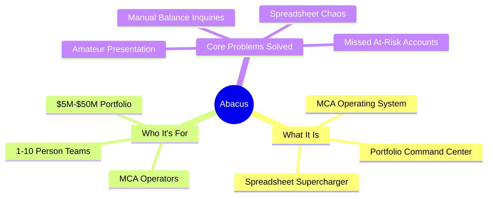

### 1.2 The Problem We Solve

```
┌─────────────────────────────────────────────────────────────────────────────┐
│                         THE SPREADSHEET PROBLEM                              │
├─────────────────────────────────────────────────────────────────────────────┤
│                                                                              │
│   TODAY: MCA operators manage everything in Google Sheets                    │
│                                                                              │
│   ┌─────────────────────────────────────────────────────────────────┐       │
│   │                                                                  │       │
│   │   • 5-10 hours/week on manual data entry                        │       │
│   │   • 10-15% of at-risk accounts missed                           │       │
│   │   • "Call us for balance" = 5-10 min per call                   │       │
│   │   • Broken formulas = wrong balances                            │       │
│   │   • No visibility into portfolio health                         │       │
│   │   • Amateur appearance to merchants                             │       │
│   │                                                                  │       │
│   └─────────────────────────────────────────────────────────────────┘       │
│                                                                              │
│   ABACUS: Connect your sheet → Get a professional operation                  │
│                                                                              │
│   ┌─────────────────────────────────────────────────────────────────┐       │
│   │                                                                  │       │
│   │   • AI understands your columns in minutes                      │       │
│   │   • Real-time dashboard with accurate balances                  │       │
│   │   • Merchant portal for self-service                            │       │
│   │   • Risk alerts before accounts go bad                          │       │
│   │   • Collections workflow for your team                          │       │
│   │   • Professional letters generated instantly                    │       │
│   │                                                                  │       │
│   └─────────────────────────────────────────────────────────────────┘       │
│                                                                              │
└─────────────────────────────────────────────────────────────────────────────┘
```

### 1.3 Before vs After

| Aspect | WITHOUT Abacus | WITH Abacus |
|--------|----------------|-------------|
| **Balance inquiries** | "Call us" (5-10 min each) | Instant portal access |
| **PDF statements** | Email manually | Auto-generated |
| **Payments** | "Check's in the mail" | Pay online instantly |
| **Portfolio view** | Spreadsheet chaos | Professional dashboard |
| **Risk detection** | Manual analysis | AI-powered alerts |
| **Onboarding** | 3-month implementation | 5 minutes |
| **Monthly cost** | $5,000+/month | $500/month |

---

## 2. The Three Pillars

### 2.1 Philosophy Diagram

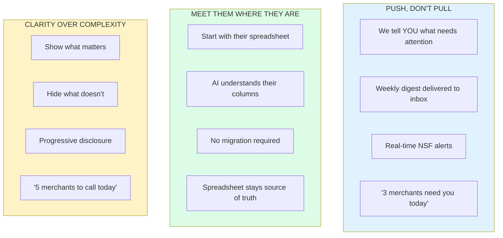

### 2.2 Three Pillars Visual

```
┌─────────────────────────────────────────────────────────────────────────────┐
│                         THE THREE PILLARS OF ABACUS                          │
├─────────────────────┬─────────────────────┬─────────────────────────────────┤
│                     │                     │                                 │
│   PUSH, DON'T PULL  │  MEET THEM WHERE    │   CLARITY OVER                 │
│                     │  THEY ARE           │   COMPLEXITY                   │
│                     │                     │                                 │
│  ┌───────────────┐  │  ┌───────────────┐  │  ┌───────────────┐             │
│  │ Weekly digest │  │  │ Start with    │  │  │ Show what     │             │
│  │ delivered     │  │  │ spreadsheets  │  │  │ matters       │             │
│  └───────────────┘  │  └───────────────┘  │  └───────────────┘             │
│  ┌───────────────┐  │  ┌───────────────┐  │  ┌───────────────┐             │
│  │ Real-time     │  │  │ AI understands│  │  │ Progressive   │             │
│  │ NSF alerts    │  │  │ your columns  │  │  │ disclosure    │             │
│  └───────────────┘  │  └───────────────┘  │  └───────────────┘             │
│  ┌───────────────┐  │  ┌───────────────┐  │  ┌───────────────┐             │
│  │ "3 merchants  │  │  │ No migration  │  │  │ "5 merchants  │             │
│  │ need you"     │  │  │ required      │  │  │ to call today"│             │
│  └───────────────┘  │  └───────────────┘  │  └───────────────┘             │
│                     │                     │                                 │
└─────────────────────┴─────────────────────┴─────────────────────────────────┘
```

---

## 3. How It Works

### 3.1 The 5-Minute Onboarding Flow

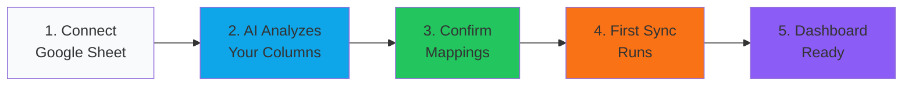

### 3.2 Core Data Flow

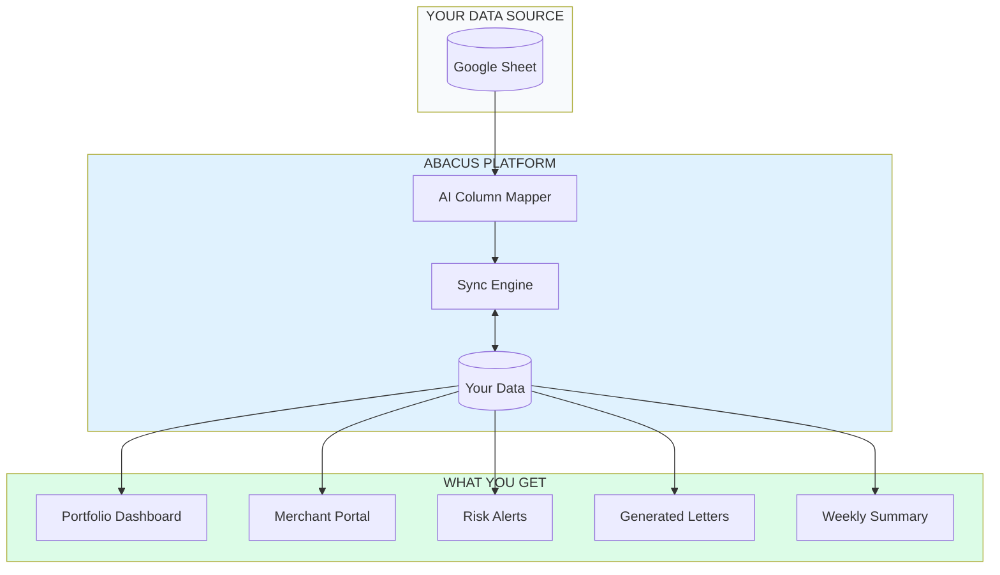

### 3.3 AI Column Mapping

```
┌─────────────────────────────────────────────────────────────────────────────┐
│                         AI COLUMN MAPPING                                    │
├─────────────────────────────────────────────────────────────────────────────┤
│                                                                              │
│   YOUR SPREADSHEET                    ABACUS UNDERSTANDS                     │
│   ─────────────────                   ───────────────────                    │
│                                                                              │
│   "Merchant Name"        ──────▶      Business Name                         │
│   "Amt Funded"           ──────▶      Funded Amount                         │
│   "FR"                   ──────▶      Factor Rate                           │
│   "Total Payback"        ──────▶      Payback Amount                        │
│   "Remaining"            ──────▶      Current Balance                       │
│   "Status (A/P/D)"       ──────▶      Deal Status                           │
│                                                                              │
│   ┌─────────────────────────────────────────────────────────────────┐       │
│   │  "Column G uses formula: =E2*F2 to calculate payback"           │       │
│   │  "Status 'A' means Active, 'P' means Paid Off"                  │       │
│   │  "Balance formula: =G2-SUM(payments)"                           │       │
│   └─────────────────────────────────────────────────────────────────┘       │
│                                                                              │
│   AI analyzes your spreadsheet logic and applies it automatically            │
│                                                                              │
└─────────────────────────────────────────────────────────────────────────────┘
```

---

## 4. Core Features

### 4.1 Feature Overview Mind Map

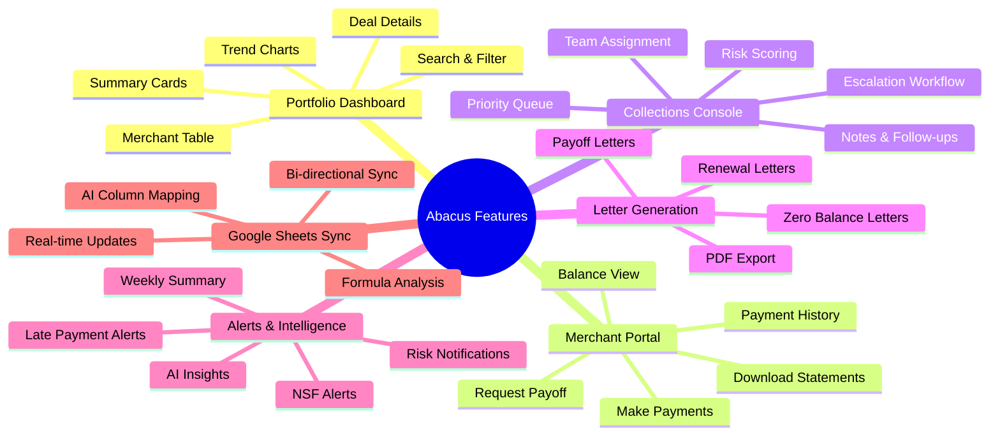

### 4.2 Feature Stack

```
┌─────────────────────────────────────────────────────────────────────────────┐
│                              ABACUS FEATURE STACK                            │
├─────────────────────────────────────────────────────────────────────────────┤
│                                                                              │
│   ┌─────────────────────────────────────────────────────────────────────┐   │
│   │                        ALERTS & INTELLIGENCE                         │   │
│   │   NSF Alerts • Late Alerts • Risk Notifications • Weekly Summary    │   │
│   └─────────────────────────────────────────────────────────────────────┘   │
│                                      │                                       │
│   ┌──────────────────────┐  ┌───────▼───────────────────────────────────┐   │
│   │   MERCHANT PORTAL    │  │            ADMIN TOOLS                    │   │
│   │   ────────────────   │  │   ─────────────────────────               │   │
│   │   • Balance view     │  │   • Portfolio Dashboard                   │   │
│   │   • Payment history  │  │   • Collections Console                   │   │
│   │   • Make payments    │  │   • Letter Generation                     │   │
│   │   • Request payoff   │  │   • User Management                       │   │
│   └──────────────────────┘  └───────────────────────────────────────────┘   │
│                                      │                                       │
│   ┌─────────────────────────────────────────────────────────────────────┐   │
│   │                          DATA LAYER                                  │   │
│   │   Google Sheets Sync • AI Mapping • Ledger Calculation • Storage    │   │
│   └─────────────────────────────────────────────────────────────────────┘   │
│                                                                              │
└─────────────────────────────────────────────────────────────────────────────┘
```

---

## 5. Portfolio Dashboard

### 5.1 Dashboard Layout

```
┌─────────────────────────────────────────────────────────────────────────────┐
│  ABACUS DASHBOARD                                    [Search] [Profile ▼]   │
├─────────────────────────────────────────────────────────────────────────────┤
│                                                                              │
│  ┌─────────────┐ ┌─────────────┐ ┌─────────────┐ ┌─────────────┐           │
│  │ Active MCAs │ │ Outstanding │ │ Collected   │ │ At-Risk     │           │
│  │     147     │ │   $2.4M     │ │ $847K MTD   │ │     12      │           │
│  │  ▲ +5 week  │ │  ▲ +$120K   │ │  ▲ +12%     │ │  ▼ -3       │           │
│  └─────────────┘ └─────────────┘ └─────────────┘ └─────────────┘           │
│                                                                              │
│  ┌─────────────────────────────────────────────────────────────────────┐   │
│  │ MERCHANTS                                         [+ Add] [Filter ▼]│   │
│  ├─────────────────────────────────────────────────────────────────────┤   │
│  │ Name              │ Balance   │ Status    │ Risk  │ Last Payment    │   │
│  ├───────────────────┼───────────┼───────────┼───────┼─────────────────┤   │
│  │ Joe's Pizza       │ $12,450   │ Active    │ ●●●●  │ Jan 20          │   │
│  │ Main St Deli      │ $8,200    │ Active    │ ●●●○  │ Jan 18          │   │
│  │ Quick Mart        │ $15,800   │ Delinquent│ ●●○○  │ Jan 10          │   │
│  │ City Cleaners     │ $6,500    │ Active    │ ●○○○  │ Jan 22          │   │
│  │ Harbor Cafe       │ $0        │ Paid Off  │ ────  │ Jan 15          │   │
│  └───────────────────┴───────────┴───────────┴───────┴─────────────────┘   │
│                                                                              │
└─────────────────────────────────────────────────────────────────────────────┘
```

### 5.2 Dashboard Components

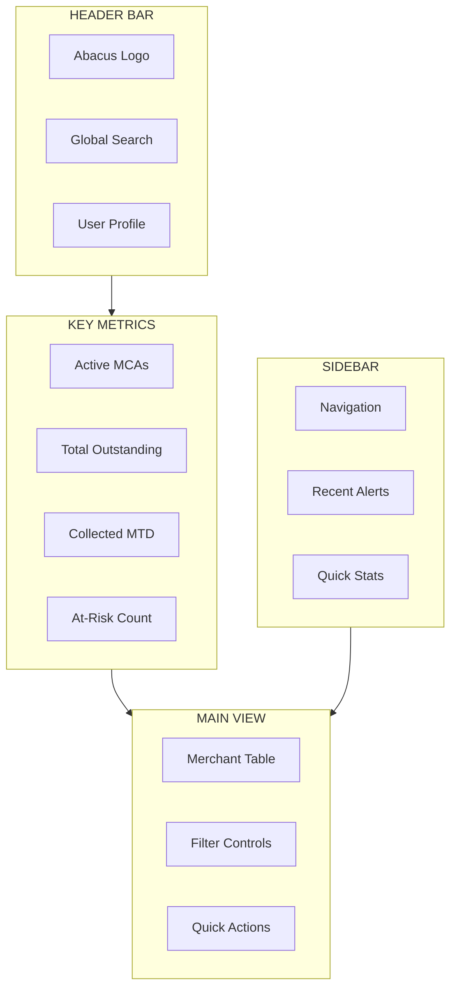

---

## 6. Merchant Portal

### 6.1 Portal Overview

```
┌─────────────────────────────────────────────────────────────────────────────┐
│                          THE MERCHANT PORTAL                                 │
│                        (The "$50K Feature")                                  │
├─────────────────────────────────────────────────────────────────────────────┤
│                                                                              │
│   WHAT MERCHANTS GET:                                                        │
│   ───────────────────                                                        │
│                                                                              │
│   ┌──────────────┐  ┌──────────────┐  ┌──────────────┐  ┌──────────────┐   │
│   │   Balance    │  │   Payment    │  │   Request    │  │    Make      │   │
│   │    View      │  │   History    │  │   Payoff     │  │   Payment    │   │
│   │              │  │              │  │              │  │              │   │
│   │  See current │  │  Full ledger │  │  Get letter  │  │  Pay online  │   │
│   │  balance     │  │  with dates  │  │  instantly   │  │  instantly   │   │
│   └──────────────┘  └──────────────┘  └──────────────┘  └──────────────┘   │
│                                                                              │
│   WHY THIS MATTERS:                                                          │
│   ─────────────────                                                          │
│                                                                              │
│   • Eliminates 10-20 "What's my balance?" calls per day                     │
│   • Would cost $30-50K to build custom                                      │
│   • Creates massive lock-in (merchants expect the portal)                   │
│   • Makes small MCAs look like enterprise operations                        │
│                                                                              │
└─────────────────────────────────────────────────────────────────────────────┘
```

### 6.2 Portal Layout

```
┌─────────────────────────────────────────────────────────────────────────────┐
│  [YOUR LOGO]  Merchant Portal                           Welcome, Joe's Pizza│
├─────────────────────────────────────────────────────────────────────────────┤
│                                                                              │
│  ┌─────────────────────────────────────────────────────────────────────┐   │
│  │                     CURRENT BALANCE                                  │   │
│  │                                                                       │   │
│  │                       $12,450.00                                     │   │
│  │                                                                       │   │
│  │              Original: $25,000  •  Paid: $12,550                     │   │
│  │                                                                       │   │
│  │              ████████████░░░░░░░░░░░░  50% paid                      │   │
│  │                                                                       │   │
│  │              [Make Payment]  [Request Payoff Letter]                 │   │
│  └─────────────────────────────────────────────────────────────────────┘   │
│                                                                              │
│  PAYMENT HISTORY                                                             │
│  ┌─────────────────────────────────────────────────────────────────────┐   │
│  │ Date        │ Amount    │ Status    │ Running Balance              │   │
│  ├─────────────┼───────────┼───────────┼──────────────────────────────┤   │
│  │ Jan 20      │ $850      │ Cleared   │ $12,450                      │   │
│  │ Jan 13      │ $850      │ Cleared   │ $13,300                      │   │
│  │ Jan 6       │ $850      │ Cleared   │ $14,150                      │   │
│  │ Dec 30      │ $850      │ Cleared   │ $15,000                      │   │
│  └─────────────┴───────────┴───────────┴──────────────────────────────┘   │
│                                                                              │
│                              [Download Statement PDF]                        │
│                                                                              │
└─────────────────────────────────────────────────────────────────────────────┘
```

### 6.3 Professionalization Comparison

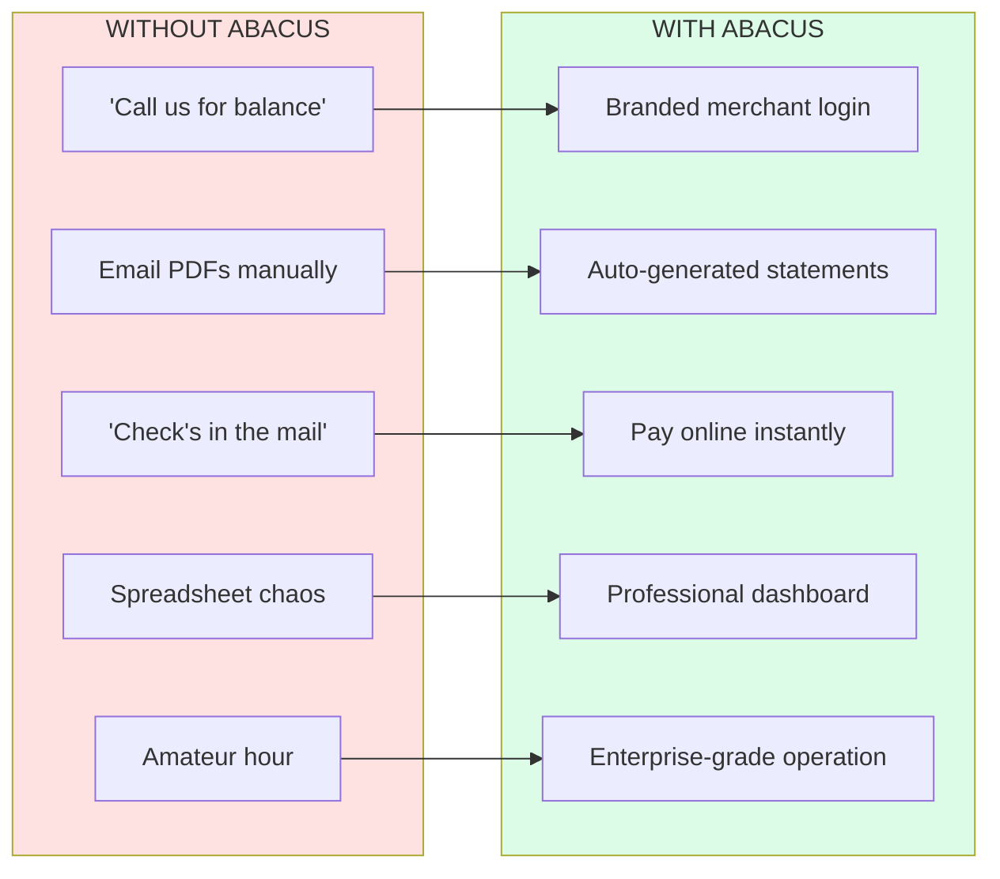

---

## 7. Collections Console

### 7.1 Risk Scoring Model

```
┌─────────────────────────────────────────────────────────────────────────────┐
│                         RISK SCORE (0-100)                                   │
├─────────────────────────────────────────────────────────────────────────────┤
│                                                                              │
│   ┌─────────────────────────────────────────────────────────────────┐       │
│   │  FACTOR              │  Weight  │  What It Measures             │       │
│   ├──────────────────────┼──────────┼───────────────────────────────┤       │
│   │  NSF (last 7 days)   │  30 pts  │  Recent bounced payments      │       │
│   │  Days Past Due       │  30 pts  │  How late they are            │       │
│   │  Total NSF Count     │  20 pts  │  Historical pattern           │       │
│   │  Late Payments (7d)  │  20 pts  │  Recent payment issues        │       │
│   └──────────────────────┴──────────┴───────────────────────────────┘       │
│                                                                              │
│   RISK LEVELS:                                                               │
│                                                                              │
│   ┌──────────┬────────────┬───────────────────────────────────────┐         │
│   │  LOW     │  0-19      │  🟢 Monitor - Payments on track       │         │
│   │  MEDIUM  │  20-39     │  🟡 Review - Some concerns            │         │
│   │  HIGH    │  40-59     │  🟠 Contact - Needs attention         │         │
│   │  CRITICAL│  60-100    │  🔴 Escalate - Immediate action       │         │
│   └──────────┴────────────┴───────────────────────────────────────┘         │
│                                                                              │
└─────────────────────────────────────────────────────────────────────────────┘
```

### 7.2 Collections Console Layout

```
┌─────────────────────────────────────────────────────────────────────────────┐
│  COLLECTIONS                                            [+ Add Note] [▼]    │
├─────────────────────────────────────────────────────────────────────────────┤
│                                                                              │
│  ┌─────────┐ ┌─────────┐ ┌─────────┐ ┌─────────┐                           │
│  │ Critical│ │  High   │ │ Medium  │ │   All   │                           │
│  │    12   │ │   28    │ │   45    │ │   147   │                           │
│  │   🔴    │ │   🟠    │ │   🟡    │ │         │                           │
│  └─────────┘ └─────────┘ └─────────┘ └─────────┘                           │
│                                                                              │
│  ┌─────────────────────────────────────────────────────────────────────┐   │
│  │ Merchant        │ Balance   │ Risk │ DPD │ Assignee │ Follow-up    │   │
│  ├─────────────────┼───────────┼──────┼─────┼──────────┼──────────────┤   │
│  │ 🔴 Joe's Pizza  │ $12,450   │  72  │  14 │ Sarah    │ Today 2pm    │   │
│  │ 🟠 Main St Deli │ $8,200    │  55  │   7 │ Mike     │ Tomorrow     │   │
│  │ 🟡 Quick Mart   │ $15,800   │  32  │   3 │ --       │ --           │   │
│  │ 🟢 City Cleaners│ $6,500    │  12  │   1 │ --       │ --           │   │
│  └─────────────────┴───────────┴──────┴─────┴──────────┴──────────────┘   │
│                                                                              │
└─────────────────────────────────────────────────────────────────────────────┘
```

### 7.3 Collections Workflow

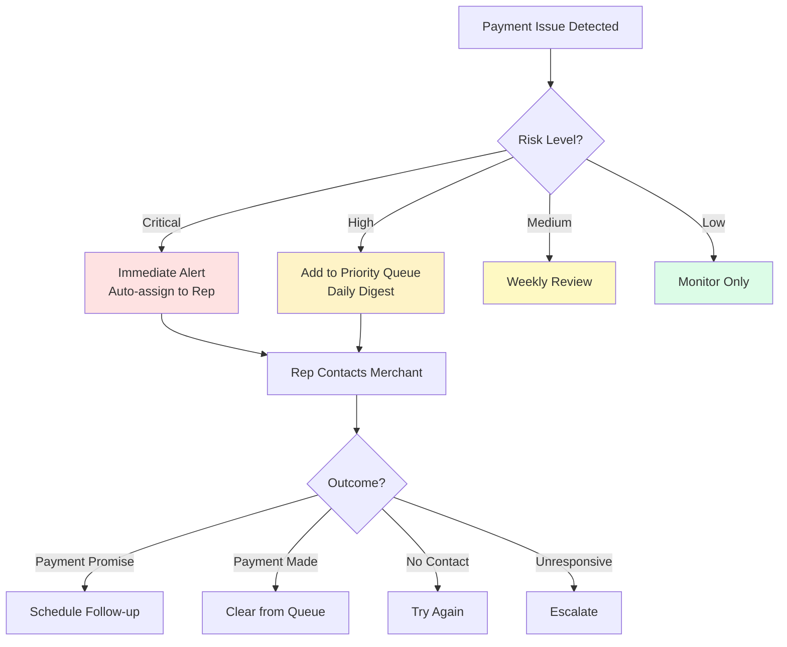

---

## 8. Alerts & Weekly Summary

### 8.1 Alert Types

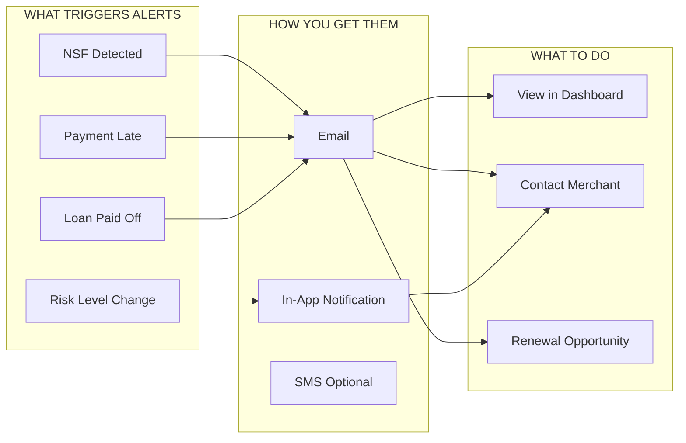

### 8.2 Weekly Summary Email

```
┌─────────────────────────────────────────────────────────────────────────────┐
│                                                                              │
│   [LOGO]  Weekly Portfolio Summary                     Week of Jan 20, 2026 │
│                                                                              │
├─────────────────────────────────────────────────────────────────────────────┤
│                                                                              │
│   THIS WEEK'S COLLECTIONS                                                    │
│   ┌─────────────────────────────────────────────────────────────────┐       │
│   │                      $47,250                                     │       │
│   │                   ▲ 12% vs last week                            │       │
│   └─────────────────────────────────────────────────────────────────┘       │
│                                                                              │
│   🔴 NEEDS ATTENTION                                                         │
│   ─────────────────────                                                      │
│   • 3 merchants went late this week                                          │
│   • 2 merchants have 3+ NSFs                                                │
│   • 5 follow-ups are overdue                                                │
│                                                                              │
│   🟢 OPPORTUNITIES                                                           │
│   ─────────────────────                                                      │
│   • 4 merchants paid off - renewal candidates                               │
│   • 2 merchants at 80%+ paid - near completion                              │
│                                                                              │
│                         [View Dashboard →]                                   │
│                                                                              │
└─────────────────────────────────────────────────────────────────────────────┘
```

---

## 9. User Roles

### 9.1 Role Hierarchy

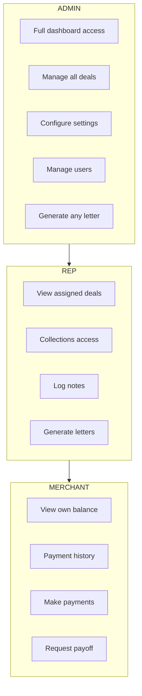

### 9.2 Permissions Matrix

| Capability | ADMIN | REP | MERCHANT |
|------------|:-----:|:---:|:--------:|
| View all deals | ● | - | - |
| View assigned deals | ● | ● | - |
| View own deal | ● | ● | ● |
| Collections console | ● | ● | - |
| Generate letters | ● | ● | - |
| Make payments | - | - | ● |
| Request payoff | - | - | ● |
| Manage users | ● | - | - |
| System settings | ● | - | - |

---

## 10. Deal Lifecycle

### 10.1 Status State Machine

```mermaid
stateDiagram-v2
    [*] --> ACTIVE: Deal Funded

    ACTIVE --> DELINQUENT: NSF/Late
    ACTIVE --> PAID_OFF: Balance = 0

    DELINQUENT --> ACTIVE: Payments Resume
    DELINQUENT --> COLLECTIONS: 7+ Days Late

    COLLECTIONS --> ACTIVE: Payments Resume
    COLLECTIONS --> DEFAULT: Unrecoverable
    COLLECTIONS --> PAID_OFF: Settled

    PAID_OFF --> RENEWED: New Deal Funded

    DEFAULT --> [*]
    RENEWED --> ACTIVE
```

### 10.2 Status Flow ASCII

```
                    ┌─────────────────┐
                    │                 │
        ┌───────────│     ACTIVE      │◄──────────┐
        │           │   (Healthy)     │           │
        │           └────────┬────────┘           │
        │                    │                    │
        │ NSF/Late           │ Paid Off           │ Renewal
        │                    │                    │
        ▼                    ▼                    │
┌───────────────┐    ┌───────────────┐    ┌──────┴────────┐
│               │    │               │    │               │
│  DELINQUENT   │    │   PAID OFF    │────│    RENEWED    │
│   (1-7 days)  │    │  (Complete)   │    │  (New Deal)   │
└───────┬───────┘    └───────────────┘    └───────────────┘
        │
        │ Escalate (7+ days)
        │
        ▼
┌───────────────┐    ┌───────────────┐
│               │    │               │
│  COLLECTIONS  │───▶│   DEFAULT     │
│   (Active)    │    │  (Terminal)   │
└───────────────┘    └───────────────┘
```

---

## 11. Technical Architecture (Simplified)

### 11.1 How It All Connects

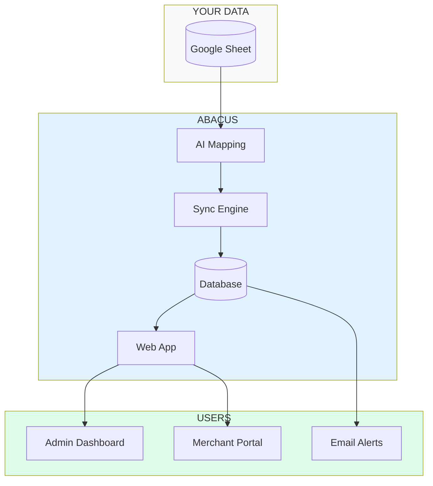

### 11.2 Integration Ecosystem

```
┌─────────────────────────────────────────────────────────────────────────────┐
│                         ABACUS INTEGRATIONS                                  │
├─────────────────────────────────────────────────────────────────────────────┤
│                                                                              │
│   DATA IN                        ABACUS                        DATA OUT     │
│   ───────                        ──────                        ────────     │
│                                                                              │
│   ┌──────────────┐          ┌──────────────┐          ┌──────────────┐     │
│   │ Google       │          │              │          │ Dashboard    │     │
│   │ Sheets       │─────────▶│   Abacus     │─────────▶│ Views        │     │
│   └──────────────┘          │   Platform   │          └──────────────┘     │
│                             │              │                                │
│   ┌──────────────┐          │  • AI Engine │          ┌──────────────┐     │
│   │ Plaid        │─────────▶│  • Sync      │─────────▶│ Merchant     │     │
│   │ (Banking)    │          │  • Database  │          │ Portal       │     │
│   └──────────────┘          │  • Rules     │          └──────────────┘     │
│                             │              │                                │
│   ┌──────────────┐          └──────────────┘          ┌──────────────┐     │
│   │ Stripe       │                 │                  │ Email        │     │
│   │ (Payments)   │◀────────────────┼─────────────────▶│ Alerts       │     │
│   └──────────────┘                 │                  └──────────────┘     │
│                                    │                                        │
│                                    ▼                  ┌──────────────┐     │
│                             ┌──────────────┐          │ PDF          │     │
│                             │ Claude AI    │─────────▶│ Letters      │     │
│                             └──────────────┘          └──────────────┘     │
│                                                                              │
└─────────────────────────────────────────────────────────────────────────────┘
```

---

## Appendix: MCA Terminology

| Term | Definition |
|------|------------|
| **MCA** | Merchant Cash Advance - Purchase of future receivables |
| **Factor Rate** | Multiplier on principal (1.35 = pay back $1.35 per $1 funded) |
| **Payback** | Total to repay (Principal x Factor Rate) |
| **NSF** | Non-Sufficient Funds - Bounced payment |
| **DPD** | Days Past Due |
| **ISO** | Independent Sales Organization (Broker) |
| **Stacking** | Multiple MCAs on same merchant |

---

## Appendix: Color Palette

| Purpose | Color | Hex |
|---------|-------|-----|
| Primary | Sky Blue | `#0ea5e9` |
| Secondary | Orange | `#f97316` |
| Success | Green | `#16a34a` |
| Warning | Amber | `#d97706` |
| Danger | Red | `#dc2626` |
| Background | White | `#ffffff` |
| Text | Dark Gray | `#0f172a` |

---

*Document Version: 1.0 | Generated: January 2026*
*For use with: Mermaid, draw.io, Excalidraw, Figma, Claude/GPT*
