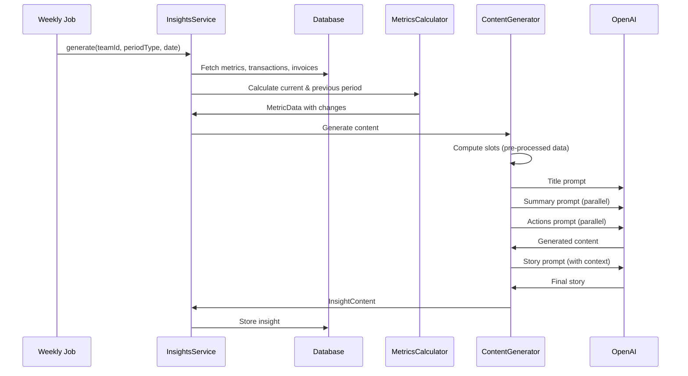

# Weekly Insights

## Overview

The Weekly Insights system generates AI-powered summaries of business financial performance. It analyzes transactions, invoices, and historical patterns to create actionable weekly reports for SMB owners.

## Key Features

- **🤖 AI-Powered Summaries**: Natural language summaries using GPT-4.1-mini with optimized prompts
- **📊 Smart Metric Selection**: Automatically selects the 4 most relevant metrics based on changes and importance
- **🎯 Actionable Recommendations**: Prioritized actions based on overdue invoices, expense anomalies, and concentration risk
- **📈 Trend Detection**: Identifies streaks (profitable weeks, revenue decline) and year-over-year comparisons
- **⏰ Runway Projections**: Specific exhaustion dates like "cash lasts until March 3, 2026"
- **🔮 Quarter Pace**: Projects quarterly revenue vs same quarter last year
- **⚠️ Payment Anomalies**: Detects unusual payment delays from historically fast-paying customers
- **✅ Data Consistency**: Multi-layer validation ensures numbers are mathematically correct

## Architecture Overview

### Core Components

1. **InsightsService**: Main orchestrator that fetches data and coordinates generation
2. **MetricsCalculator**: Computes financial metrics with period comparisons
3. **MetricsAnalyzer**: Selects top metrics and detects anomalies
4. **ContentGenerator**: Generates AI content using split prompts
5. **Slots System**: Pre-computes all data for AI consumption

### Data Flow



## Content Generation

### Split Prompt Strategy

Content is generated using focused, single-purpose prompts for maximum quality:

| Prompt | Purpose | Dependencies |
|--------|---------|--------------|
| `title.ts` | 15-25 word headline | Slots only |
| `summary.ts` | 40-60 word overview | Slots only |
| `actions.ts` | 3-5 prioritized recommendations | Slots only |
| `story.ts` | Highlight narrative | Title + Summary |

### Slots System

The `computeSlots()` function pre-processes all data before AI generation:

```typescript
type InsightSlots = {
  // Core financials
  profit: string;           // "117,061 kr"
  profitRaw: number;        // 117061
  revenue: string;
  expenses: string;
  margin: string;           // "97.4"
  runway: number;           // 8
  runwayExhaustionDate?: string; // "March 3, 2026"
  
  // Changes
  profitChange: number;     // 96
  profitDirection: "up" | "down" | "flat";
  profitChangeDescription: string; // Pre-computed semantic description
  
  // Context
  weekType: "great" | "good" | "quiet" | "challenging";
  highlight: { type: string; description?: string };
  streak?: { type: string; count: number; description: string };
  
  // Money on table
  overdue: OverdueSlot[];
  overdueTotal: string;
  
  // Projections
  quarterPace?: string;     // "On pace for 450,000 kr this Q1 — 18% ahead"
  yoyRevenue?: string;      // "up 35% vs last year"
  yoyProfit?: string;
};
```

### Semantic Profit Descriptions

To prevent AI misinterpretation, profit changes are pre-computed with semantic accuracy:

| Previous | Current | Change | Description |
|----------|---------|--------|-------------|
| -189,000 | -7,000 | +96% | "Loss decreased from -189,000 to -7,000" |
| -50,000 | 10,000 | +120% | "Turned from -50,000 loss to 10,000 profit" |
| 100,000 | 80,000 | -20% | "Down 20% vs last week" |
| 0 | 50,000 | - | "New profit of 50,000" |

This prevents the AI from saying "profit nearly doubled" when a loss merely decreased.

## Metric Selection

### Algorithm

The `selectTopMetrics()` function chooses the 4 most relevant metrics:

1. **Score each metric** based on:
   - Absolute change magnitude (higher = more interesting)
   - Category importance (profit > revenue > expenses)
   - Anomaly detection boost

2. **Ensure diversity**:
   - Maximum 2 metrics from same category
   - At least 1 core financial metric (profit, revenue, margin)

3. **Fill gaps with state metrics** (for quiet weeks):
   - Cash Balance
   - Total Overdue Amount
   - Runway

### Categories

| Category | Metrics |
|----------|---------|
| `profitability` | Profit, Profit Margin |
| `revenue` | Revenue, Cash Flow |
| `expenses` | Total Expenses |
| `operational` | Runway |
| `receivables` | Overdue Amount |
| `balance` | Cash Balance |

## Advanced Features

### Runway Exhaustion Date

Calculates specific date when cash runs out:

```typescript
// Uses period end date for historical accuracy
const baseDate = context?.periodEnd ?? new Date();
const exhaustionDate = new Date(baseDate);
exhaustionDate.setDate(exhaustionDate.getDate() + Math.round(runway * 30));
// Result: "March 3, 2026"
```

**Conditions:**
- Runway > 0 months
- Runway < 24 months (too far out is meaningless)

### Quarter Pace Projection

Projects full-quarter revenue based on current pace:

```typescript
// Example: 3 weeks into Q1 with 150,000 kr revenue
// Q1 has 13 weeks total
const projectedRevenue = (qtdRevenue / daysElapsed) * totalQuarterDays;
// "On pace for 450,000 kr this Q1 — 18% ahead of Q1 last year"
```

**Requirements:**
- At least 7 days into the quarter
- Non-zero QTD revenue
- Prior year comparison data (optional)

### Payment Anomaly Detection

Flags unusual payment delays from typically fast-paying customers:

```typescript
// Customer typically pays in 5 days, now 15 days overdue
const unusualThreshold = Math.max(typicalPayDays * 1.5, typicalPayDays + 7);
const isUnusual = daysOverdue > unusualThreshold;
// Result: "⚠️ UNUSUAL - typically pays in 5 days"
```

**Requirements:**
- Customer has 2+ paid invoices (to establish pattern)
- Current delay exceeds threshold

### Streak Detection

Identifies consecutive week patterns:

| Streak Type | Trigger | Example |
|-------------|---------|---------|
| `profitable` | 3+ profitable weeks | "Third consecutive profitable week" |
| `revenue_growth` | 3+ weeks of growth | "Revenue up for 4 weeks straight" |
| `revenue_decline` | 2+ weeks of decline | "Second week of declining revenue" |
| `invoices_paid_on_time` | 3+ weeks, requires actual invoices | "All invoices paid on time for 5 weeks" |

## Data Consistency

### Multi-Layer Validation

The system ensures mathematical consistency at multiple points:

#### Layer 1: Fetch Time (`fetchMetricData`)
```typescript
// If spending query returns 0 but profit is negative, derive expenses
if (expenses === 0 && profit < 0 && revenue >= 0) {
  expenses = revenue - profit;
}
```

#### Layer 2: Slots Computation (`computeSlots`)
```typescript
// If revenue is 0 but profit + expenses > 0, derive revenue
if (revenueRaw === 0 && profitRaw > 0 && expensesRaw > 0) {
  revenueRaw = profitRaw + expensesRaw;
}
```

#### Layer 3: Prompt Accuracy Rules
```xml
<accuracy>
- If profit is negative, expenses MUST be mentioned
- Profit of 0 is "no activity", NOT a loss
- If profit is NEGATIVE, never say it "improved" or "doubled"
</accuracy>
```

## Configuration

### Model Selection

```typescript
// Default model optimized for instruction following + cost
const model = "gpt-4.1-mini";
```

### Prompt Constraints

| Constraint | Title | Summary | Story | Actions |
|------------|-------|---------|-------|---------|
| Word count | 15-25 | 40-60 | 25-40 | N/A |
| Banned words | solid, healthy, strong... | same | same | N/A |
| Required elements | profit, runway | profit, revenue, margin, runway | highlight | overdue invoices first |

### Thresholds

```typescript
// Anomaly detection
const SIGNIFICANT_CHANGE_THRESHOLD = 20; // 20% change is significant
const LOW_RUNWAY_WARNING = 6; // months
const CRITICAL_RUNWAY_ALERT = 3; // months

// Streak detection
const MIN_STREAK_FOR_HIGHLIGHT = 3; // weeks (except revenue_decline = 2)

// Concentration risk
const CONCENTRATION_WARNING_THRESHOLD = 0.7; // 70% from one customer
```

## Evaluation Testing

### Evalite Framework

The insights package uses Evalite for AI output testing:

```bash
cd packages/insights
bun run eval
```

### Scorers

| Scorer | Type | What it checks |
|--------|------|----------------|
| `titleWordCount` | Deterministic | 15-25 words |
| `summaryWordCount` | Deterministic | 40-60 words |
| `bannedPhrases` | Deterministic | No filler words |
| `profitAccuracy` | Deterministic | Negative profit mentions expenses |
| `runwayDateMentioned` | Deterministic | Short runway includes date |
| `quarterPaceMentioned` | Deterministic | Quarter pace in summary when available |
| `overallQuality` | LLM-as-judge | Natural, actionable, accurate |

### Fixtures

14 test fixtures covering various scenarios:
- Great week, good week, quiet week, challenging week
- First insight (no comparison data)
- Recovery after losses
- Loss scenarios (with/without revenue)
- Short runway urgency
- Quarter pace projection
- Payment anomaly detection
- Concentration risk

## Key Files

| File | Purpose |
|------|---------|
| `packages/insights/src/index.ts` | Main InsightsService orchestrator |
| `packages/insights/src/content/generator.ts` | AI content generation |
| `packages/insights/src/content/prompts/slots.ts` | Data pre-processing |
| `packages/insights/src/content/prompts/title.ts` | Title prompt |
| `packages/insights/src/content/prompts/summary.ts` | Summary prompt |
| `packages/insights/src/content/prompts/actions.ts` | Actions prompt |
| `packages/insights/src/content/prompts/story.ts` | Story prompt |
| `packages/insights/src/metrics/calculator.ts` | Metric calculations |
| `packages/insights/src/metrics/analyzer.ts` | Metric selection & anomaly detection |
| `packages/db/src/queries/insights.ts` | Database queries & historical context |
| `packages/insights/evals/insight.eval.ts` | Evalite test definitions |
| `packages/insights/evals/fixtures.ts` | Test data fixtures |
| `packages/insights/evals/scorers.ts` | Custom eval scorers |

## Troubleshooting

### Summary Says "No Expenses" When Profit is Negative

**Symptom:** Summary claims no expenses despite negative profit.

**Cause:** Spending query returned 0 but mathematical consistency wasn't enforced.

**Fix:** Data consistency layers should catch this. If still occurring:
1. Check `fetchMetricData` consistency logic
2. Check `computeSlots` secondary validation
3. Verify profit/revenue/expenses relationship: `profit = revenue - expenses`

### Runway Date Not Showing

**Symptom:** Summary mentions "1 month runway" but no specific date.

**Possible Causes:**
1. Runway is 0 or negative
2. Runway is >= 24 months (too far out)
3. `periodEnd` not passed to slots computation

**Debug:**
```typescript
console.log({
  runway: slots.runway,
  runwayExhaustionDate: slots.runwayExhaustionDate,
  periodEnd: context?.periodEnd
});
```

### Quarter Pace Not Appearing

**Symptom:** No quarter pace projection in summary.

**Requirements not met:**
1. Less than 7 days into the quarter
2. Zero QTD revenue
3. Historical context not computed

**Verify:**
```typescript
console.log({
  quarterPace: slots.quarterPace,
  historicalContext: context?.quarterPace
});
```

### AI Says "Profit Doubled" for Loss Decrease

**Symptom:** AI uses growth language when loss merely decreased.

**Fix:** Ensure `profitChangeDescription` is being used in prompts:
```typescript
// Should see pre-computed description like:
"Loss decreased from -189,000 to -7,000"
// Not calculated percentage like:
"+96%"
```

### Metrics Show "-100% vs last week" for Zero Activity

**Symptom:** Key metrics display shows "-100% vs last week" for quiet weeks.

**This is expected behavior.** The raw percentage is mathematically correct. The summary handles this with natural language like "no financial activity this week."

### Eval Score Below 90%

**Common issues:**
1. Word count outside range → Check prompt constraints
2. Banned phrases used → AI may be ignoring instructions
3. Accuracy violations → Data consistency issue

**Debug:**
```bash
cd packages/insights
bun run eval
# Check individual scorer failures in output
```

## Performance

### Generation Time

Typical insight generation: 2-4 seconds

| Phase | Time |
|-------|------|
| Data fetch | 200-500ms |
| Metric calculation | 50-100ms |
| Title + Summary (parallel) | 800-1200ms |
| Actions (parallel with above) | 600-800ms |
| Story | 600-1000ms |
| Total | 2-4s |

### Cost

Using `gpt-4.1-mini`:
- ~1,500 input tokens per insight
- ~300 output tokens per insight
- Estimated cost: ~$0.002 per insight
