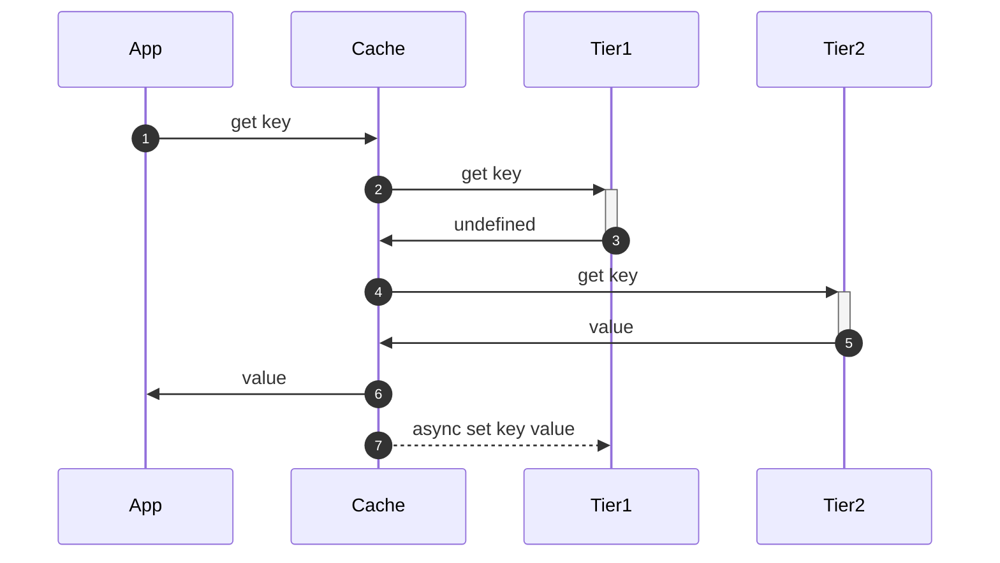
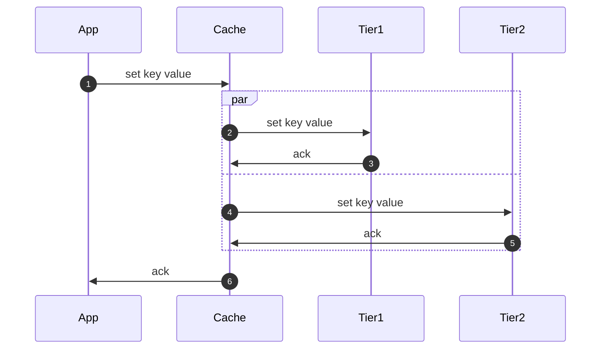
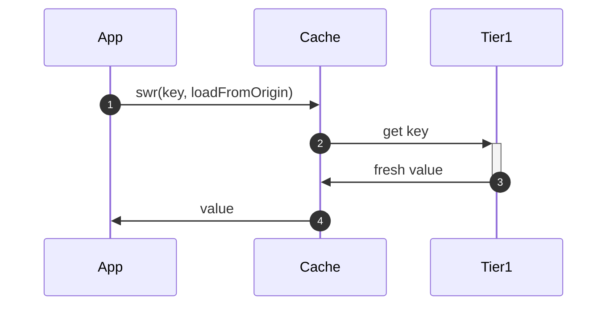
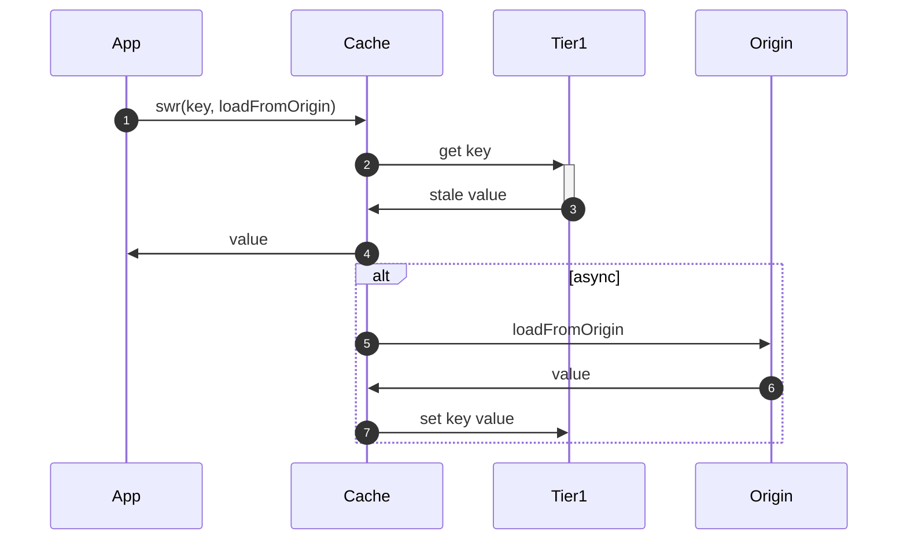
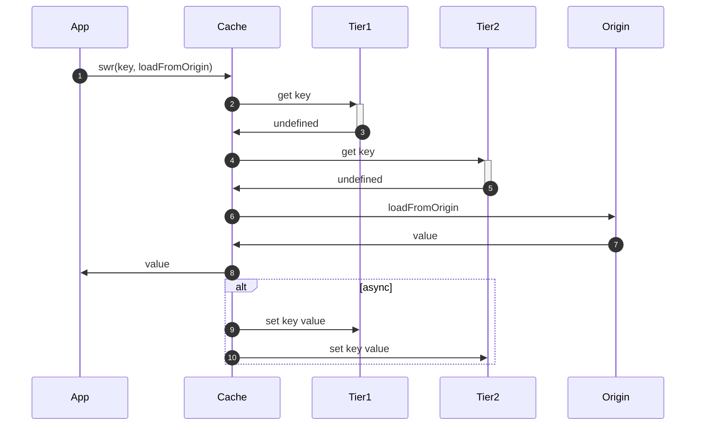

## Motivation

Everyone needs caching, but it's often poorly implemented. Not from a technical perspective but from a usability perspective. Caching should be easy to use, typesafe, and composable.

How caching looks like in many applications:

```ts
const cache = new Some3rdPartyCache(...)

type User = { email: string };

let user = await cache.get("userId") as User | undefined | null;
if (!user){
  user = await database.get(...)
  await cache.set("userId", user, Date.now() + 60_000)
}

// use user

```

There are a few annoying things about this code:

- Manual type casting
- No support for stale-while-revalidate
- Only checks a single cache

Most people would build a small wrapper around this to make it easier to use and so did we:
This library is the result of a rewrite of our own caching layer after some developers were starting to replicate it. It's used in production by Unkey any others.

## Features

- **Typescript**: Fully typesafe
- **Tiered Cache**: Multiple caches in series to fall back on
- **Metrics**: Middleware for collecting metrics
- **Stale-While-Revalidate**: Async loading of data from your origin
- **Encryption**: Middleware for automatic encryption of cache values
- **Composable**: Mix and match primitives to build what you need

## Quickstart

<Tabs>
  <Tab title="npm">```bash npm install @internal/cache ```</Tab>
  <Tab title="pnpm">```bash pnpm add @internal/cache``</Tab>
  <Tab title="yarn">```bash yarn add @internal/cache``</Tab>
  <Tab title="bun">```bash bun install @internal/cache``</Tab>
</Tabs>

<CodeGroup>
  ```ts Hello World
import { createCache, DefaultStatefulContext, Namespace } from "@internal/cache
import { MemoryStore } from "@internal/cachetores";

/\*\*

- Define the type of your data,
- or perhaps generate the types from your database
  \*/
  type User = {
  id: string;
  email: string;
  };

/\*\*

- In serverless you'd get this from the request handler
- See /docs/libraries/ts/cache/overview#context
  \*/
  const ctx = new DefaultStatefulContext();

const memory = new MemoryStore({ persistentMap: new Map() });

const cache = createCache({
user: new Namespace<User>(ctx, {
stores: [memory],
fresh: 60_000, // Data is fresh for 60 seconds
stale: 300_000, // Data is stale for 300 seconds
})
});

await cache.user.set("userId", { id: "userId", email: "user@email.com" });
const user = await cache.user.get("userId")
console.log(user)

````
```ts Tiered Caches
import { createCache, DefaultStatefulContext, Namespace } from "@internal/cache
import { CloudflareStore, MemoryStore } from "@internal/cachetores";

/**
 * In serverless you'd get this from the request handler
 * See /docs/libraries/ts/cache/overview#context
 */
const ctx = new DefaultStatefulContext();

/**
 * Define the type of your data, or perhaps generate the types from your database
 */
type User = {
  id: string;
  email: string;
};

const memory = new MemoryStore({ persistentMap: new Map() });

const cloudflare = new CloudflareStore({
  domain: "cache.unkey.dev",
  zoneId: env.CLOUDFLARE_ZONE_ID!,
  cloudflareApiKey: env.CLOUDFLARE_API_KEY!,
});


const cache = createCache({
  user: new Namespace<User>(ctx, {
    /**
     * Specifying first `memory`, then `cloudflare` will automatically check both stores
     * in order.
     * If a value is found in memory, it is returned, else it will check cloudflare,
     * and if it's found in cloudflare, the value is backfilled to memory.
     */
    stores: [memory, cloudflare],
    fresh: 60_000, // Data is fresh for 60 seconds
    stale: 300_000, // Data is stale for 300 seconds
  });
});

async function main() {
  await cache.user.set("userId", { id: "userId", email: "user@email.com" });

  const user = await cache.user.get("userId");

  console.info(user);
}

main();
````

```ts Multiple Namespaces
import { createCache, DefaultStatefulContext, Namespace } from "@internal/cache
import { CloudflareStore, MemoryStore } from "@internal/cachetores";

/**
 * In serverless you'd get this from the request handler
 * See /docs/libraries/ts/cache/overview#context
 */
const ctx = new DefaultStatefulContext();

/**
 * Define the type of your data, or perhaps generate the types from your database
 */
type User = {
  id: string;
  email: string;
};

const memory = new MemoryStore({ persistentMap: new Map() });

const cloudflare = new CloudflareStore({
  domain: "cache.unkey.dev",
  zoneId: env.CLOUDFLARE_ZONE_ID!,
  cloudflareApiKey: env.CLOUDFLARE_API_KEY!,
});


type ApiKey = {
  hash: string;
  ownerId: string;
  permissions: string[];
};

const cache = createCache({
  user: new Namespace<User>(ctx, {
    stores: [memory, cloudflare],
    fresh: 60_000, // Data is fresh for 60 seconds
    stale: 300_000, // Data is stale for 300 seconds
  });
  apiKey:new Namespace<ApiKey>(ctx, {
    stores: [memory],
    fresh: 10_000, // Data is fresh for 10 seconds
    stale: 60_000, // Data is stale for 60 seconds
  });
});

async function main() {
  await cache.user.set("userId", { id: "userId", email: "user@email.com" });
  const user = await cache.user.get("userId");
  console.info(user);


  await cache.apiKey.set("hash", {hash:"hash", ownerId: "me", permissions: ["do_many_things"]})
}

main();

```

</CodeGroup>

```ts
import { createCache, Namespace } from "@internal/cache
import { CloudflareStore, MemoryStore } from "@internal/cachetores";

/**
 * Define your data types.
 * You can hopefully reuse some of these from your database models.
 */
type User = {
  email: string;
};

type Account = {
  name: string;
};

/**
 * Configure the swr cache defaults.
 */
const fresh = 60_000; // fresh for 1 minute
const stale = 900_000; // stale for 15 minutes

/**
 * Create your store instances
 */
const memory = new MemoryStore({
  persistentMap: new Map(),
});
const cloudflare = new CloudflareStore({
  cloudflareApiKey: "<CLOUDFLARE_API_KEY>",
  zoneId: "<CLOUDFLARE_ZONE_ID>",
  domain: "<YOUR_CACHE_DOMAIN>",
});

/**
 * Create your cache instance
 */
const cache = createCache({
  account: new Namespace<Account>(ctx, {
    stores: [memory],
    fresh, // use the defaults defined above or a custom value
    stale,
  }),
  user: new Namespace<User>(ctx, {
    // tiered cache, checking memory first, then cloudflare
    stores: [memory, cloudflare],
    fresh,
    stale,
  }),
});

await cache.account.set("key", { name: "x" });

const user = await cache.user.get("user_123");

// typescript error, because `email` is not a key of `Account`
await cache.account.set("key", { email: "x" });
```

## Concepts

### Namespaces

Namespaces are a way to define the type of data in your cache and apply settings to it. They are used to ensure that you don't accidentally store the wrong type of data in a cache, which otherwise can happen easily when you're changing your data structures.

Each namespace requires a type parameter and is instantiated with a set of stores and cache settings.

```ts Constructor
new Namespace<TValue>(ctx, opts);
```

<ParamField path="TValue" type="type">
  The type of data stored in this namespace, for example:
  ```ts
  type User = {
    email: string;
  };
  ```
</ParamField>

<ParamField path="ctx" type="Context">
  An execution context, such as a request or a worker instance.

[Read more](/libraries/ts/cache/overview#context)

```ts
interface Context {
  waitUntil: (p: Promise<unknown>) => void;
}
```

On Cloudflare workers or Vercel edge functions, you receive a context from the `fetch` handler.

Otherwise you can use this:

```ts
import { DefaultStatefulContext } from "@internal/cache

const ctx = new DefaultStatefulContext();
```

</ParamField>

<ParamField path="opts" type="NamespaceOptions">

<Expandable>
  <ParamField path="stores" required type="Store[]">
    An array of stores to use for this namespace. When providing multiple stores, the cache will be checked in order of the array until a value is found or all stores have been checked.

    You should order the stores from fastest to slowest, so that the fastest store is checked first.

  </ParamField>

  <ParamField path="fresh" requried type="number">
    The time in milliseconds that a value is considered fresh. Cache hits within this time will return the cached value.

    Must be less than `stale`.

  </ParamField>

  <ParamField path="stale" requried type="number">
    The time in milliseconds that a value is considered stale. Cache hits within this time will return the cached value and trigger a background refresh.

    Must be greater than `fresh`.
    </ParamField>

</Expandable>

</ParamField>

```ts Example namespace with two stores
import {
  CloudflareStore,
  DefaultStatefulContext,
  MemoryStore,
  Namespace,
} from "@internal/cache

type User = {
  email: string;
};

const memory = new MemoryStore({
  persistentMap: new Map(),
});

const cloudflare = new CloudflareStore({
  cloudflareApiKey: c.env.CLOUDFLARE_API_KEY,
  zoneId: c.env.CLOUDFLARE_ZONE_ID,
  domain: "cache.unkey.dev",
});

const ctx = new DefaultStatefulContext();

const namespace = new Namespace<User>(ctx, {
  stores: [memory, cloudflare],
  fresh: 60_000,
  stale: 900_000,
});
```

### Tiered Cache

Different caches have different characteristics, some may be fast but volatile, others may be slow but persistent. By using a tiered cache, you can combine the best of both worlds.
In almost every case, you want to use a fast in-memory cache as the first tier. There is no reason not to use it, as it doesn't add any latency to your application.

The goal of this implementation is that it's invisible to the user. Everything behaves like a single cache.
You can add as many tiers as you want.

#### Reading from the cache

When using a tiered cache, all stores will be checked in order until a value is found or all stores have been checked.
If a value is found in a store, it will be backfilled to the previous stores in the list asynchronously.



#### Writing to the cache

When setting or deleting a key, every store will be updated in parallel.



#### Example

```ts
import {
  createCache,
  DefaultStatefulContext,
  Namespace,
} from "@internal/cache
import { CloudflareStore, MemoryStore } from "@internal/cachetores";

/**
 * In serverless you'd get this from the request handler
 * See https://unkey.com/docs/libraries/ts/cache/overview#context
 */
const ctx = new DefaultStatefulContext();

/**
 * Define the type of your data, or perhaps generate the types from your database
 */
type User = {
  id: string;
  email: string;
};

const memory = new MemoryStore({ persistentMap: new Map() });

/**
 * @see https://unkey.com/docs/libraries/ts/cache/overview#cloudflare
 */
const cloudflare = new CloudflareStore({
  domain: "cache.unkey.dev",
  zoneId: env.CLOUDFLARE_ZONE_ID!,
  cloudflareApiKey: env.CLOUDFLARE_API_KEY!,
});

const userNamespace = new Namespace<User>(ctx, {
  /**
   * Specifying first `memory`, then `cloudflare` will automatically check both stores in order
   * If a value is found in memory, it is returned, else it will check cloudflare, and if it's found
   * in cloudflare, the value is backfilled to memory.
   */
  stores: [memory, cloudflare],
  fresh: 60_000, // Data is fresh for 60 seconds
  stale: 300_000, // Data is stale for 300 seconds
});

const cache = createCache({ user: userNamespace });

async function main() {
  await cache.user.set("userId", { id: "userId", email: "user@email.com" });

  const user = await cache.user.get("userId");

  console.log(user);
}

main();
```

### Stale-While-Revalidate

To make data fetching as easy as possible, the cache offers a `swr` method, that acts as a pull through cache. If the data is fresh, it will be returned from the cache, if it's stale it will be returned from the cache and a background refresh will be triggered and if it's not in the cache, the data will be synchronously fetched from the origin.

```ts
const user = await cache.user.swr("userId", async (userId) => {
  return database.exec("SELECT * FROM users WHERE id = ?", userId);
});
```

<ParamField path="key" type="string">
  The cache key to fetch, just like when using `.get(key)`
</ParamField>

<ParamField
  path="loadFromOrigin"
  type="(key: string) => Promise<TValue | undefined>"
>
  A callback function that will be called to fetch the data from the origin if
  it's stale or not in the cache.
</ParamField>

To understand what's happening under the hood, let's look at the different scenarios. `swr` works with tiered caches, but for simplicity, these charts may only show a single store.

<Tabs>

<Tab title="Fresh Cache Hit">


</Tab>
<Tab title="Stale Cache Hit">



</Tab>

<Tab title="Cache Miss">



</Tab>
</Tabs>

#### Example

```ts
import {
  createCache,
  DefaultStatefulContext,
  Namespace,
} from "@internal/cache
import { CloudflareStore, MemoryStore } from "@internal/cachetores";

/**
 * In serverless you'd get this from the request handler
 * See https://unkey.com/docs/libraries/ts/cache/overview#context
 */
const ctx = new DefaultStatefulContext();

/**
 * Define the type of your data, or perhaps generate the types from your database
 */
type User = {
  id: string;
  email: string;
};

const memory = new MemoryStore({ persistentMap: new Map() });

/**
 * @see https://unkey.com/docs/libraries/ts/cache/overview#cloudflare
 */
const cloudflare = new CloudflareStore({
  domain: "cache.unkey.dev",
  zoneId: env.CLOUDFLARE_ZONE_ID!,
  cloudflareApiKey: env.CLOUDFLARE_API_KEY!,
});

const userNamespace = new Namespace<User>(ctx, {
  /**
   * Specifying first `memory`, then `cloudflare` will automatically check both stores in order
   * If a value is found in memory, it is returned, else it will check cloudflare, and if it's found
   * in cloudflare, the value is backfilled to memory.
   */
  stores: [memory, cloudflare],
  fresh: 60_000, // Data is fresh for 60 seconds
  stale: 300_000, // Data is stale for 300 seconds
});

const cache = createCache({ user: userNamespace });

async function main() {
  await cache.user.set("userId", { id: "userId", email: "user@email.com" });

  const user = await cache.user.swr("userId", async (userId) => {
    // @ts-expect-error we don't have a db in this example
    return db.getUser(userId);
  });

  console.info(user);
}

main();
```

### Context

In serverless functions it's not always trivial to run some code after you have returned a response. This is where the context comes in. It allows you to register promises that should be awaited before the function is considered done.
Fortunately many providers offer a way to do this.

In order to be used in this cache library, the context must implement the following interface:

```ts
export interface Context {
  waitUntil: (p: Promise<unknown>) => void;
}
```

For stateful applications, you can use the `DefaultStatefulContext`:

```ts
import { DefaultStatefulContext } from "@internal/cache

const ctx = new DefaultStatefulContext();
```

Vendor specific documentation:

- [Cloudflare Workers](https://developers.cloudflare.com/workers/runtime-apis/context/)
- [Vercel Serverless](https://vercel.com/docs/functions/functions-api-reference#waituntil)
- [Vercel Edge and Middleware](https://vercel.com/docs/functions/edge-middleware/middleware-api#waituntil)

## Primitives

### Stores

Stores are the underlying storage mechanisms for your cache. They can be in-memory, on-disk, or remote. You can use multiple stores in a namespace to create a tiered cache.
The order of stores in a namespace is important. The cache will check the stores in order until it finds a value or all stores have been checked.

<Info>
  You can create your own store by implementing the `Store` interface. [Read
  more.](/libraries/ts/cache/interface/store)
</Info>

Below are the avaliable stores:

#### Memory

The memory store is an in-memory cache that is fast but only as persistent as your memory. In serverless environments, this means that the cache is lost when the function is cold-started.

```ts
import { MemoryStore } from "@internal/cachetores";

const memory = new MemoryStore({
  persistentMap: new Map(),
});
```

Ensure that the `Map` is instantiated in a persistent scope of your application. For Cloudflare workers or serverless functions in general, this is the global scope.

#### Cloudflare

The Cloudflare store uses cloudflare's [`Cache` API](https://developers.cloudflare.com/workers/runtime-apis/cache/) to store cache values. This is a remote cache that is shared across all instances of your worker but isolated per datacenter. It's still pretty fast, but needs a network request to access the cache.

```ts
import { CloudflareStore } from "@internal/cachetores";

const cloudflare = new CloudflareStore({
  cloudflareApiKey: "<CLOUDFLARE_API_KEY>",
  zoneId: "<CLOUDFLARE_ZONE_ID>",
  domain: "<YOUR_CACHE_DOMAIN>",
  cacheBuster: "<CACHE_STORE_VERSION>",
});
```

  <ParamField path="cloudflareApiKey" type="string">
    The Cloudflare API key to use for cache purge operations.

The api key must have the `Cache Purge` permission. You can create a new API token with this permission in the [Cloudflare dashboard](https://dash.cloudflare.com/profile/api-tokens).

  </ParamField>

{" "}

<ParamField path="zoneId" type="string">
  The Cloudflare zone ID where the cache is stored. You can find this in the
  Cloudflare dashboard.
</ParamField>

  <ParamField path="domain" type="string">
    The domain to use for the cache. This must be a valid domain within the zone specified by `zoneId`.
    <Warning>
    If the domain is not valid in the specified zone, the cache will not work and cloudflare does not provide an error message. You will just get cache misses.

    For example, we use `domain: "cache.unkey.dev"` in our API.
    </Warning>

  </ParamField>
   <ParamField path="cacheBuster" type="string" default="v1">
    As your data changes, it is important to keep backwards compatibility in mind. If your cached values are no longer backwards compatible, it can cause problems. For example when a value changes from optional to required. In these cases you should purge the entire cache by setting a new `cacheBuster` value. The `cacheBuster` is used as part of the cache key and changes ensure you are not reading old data anymore.
  </ParamField>

#### Upstash Redis

The Upstash Redis store uses the [Serverless Redis](https://upstash.com/docs/redis/overall/getstarted) offering from Upstash to store cache values. This is a serverless database with Redis compatibility.

```ts
import { UpstashRedisStore } from "@internal/cachetores";
import { Redis } from "@upstash/redis";

const redis = new Redis({
  url: <UPSTASH_REDIS_REST_URL>,
  token: <UPSTASH_REDIS_REST_TOKEN>,
})

const redisStore = new UpstashRedisStore({
  redis
})
```

<ParamField path="redis" type="Redis">
  The Upstash Redis client to use for cache operations.
</ParamField>

#### libSQL (Turso)

The libSQL store can use an [embedded SQLite database](https://docs.turso.tech/features/embedded-replicas/introduction), or a remote [Turso](https://turso.tech) database to store cache values.

You must create a table in your Turso database with the following schema:

```sql
CREATE TABLE IF NOT EXISTS cache (
  key TEXT PRIMARY KEY,
  value TEXT NOT NULL,
  freshUntil INTEGER NOT NULL,
  staleUntil INTEGER NOT NULL
);
```

<CodeGroup>

```ts Remote Only
import { createClient } from "@libsql/client";

import { LibSQLStore } from "@internal/cachetores";

const client = createClient({
  url: "libsql://...",
  authToken: "...",
});

const store = new LibSQLStore({
  client,
});
```

```ts Embedded Replicas
import { createClient } from "@libsql/client";

import { LibSQLStore } from "@internal/cachetores";

const client = createClient({
  url: "file:dev.db",
  syncUrl: "libsql://...",
  authToken: "...",
});

const store = new LibSQLStore({
  client,
});
```

</CodeGroup>

<ParamField path="client" type="Client" required="true">
  The [libSQL client](https://docs.turso.tech/sdk/ts) to use for cache
  operations.
</ParamField>

<ParamField path="tableName" type="string" default="cache">
  The name of the database table name to use for cache operations.
</ParamField>

### Middlewares

#### Metrics

The metrics middleware collects metrics about cache hits, misses, and backfills. It's useful for debugging and monitoring your cache usage.

Using the metrics middleware requires a metrics sink. You can build your own sink by implementing the `Metrics` interface.
For example we are using [axiom](https://axiom.co?ref=unkey).

```ts
interface Metrics<
  TMetric extends Record<string, unknown> = Record<string, unknown>,
> {
  /**
   * Emit a new metric event
   *
   */
  emit(metric: TMetric): void;

  /**
   * flush persists all metrics to durable storage.
   * You must call this method before your application exits, metrics are not persisted automatically.
   */
  flush(): Promise<void>;
}
```

Wrap your store with the metrics middleware to start collecting metrics.

```ts
import { withMetrics } from "@internal/cacheiddleware";

const metricsSink = // your metrics sink
const metricsMiddleware = withMetrics(metricsSink);

const memory = new MemoryStore({ persistentMap: new Map() });

new Namespace<User>(ctx, {
  // Wrap the store with the metrics middleware
  stores: [metricsMiddleware.wrap(memory)],
  // ...
});
```

The following metrics are emitted:

```ts
type Metric =
  | {
      metric: "metric.cache.read";
      key: string;
      hit: boolean;
      status?: "fresh" | "stale";
      latency: number;
      tier: string;
      namespace: string;
    }
  | {
      metric: "metric.cache.write";
      key: string;
      latency: number;
      tier: string;
      namespace: string;
    }
  | {
      metric: "metric.cache.remove";
      key: string;
      latency: number;
      tier: string;
      namespace: string;
    };
```

#### Encryption

When dealing with sensitive data, you might want to encrypt your cache values at rest.
You can encrypt a store by wrapping it with the `EncryptedStore`.

All you need is a 32 byte base64 encoded key.
You can generate one with openssl:

```bash Generate a new encryption key
openssl rand -base64 32
```

```ts Example
import { withEncryption } from "@internal/cache

const encryptionKey = "<BASE64_KEY>"
const encryptionMiddleware = await withEncryption(encryptionKey)

const memory = new Memory({..}) // or any other store

const store = encryptionMiddleware.wrap(memory);

```

Values will be encrypted using `AES-256-GCM` and persisted in the underlying store.

<Info>
  You can rotate your encryption key at any point, but this will essentially purge the cache.

A SHA256 hash of the encryption key is used in the cache key, to allow for rotation without causing decryption errors.

</Info>

## Contributing

If you have a store or middleware you'd like to see in this library, please open an [issue](https://github.com/unkeyed/unkey/issues/new) or a pull request.
