# Accounting Integration Architecture

Deep technical documentation of the accounting sync system architecture.

## System Components

### Provider Abstraction Layer

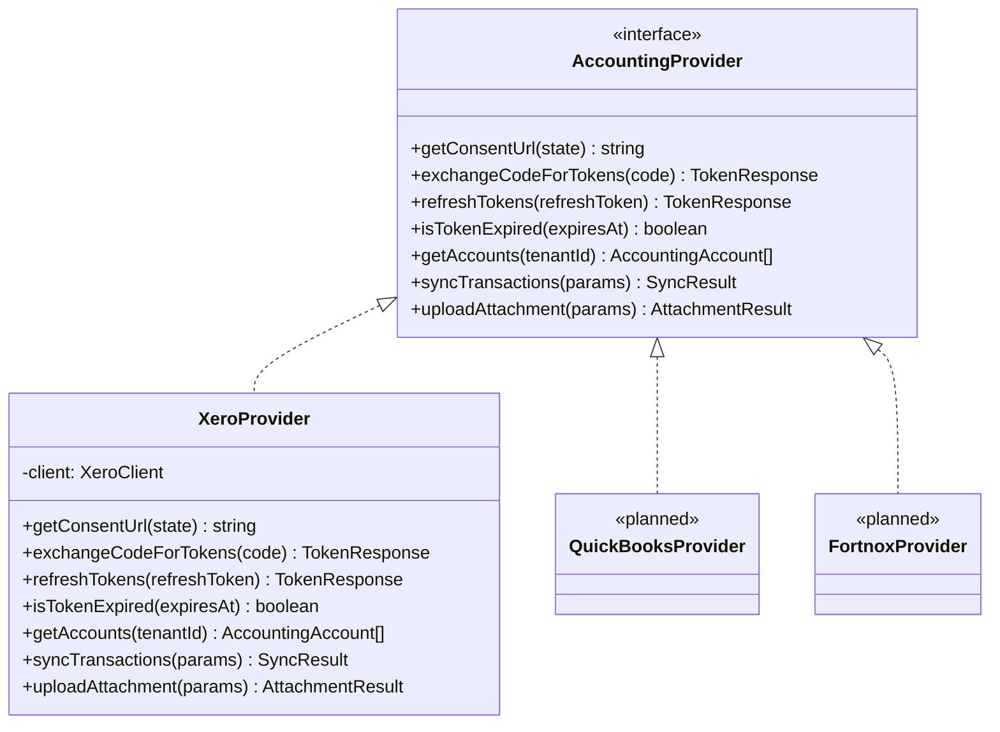

### Worker Pipeline

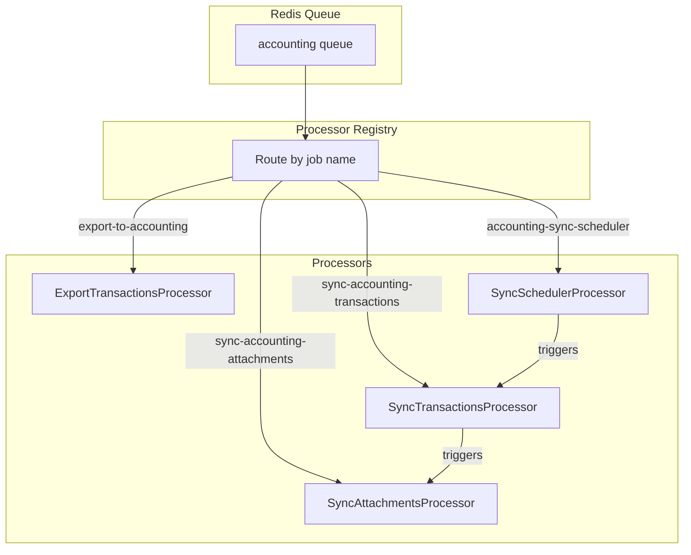

### Database Layer

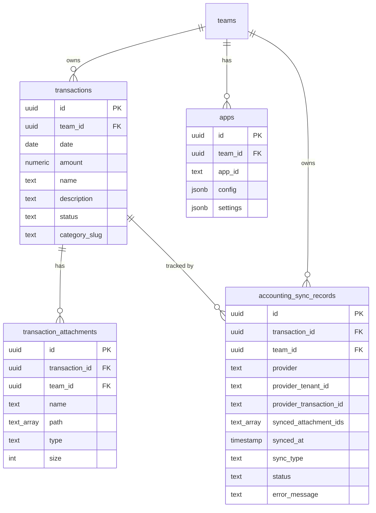

---

## Sync Algorithm

### Phase 1: Transaction Selection

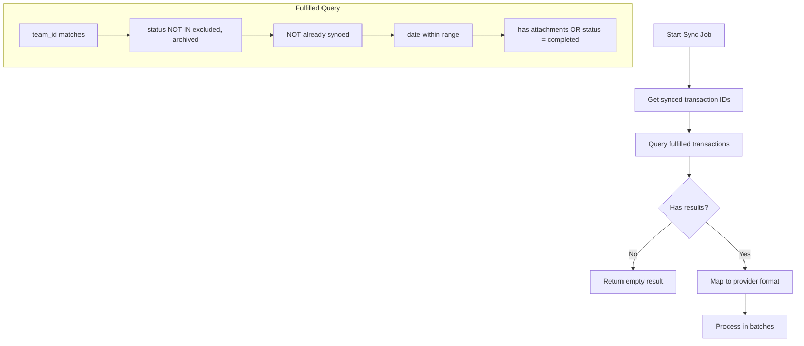

### Phase 2: Batch Processing

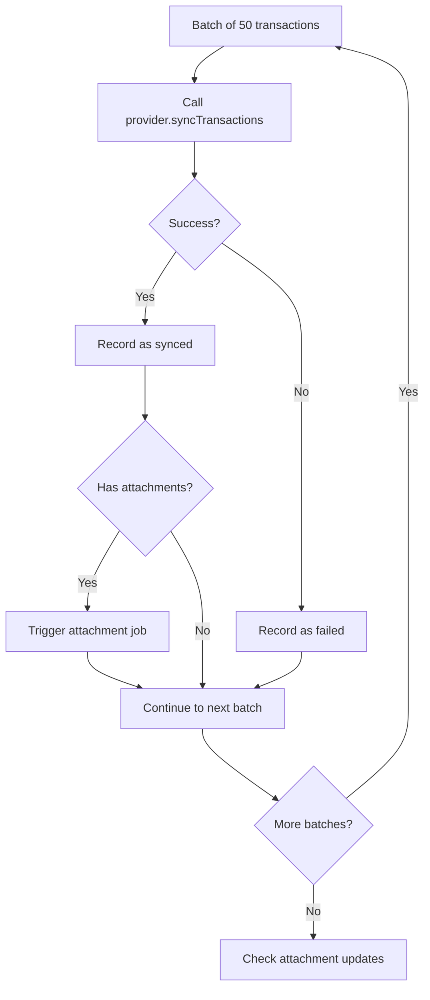

### Phase 3: Attachment Detection

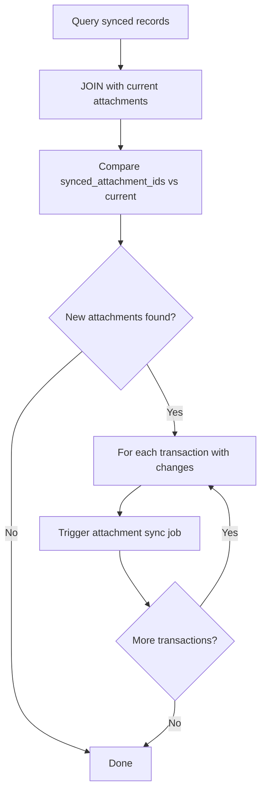

---

## Token Lifecycle

### Refresh Flow

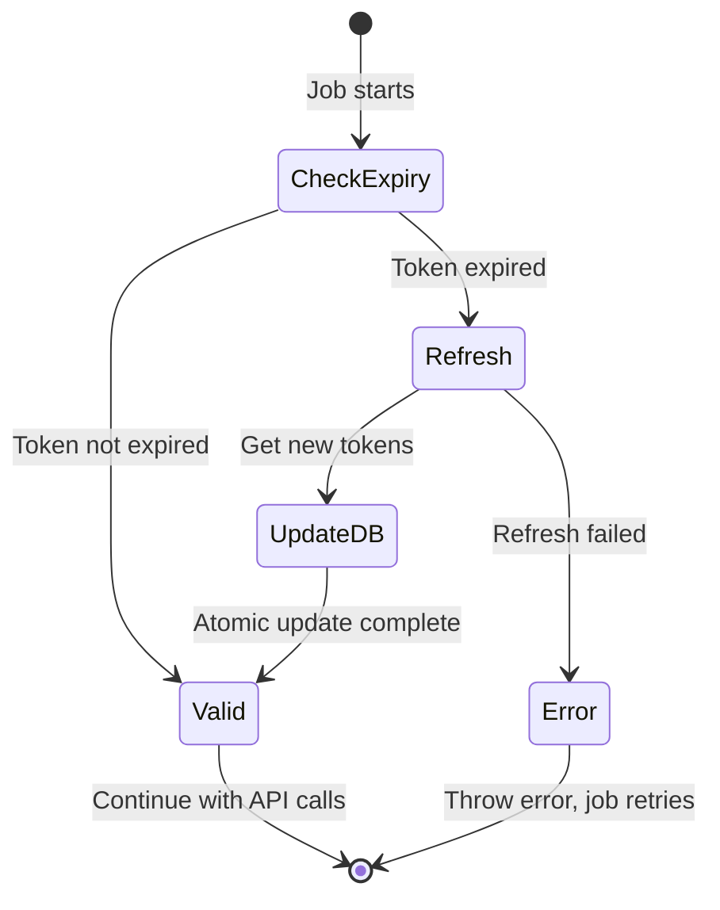

### Atomic Update

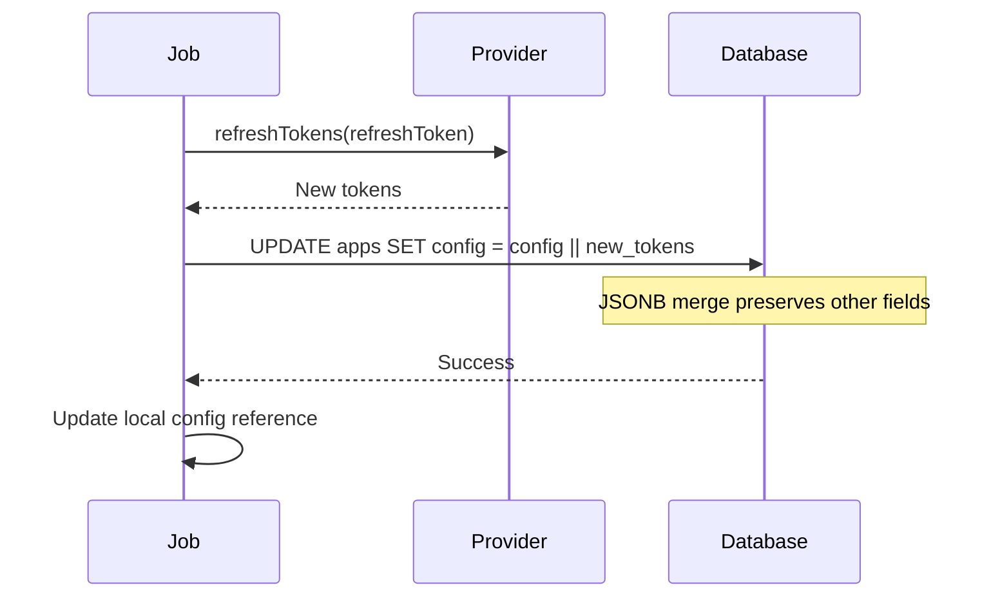

---

## Retry Mechanism

### BullMQ Configuration

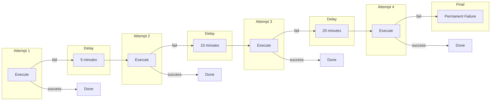

### Error Classification

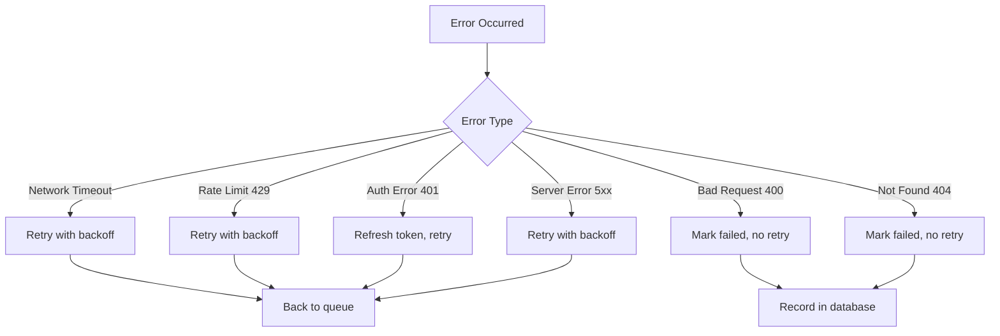

---

## Concurrency Model

### Queue Worker Settings

```typescript
const workerOptions: WorkerOptions = {
  concurrency: 10,              // Max 10 jobs in parallel
  lockDuration: 300000,         // 5 minute lock (API can be slow)
  stalledInterval: 5 * 60 * 1000,
  maxStalledCount: 1,
  limiter: {
    max: 20,                    // Max 20 jobs per second
    duration: 1000,
  },
};
```

### Job Isolation

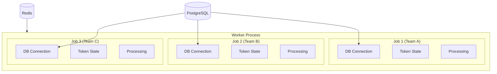

---

## Data Mapping

### Midday to Xero Transaction Mapping

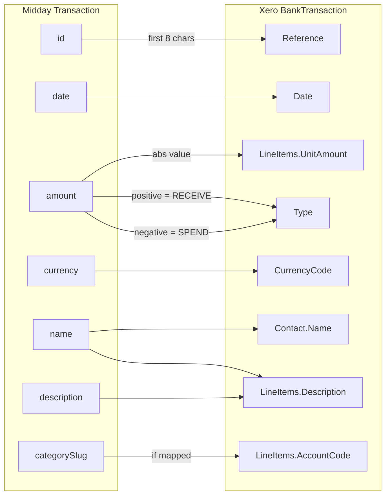

### Attachment Upload Flow

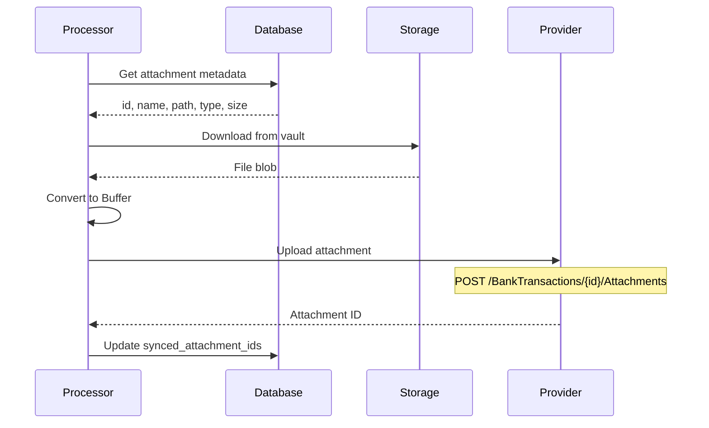

---

## Performance Characteristics

### Query Complexity

| Query | Complexity | Index Used |
|-------|------------|------------|
| Get synced IDs | O(n) | idx_accounting_sync_team_provider |
| Get transactions for sync | O(n log n) | transactions PK + team_id |
| Detect attachment changes | O(n) | Single JOIN, grouped |
| Upsert sync record | O(1) | Unique constraint |

### Batch Sizes

| Operation | Batch Size | Rationale |
|-----------|------------|-----------|
| Transaction sync | 50 | Balance between API calls and memory |
| Attachment upload | 1 | Sequential for error isolation |
| Progress updates | Per batch | User feedback without overhead |

### Rate Limits

| Provider | Limit | Midday Handling |
|----------|-------|-----------------|
| Xero | 60 calls/minute | BullMQ limiter (20/sec max) |
| Xero | 5000 calls/day | Batch processing reduces calls |

---

## Security Model

### Data Access

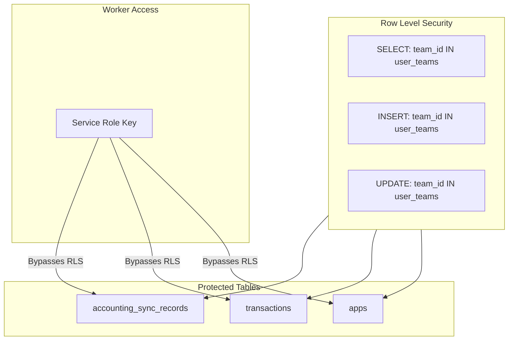

### Secret Storage

| Secret Type | Storage | Access |
|-------------|---------|--------|
| OAuth Client ID/Secret | Environment vars | Worker process only |
| Access Token | apps.config (DB) | Encrypted at rest |
| Refresh Token | apps.config (DB) | Encrypted at rest |
| OAuth State | Encrypted string | HMAC with server secret |
