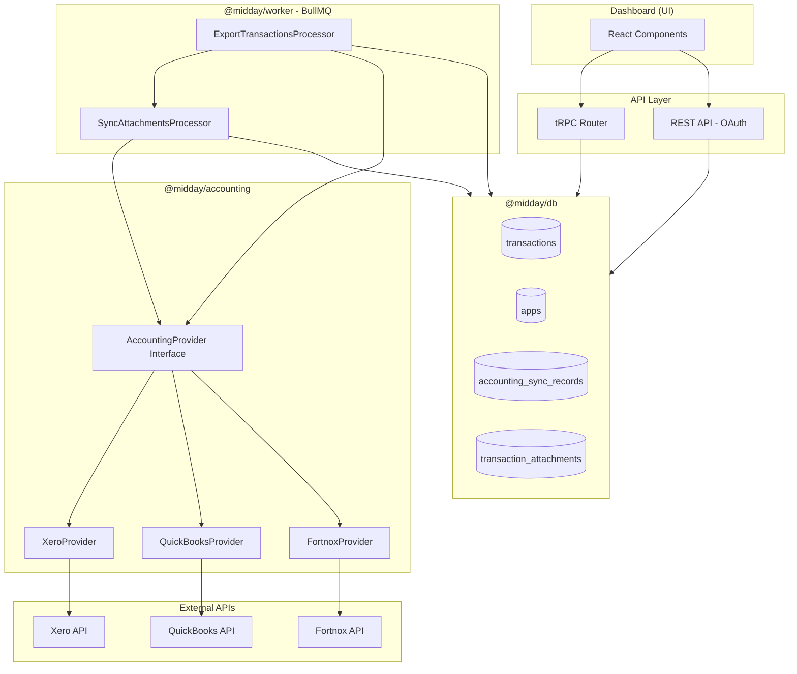
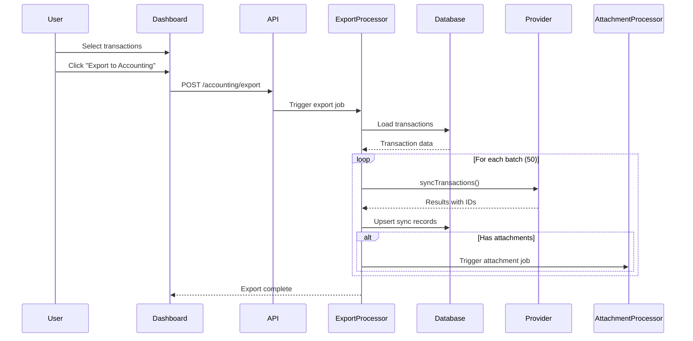
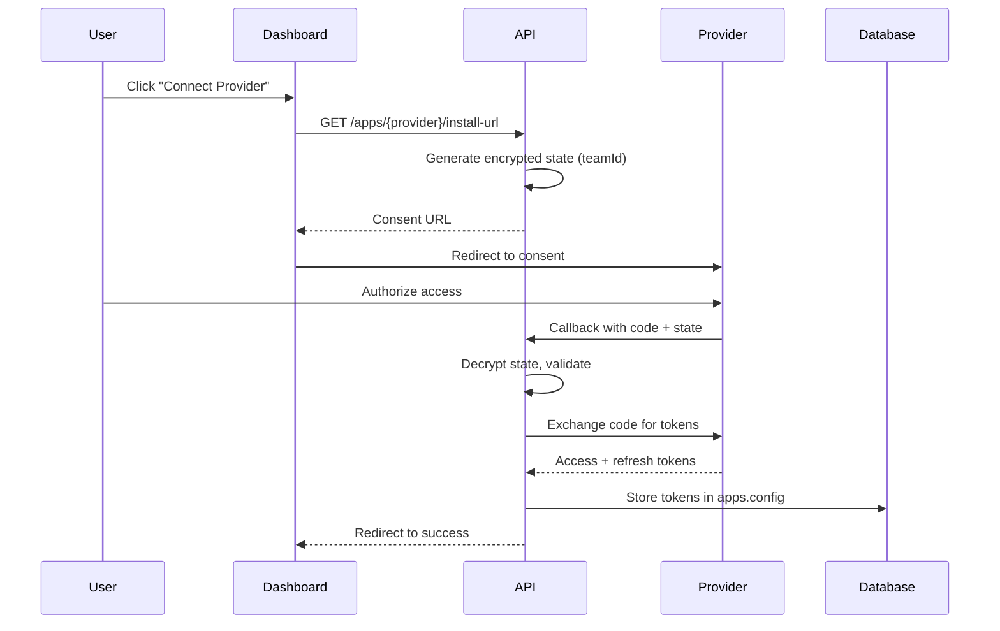
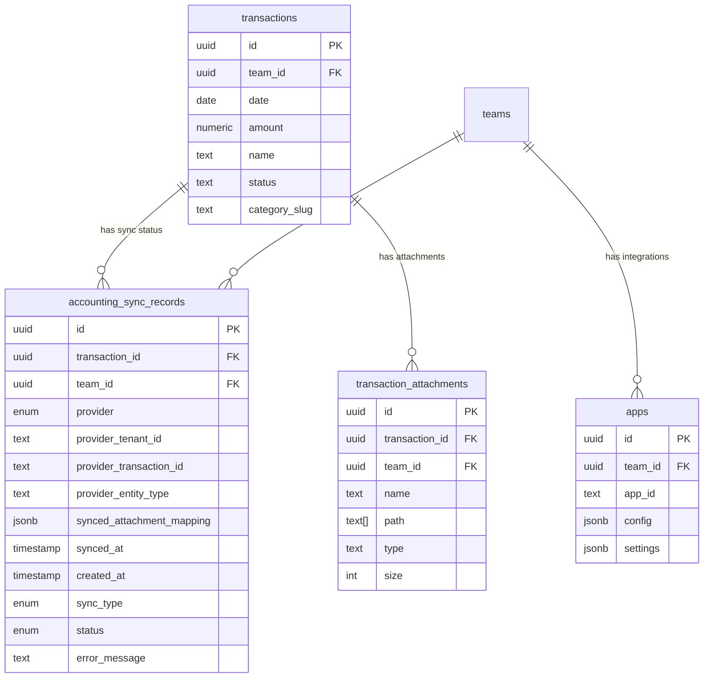
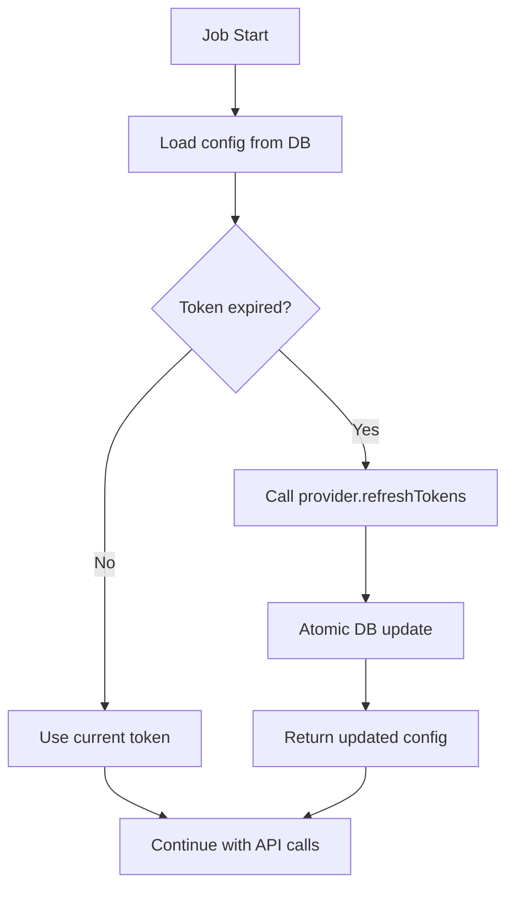
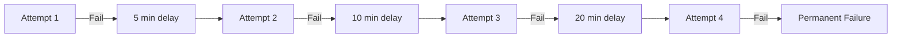

# Accounting Integration Package

Technical documentation for Midday's accounting software integrations (Xero, QuickBooks, Fortnox).

## Table of Contents

1. [Overview](#overview)
2. [Architecture](#architecture)
3. [Data Flow](#data-flow)
4. [Database Schema](#database-schema)
5. [Export Logic](#export-logic)
6. [Authentication](#authentication)
7. [Worker Jobs](#worker-jobs)
8. [API Reference](#api-reference)
9. [Configuration](#configuration)
10. [Error Handling](#error-handling)

---

## Overview

The accounting integration enables Midday users to export their enriched financial transactions and attachments (receipts, invoices) to external accounting software. The system uses manual export only, giving users full control over when data is sent to their accounting provider.

### Supported Providers

| Provider | Status | OAuth | Export | Attachments |
|----------|--------|-------|--------|-------------|
| Xero | Active | OAuth 2.0 | Yes | Yes |
| QuickBooks | Active | OAuth 2.0 | Yes | Yes |
| Fortnox | Active | OAuth 2.0 | Yes (Vouchers) | Yes |

### Key Features

- OAuth 2.0 authentication with automatic token refresh
- Manual export of selected transactions
- Attachment upload with deduplication
- Multi-provider support per team
- Batch processing with progress tracking
- Retry handling with exponential backoff
- Re-export support (creates new entries in accounting provider)
- **Concurrent uploads** with provider-specific rate limiting
- **Adaptive rate limiting** (Xero) based on API quota tracking
- **Date-sorted exports** for chronological ordering in accounting software

---

## Architecture



### Package Structure

```
packages/accounting/
├── src/
│   ├── index.ts              # Factory and exports
│   ├── provider.ts           # AccountingProvider interface
│   ├── types.ts              # Shared types
│   ├── utils.ts              # OAuth state encryption, utilities
│   └── providers/
│       ├── xero.ts           # Xero implementation
│       ├── quickbooks.ts     # QuickBooks implementation
│       └── fortnox.ts        # Fortnox implementation
├── package.json
└── tsconfig.json

apps/worker/src/
├── processors/accounting/
│   ├── index.ts              # Processor exports
│   ├── base.ts               # Shared processor logic
│   ├── sync-attachments.ts   # Attachment upload processor
│   └── export-transactions.ts# Manual export processor
├── queues/
│   └── accounting.config.ts  # BullMQ queue configuration
├── schemas/
│   └── accounting.ts         # Zod schemas for job payloads
└── utils/
    └── accounting-auth.ts    # Token refresh utilities
```

---

## Data Flow

### Manual Export Flow



### OAuth Authentication Flow



---

## Database Schema

### accounting_sync_records

Tracks export status for each transaction per provider.



### apps.config Structure

OAuth tokens and settings stored in JSONB config field:

```typescript
interface AccountingProviderConfig {
  accessToken: string;
  refreshToken: string;
  expiresAt: string;      // ISO timestamp
  tenantId: string;       // Organization ID (realmId for QB)
  tenantName?: string;    // Organization name
}
```

---

## Export Logic

### Transaction Selection

Users manually select which transactions to export. The system validates that transactions are eligible:

| Condition | Exports | Reason |
|-----------|---------|--------|
| Status = pending | Yes | User can export anytime |
| Status = completed | Yes | User marked as done |
| Status = excluded | No | User excluded from books |
| Status = archived | No | Old transaction |

### Re-export Behavior

- **Always creates new entries**: Re-exporting creates new transactions/vouchers in the accounting provider
- **No updates**: Accounting providers have limited or no update support (Fortnox vouchers are immutable)
- **Sync records updated**: The latest provider transaction ID is stored
- **User responsibility**: Users should delete old entries in accounting software if needed

### Provider-Specific Behavior

| Provider | Entity Type | Idempotency | Notes |
|----------|-------------|-------------|-------|
| Xero | BankTransaction | `updateOrCreate` | SPEND/RECEIVE, deterministic keys |
| QuickBooks | Purchase/Deposit | `Request-Id` header | Based on amount sign |
| Fortnox | Voucher | None (immutable) | Posted vouchers, double-entry |

### Important: Re-Export Behavior

- **Xero**: Uses `updateOrCreateBankTransactions` - re-exporting the same transaction **updates** it rather than creating duplicates
- **QuickBooks**: Uses idempotency headers but creates new entities on re-export
- **Fortnox**: Vouchers are **immutable** via API - re-exporting always creates a new voucher. Users must manually delete old vouchers in Fortnox if needed

---

## Authentication

### Token Management



OAuth tokens are managed through the `ensureValidToken` utility:

```typescript
export const ensureValidToken = async (
  db: Database,
  provider: AccountingProvider,
  config: AccountingProviderConfig,
  teamId: string,
  providerId: string,
): Promise<AccountingProviderConfig> => {
  if (!provider.isTokenExpired(new Date(config.expiresAt))) {
    return config;
  }

  const newTokens = await provider.refreshTokens(config.refreshToken);

  await updateAppTokens(db, {
    teamId,
    appId: providerId,
    ...newTokens,
  });

  return { ...config, ...newTokens };
};
```

---

## Worker Jobs

### Queue Configuration

```typescript
const accountingQueueOptions: QueueOptions = {
  defaultJobOptions: {
    attempts: 4,
    backoff: {
      type: "exponential",
      delay: 5 * 60 * 1000,  // 5 minutes initial
    },
    removeOnComplete: { age: 24 * 3600, count: 100 },
    removeOnFail: { age: 7 * 24 * 3600, count: 500 },
  },
};
```

### Retry Sequence



### Job Types

| Job Name | Processor | Trigger | Purpose |
|----------|-----------|---------|---------|
| `export-to-accounting` | ExportTransactionsProcessor | User action | Export selected transactions |
| `sync-accounting-attachments` | SyncAttachmentsProcessor | Export job | Upload attachments to provider |

---

## API Reference

### AccountingProvider Interface

```typescript
interface AccountingProvider {
  // OAuth
  buildConsentUrl(state: string): Promise<string>;
  exchangeCodeForTokens(code: string): Promise<TokenSet>;
  refreshTokens(refreshToken: string): Promise<TokenSet>;
  isTokenExpired(expiresAt: Date, bufferSeconds?: number): boolean;

  // Tenant Info
  getTenantInfo(tenantId: string): Promise<TenantInfo>;
  getTenants(): Promise<TenantInfo[]>;

  // Accounts
  getAccounts(tenantId: string): Promise<AccountingAccount[]>;

  // Transactions
  syncTransactions(params: SyncTransactionsParams): Promise<SyncResult>;

  // Attachments
  uploadAttachment(params: UploadAttachmentParams): Promise<AttachmentResult>;
  deleteAttachment(params: DeleteAttachmentParams): Promise<DeleteAttachmentResult>;

  // Health Check
  checkConnection(): Promise<{ connected: boolean; error?: string }>;

  // Cleanup (optional)
  disconnect?(): Promise<void>;
}
```

### Database Queries

```typescript
// Get transactions for export
getTransactionsForAccountingSync(db, {
  teamId: string,
  provider: ProviderType,
  transactionIds: string[],  // Required for manual export
  limit?: number,
}): Promise<TransactionForSync[]>

// Upsert sync record
upsertAccountingSyncRecord(db, {
  transactionId: string,
  teamId: string,
  provider: ProviderType,
  providerTenantId: string,
  providerTransactionId?: string,
  providerEntityType?: string,
  // Maps Midday attachment IDs to provider attachment IDs
  syncedAttachmentMapping?: Record<string, string | null>,
  syncType: 'manual',
  status: 'synced' | 'failed' | 'pending',
  errorMessage?: string,
}): Promise<AccountingSyncRecord>

// Update attachment mapping after sync
updateSyncedAttachmentMapping(db, {
  syncRecordId: string,
  syncedAttachmentMapping: Record<string, string | null>,
}): Promise<AccountingSyncRecord>
```

---

## Configuration

### Environment Variables

```bash
# Xero
XERO_CLIENT_ID=your_client_id
XERO_CLIENT_SECRET=your_client_secret
XERO_OAUTH_REDIRECT_URL=https://api.midday.ai/v1/apps/xero/oauth-callback

# QuickBooks
QUICKBOOKS_CLIENT_ID=your_client_id
QUICKBOOKS_CLIENT_SECRET=your_client_secret
QUICKBOOKS_OAUTH_REDIRECT_URL=https://api.midday.ai/v1/apps/quickbooks/oauth-callback

# Fortnox
FORTNOX_CLIENT_ID=your_client_id
FORTNOX_CLIENT_SECRET=your_client_secret
FORTNOX_OAUTH_REDIRECT_URL=https://api.midday.ai/v1/apps/fortnox/oauth-callback

# OAuth state encryption
ACCOUNTING_OAUTH_SECRET=32_byte_encryption_key
```

---

## Error Handling

### Retry Strategy

| Error Type | Retry | Notes |
|------------|-------|-------|
| Network timeout | Yes | BullMQ exponential backoff |
| Rate limit (429) | Yes | Backoff allows recovery |
| Auth failure (401) | Yes | Token refresh attempted |
| Invalid data (400) | No | Logged, marked as failed |
| Server error (5xx) | Yes | Provider may recover |

### Error Recording

Failed exports are recorded with error details:

```typescript
await upsertAccountingSyncRecord(db, {
  transactionId: tx.id,
  teamId,
  provider: providerId,
  status: "failed",
  errorMessage: error.message,
});
```

---

## Security Considerations

1. **Token Storage**: OAuth tokens stored encrypted in database
2. **State Parameter**: OAuth state encrypted with HMAC to prevent CSRF
3. **RLS Policies**: Database enforces team-level access control
4. **API Keys**: Provider credentials stored in environment variables
5. **Audit Trail**: Sync records provide full export history

---

## Rate Limiting & Reliability

### Provider Rate Limits (2025)

| Provider | Calls/Min | Concurrent | Daily | Notes |
|----------|-----------|------------|-------|-------|
| Xero | 60 | 5 | 5,000 | Per tenant |
| QuickBooks | 500 | 10 | None | Per realm |
| Fortnox | ~300 | 3 | None | ~25/5 seconds |

### Job-Level Rate Limiting

Attachment jobs are created with **calculated delays** to stay under rate limits:

```typescript
// export-transactions.ts
function calculateAttachmentJobDelay(providerId: string, jobIndex: number): number {
  const rateLimit = RATE_LIMITS[providerId]?.callsPerMinute ?? 60;
  const msPerJob = Math.ceil((60000 / rateLimit) * 1.1); // 1.1x buffer
  return jobIndex * msPerJob;
}
// Xero: Job 0 = 0ms, Job 1 = 1100ms, Job 2 = 2200ms, ...
```

**Benefits:**
- Jobs are in "delayed" state, not blocking workers
- Different teams process in parallel (no blocking)
- Zero rate limit errors (jobs are pre-spaced)
- No runtime rate limit checking needed

### Within-Job Concurrency

For transactions with multiple attachments, uploads are batched:

```typescript
const RATE_LIMITS = {
  xero: { maxConcurrent: 3, callDelayMs: 1500 },
  quickbooks: { maxConcurrent: 10, callDelayMs: 200 },
  fortnox: { maxConcurrent: 3, callDelayMs: 600 },
};
```

### Transaction Sorting

All providers sort transactions by date before export:

- Ensures chronological order in accounting software
- Fortnox: Voucher numbers assigned in creation order
- Xero/QuickBooks: Cleaner transaction lists

### Estimated Export Times

| Transactions + Attachments | Xero | QuickBooks | Fortnox |
|---------------------------|------|------------|---------|
| 200 | ~4 min | ~30 sec | ~1 min |
| 1000 | ~18 min | ~2 min | ~4 min |
| 2000 | ~37 min | ~4 min | ~8 min |

**Note:** Xero has a daily limit of 5,000 calls. Exports larger than ~4,500 attachments may span multiple days.

---

## Limitations

1. **No Updates**: Re-exporting creates new entries; existing entries cannot be updated
2. **Attachment Deletion**: Partial support - QuickBooks and Fortnox support deletion, Xero does not (attachments remain in Xero)
3. **Bank Account Mapping**: Currently uses first active account; multi-account mapping planned
4. **Rate Limits**: Subject to provider API rate limits (handled automatically with throttling)
5. **Fortnox Vouchers**: Created as posted entries (Fortnox API doesn't support draft vouchers via API)
