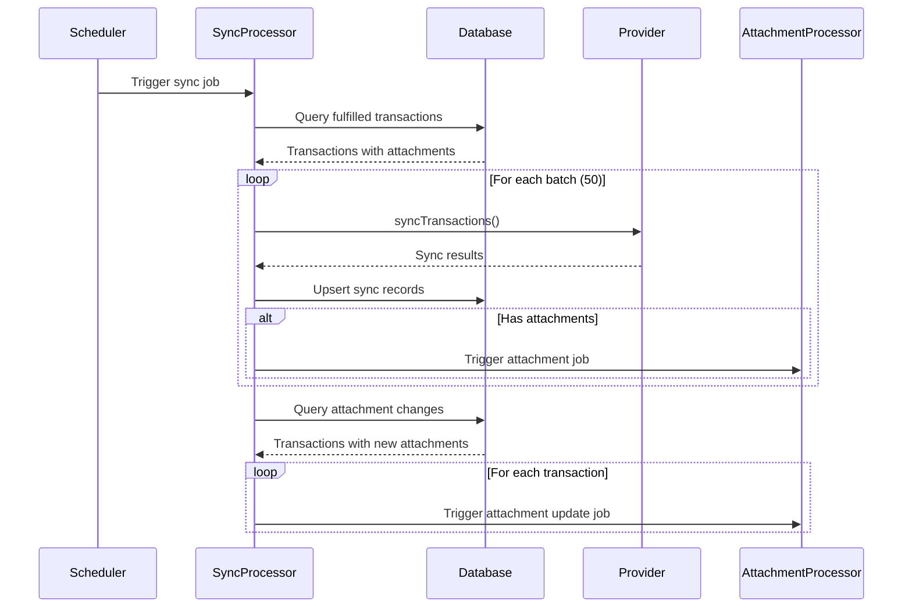

# Accounting Integration Package

Technical documentation for Midday's accounting software integrations (Xero, QuickBooks, Fortnox, Visma).

## Table of Contents

1. [Overview](#overview)
2. [Architecture](#architecture)
3. [Data Flow](#data-flow)
4. [Database Schema](#database-schema)
5. [Sync Logic](#sync-logic)
6. [Authentication](#authentication)
7. [Worker Jobs](#worker-jobs)
8. [API Reference](#api-reference)
9. [Configuration](#configuration)
10. [Error Handling](#error-handling)

---

## Overview

The accounting integration enables Midday users to automatically synchronize their financial transactions and attachments (receipts, invoices) to external accounting software. The system supports both automatic scheduled sync and manual export workflows.

### Supported Providers

| Provider | Status | OAuth | Sync | Attachments |
|----------|--------|-------|------|-------------|
| Xero | Active | OAuth 2.0 | Yes | Yes |
| QuickBooks | Planned | OAuth 2.0 | Yes | Yes |
| Fortnox | Planned | OAuth 2.0 | Yes | Yes |
| Visma | Planned | OAuth 2.0 | Yes | Yes |

### Key Features

- OAuth 2.0 authentication with automatic token refresh
- Automatic sync of "fulfilled" transactions (with attachments or marked complete)
- Manual export of selected transactions
- Attachment sync with deduplication
- Multi-provider support per team
- Batch processing with progress tracking
- Retry handling with exponential backoff

---

## Architecture


### Package Structure

```
packages/accounting/
├── src/
│   ├── index.ts              # Factory and exports
│   ├── provider.ts           # AccountingProvider interface
│   ├── types.ts              # Shared types
│   ├── utils.ts              # OAuth state encryption
│   └── providers/
│       └── xero.ts           # Xero implementation
├── package.json
└── tsconfig.json

apps/worker/src/
├── processors/accounting/
│   ├── index.ts              # Processor exports
│   ├── sync-transactions.ts  # Main sync processor
│   ├── sync-attachments.ts   # Attachment upload processor
│   ├── sync-scheduler.ts     # Per-team scheduler
│   └── export-transactions.ts# Manual export processor
├── queues/
│   └── accounting.config.ts  # BullMQ queue configuration
├── schemas/
│   └── accounting.ts         # Zod schemas for job payloads
└── utils/
    └── accounting-auth.ts    # Token refresh utilities
```

---

## Data Flow

### Automatic Sync Flow



### OAuth Authentication Flow


---

## Database Schema

### accounting_sync_records

Tracks synchronization status for each transaction per provider.


### apps.config Structure

OAuth tokens and settings stored in JSONB config field:

```typescript
interface AccountingProviderConfig {
  accessToken: string;
  refreshToken: string;
  expiresAt: string;      // ISO timestamp
  tenantId: string;       // Xero organization ID
  tenantName?: string;    // Organization name
}
```

---

## Sync Logic

### Transaction Selection Criteria

A transaction is eligible for accounting sync if it meets the "fulfilled" criteria:


| Condition | Syncs | Reason |
|-----------|-------|--------|
| Has attachments | Yes | Receipt/invoice attached |
| Status = completed | Yes | User marked as done |
| Status = pending | No | Not yet reviewed |
| Status = posted | No | Awaiting action |
| Status = excluded | No | User excluded from books |
| Status = archived | No | Old transaction |

### Attachment Change Detection

Detects transactions where new attachments were added after initial sync:

```typescript
// Compare current attachment IDs vs synced attachment IDs
const newAttachmentIds = currentIds.filter(id => !syncedSet.has(id));
```

Key behaviors:
- New attachments are pushed to the provider
- Removed attachments are NOT deleted from the provider (audit trail preservation)
- Replaced attachments result in the new version being uploaded

---

## Authentication

### Token Management


OAuth tokens are managed through the `ensureValidToken` utility:

```typescript
export const ensureValidToken = async (
  db: Database,
  provider: AccountingProvider,
  config: AccountingProviderConfig,
  teamId: string,
  providerId: string,
): Promise<AccountingProviderConfig> => {
  if (!provider.isTokenExpired(new Date(config.expiresAt))) {
    return config;
  }

  const newTokens = await provider.refreshTokens(config.refreshToken);

  await updateAppTokens(db, {
    teamId,
    appId: providerId,
    ...newTokens,
  });

  return { ...config, ...newTokens };
};
```

---

## Worker Jobs

### Queue Configuration

```typescript
const accountingQueueOptions: QueueOptions = {
  defaultJobOptions: {
    attempts: 4,
    backoff: {
      type: "exponential",
      delay: 5 * 60 * 1000,  // 5 minutes initial
    },
    removeOnComplete: { age: 24 * 3600, count: 100 },
    removeOnFail: { age: 7 * 24 * 3600, count: 500 },
  },
};
```

### Retry Sequence


### Job Types

| Job Name | Processor | Trigger | Purpose |
|----------|-----------|---------|---------|
| `sync-accounting-transactions` | SyncTransactionsProcessor | Scheduler | Sync new fulfilled transactions |
| `sync-accounting-attachments` | SyncAttachmentsProcessor | Transaction sync | Upload attachments to provider |
| `export-to-accounting` | ExportTransactionsProcessor | User action | Manual export of selected transactions |
| `accounting-sync-scheduler` | SyncSchedulerProcessor | Cron | Trigger sync for teams with auto-sync |

---

## API Reference

### AccountingProvider Interface

```typescript
interface AccountingProvider {
  // OAuth
  getConsentUrl(state: string): string;
  exchangeCodeForTokens(code: string): Promise<TokenResponse>;
  refreshTokens(refreshToken: string): Promise<TokenResponse>;
  isTokenExpired(expiresAt: Date): boolean;

  // Accounts
  getAccounts(tenantId: string): Promise<AccountingAccount[]>;

  // Transactions
  syncTransactions(params: SyncTransactionsParams): Promise<SyncResult>;

  // Attachments
  uploadAttachment(params: UploadAttachmentParams): Promise<AttachmentResult>;
}
```

### Database Queries

```typescript
// Get transactions for sync
getTransactionsForAccountingSync(db, {
  teamId: string,
  provider: ProviderType,
  transactionIds?: string[],
  sinceDaysAgo?: number,
  limit?: number,
}): Promise<TransactionForSync[]>

// Upsert sync record
upsertAccountingSyncRecord(db, {
  transactionId: string,
  teamId: string,
  provider: ProviderType,
  providerTenantId: string,
  providerTransactionId?: string,
  syncedAttachmentIds?: string[],
  syncType?: 'auto' | 'manual',
  status?: 'synced' | 'failed' | 'pending',
  errorMessage?: string,
}): Promise<AccountingSyncRecord>

// Get synced transactions with attachment changes
getSyncedTransactionsWithAttachmentChanges(db, {
  teamId: string,
  provider: ProviderType,
  sinceDaysAgo?: number,
  limit?: number,
}): Promise<TransactionWithNewAttachments[]>
```

---

## Configuration

### Environment Variables

```bash
# Xero
XERO_CLIENT_ID=your_client_id
XERO_CLIENT_SECRET=your_client_secret
XERO_OAUTH_REDIRECT_URL=https://api.midday.ai/v1/apps/xero/oauth-callback

# QuickBooks (planned)
QUICKBOOKS_CLIENT_ID=your_client_id
QUICKBOOKS_CLIENT_SECRET=your_client_secret
QUICKBOOKS_OAUTH_REDIRECT_URL=https://api.midday.ai/v1/apps/quickbooks/oauth-callback

# OAuth state encryption
ACCOUNTING_OAUTH_SECRET=32_byte_encryption_key
```

### App Store Settings Schema

```typescript
const settingsSchema = [
  {
    id: "syncMode",
    type: "select",
    options: ["auto", "manual"],
    default: "manual",
  },
  {
    id: "syncFrequency",
    type: "select",
    options: ["daily", "weekly"],
    default: "daily",
  },
  {
    id: "includeAttachments",
    type: "boolean",
    default: true,
  },
];
```

---

## Error Handling

### Retry Strategy

| Error Type | Retry | Notes |
|------------|-------|-------|
| Network timeout | Yes | BullMQ exponential backoff |
| Rate limit (429) | Yes | Backoff allows recovery |
| Auth failure (401) | Yes | Token refresh attempted |
| Invalid data (400) | No | Logged, marked as failed |
| Server error (5xx) | Yes | Provider may recover |

### Error Recording

Failed syncs are recorded with error details:

```typescript
await upsertAccountingSyncRecord(db, {
  transactionId: tx.id,
  teamId,
  provider: providerId,
  status: "failed",
  errorMessage: error.message,
});
```

---

## Security Considerations

1. **Token Storage**: OAuth tokens stored encrypted in database
2. **State Parameter**: OAuth state encrypted with HMAC to prevent CSRF
3. **RLS Policies**: Database enforces team-level access control
4. **API Keys**: Provider credentials stored in environment variables
5. **Audit Trail**: Sync records provide full audit history

---

## Limitations

1. **Attachment Deletion**: Removing attachments in Midday does not delete them from the accounting provider
2. **Bank Account Mapping**: Currently uses first active account; multi-account mapping planned
3. **Historical Sync**: Auto-sync limited to 30 days; manual export supports 365 days
4. **Rate Limits**: Subject to provider API rate limits (Xero: 60 calls/minute)
