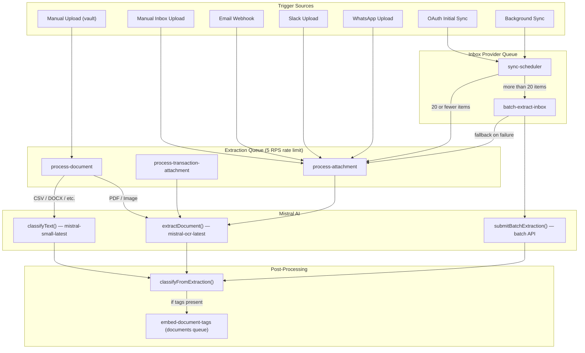

# Document Processing Architecture

Technical documentation of the document extraction, classification, and embedding pipeline.

## Overview

All document processing is consolidated through **Mistral AI**:

- **PDFs and images** use the Mistral OCR API (`mistral-ocr-latest`) for structured data extraction
- **Other file types** (CSV, DOCX, PPTX, etc.) use text extraction via langchain, then Mistral Completion API (`mistral-small-latest`) for classification
- **Bulk operations** use the Mistral Batch API for cost-efficient async processing
- **Embeddings** use Google Gemini (`gemini-embedding-001`) for tag similarity search
- **Domain lookup** uses Google Gemini with Search Grounding (`gemini-3-flash-preview`) for vendor website resolution

## Processing Flow

## Queue Architecture

### Extraction Queue

Rate-limited queue for all synchronous Mistral API calls.

| Setting | Value | Rationale |
|---------|-------|-----------|
| Rate limit | 5 jobs/sec | Stays under Mistral's 6 RPS API limit |
| Concurrency | 5 workers | Matches rate limit for throughput |
| Lock duration | 660s | Supports up to 10-minute processing jobs |
| Retries | 3 attempts | Exponential backoff (1s base delay) |

**Jobs:** `process-attachment`, `process-transaction-attachment`, `process-document`

### Documents Queue

Unbounded queue for embedding operations.

| Setting | Value |
|---------|-------|
| Concurrency | 10 workers |
| Lock duration | 120s |
| Retries | 3 attempts |

**Jobs:** `embed-document-tags`

### Inbox Provider Queue

Manages sync scheduling and batch extraction.

**Jobs:** `sync-scheduler`, `batch-extract-inbox`

## Priority Strategy

BullMQ priority: lower number = higher priority.

| Priority | Usage | Examples |
|----------|-------|---------|
| 1 | Manual user actions | Vault upload, reprocess document, transaction attachment |
| 5 | Real-time automated | Email webhooks, inbox manual uploads, OAuth initial sync |
| 10 | Background | Scheduled sync, batch fallback items |

## Processors

### process-attachment

Handles real-time inbox document processing from email, Slack, WhatsApp, and manual inbox uploads.

**Flow:** HEIC conversion → signed URL → `DocumentClient.getInvoiceOrReceipt()` → update inbox → group related items → `classifyFromExtraction()` → embed inbox → trigger matching

**Source:** `apps/worker/src/processors/inbox/process-attachment.ts`

### process-transaction-attachment

Handles receipt/invoice attachments on transactions, extracting tax information.

**Flow:** HEIC conversion (with size check) → signed URL → `DocumentClient.getInvoiceOrReceipt()` (with timeout) → update transaction tax data → `classifyFromExtraction()`

**Source:** `apps/worker/src/processors/transactions/process-attachment.ts`

### process-document

Handles vault uploads and document reprocessing. Routes by file type.

**PDF/Image flow:** HEIC conversion → file type detection → signed URL → `extractDocument()` → `classifyFromExtraction()`

**Other file flow:** `loadDocument()` (langchain) → `classifyText()` (Mistral completion) → `classifyFromExtraction()`

**Source:** `apps/worker/src/processors/documents/process-document.ts`

### batch-extract-inbox

Processes large batches of inbox items using the Mistral Batch API for cost efficiency.

**Flow:** chunk items (50 per batch) → submit batch jobs → poll for completion → download results → batch update inbox → `classifyFromExtraction()` per item → trigger batch embedding

Falls back to `process-attachment` for individual items that fail batch extraction.

**Source:** `apps/worker/src/processors/inbox/batch-extract-inbox.ts`

## Schemas

### invoiceSchema

Used by Mistral OCR for structured extraction from PDFs and images. Extracts financial data (amounts, dates, vendor info, line items, tax details) plus classification metadata (title, summary, tags, language).

**Source:** `packages/documents/src/schema.ts`

### classificationSchema

Used by Mistral Completion API for text-based classification of non-PDF/image documents. Extracts title, summary, tags, date, and language.

**Source:** `packages/documents/src/schema.ts`

## Shared Utilities

### classifyFromExtraction()

Central function that writes classification data to the documents table and triggers tag embedding. Used by all extraction processors.

**Key behaviors:**
- Generates fallback titles from document type, vendor name, invoice number, or filename
- Truncates content to 10,000 words before storage
- Maps language codes to PostgreSQL text search configurations
- Triggers `embed-document-tags` job when tags are present
- Wrapped entirely in try/catch — classification failures never fail the parent job

**Source:** `apps/worker/src/utils/classify-from-extraction.ts`

### DocumentClient

Thin wrapper around `extractDocument()` that normalizes OCR results into a consistent `GetInvoiceOrReceiptResponse` shape consumed by all inbox processors.

**Source:** `packages/documents/src/client.ts`

## Error Handling

### Fault Isolation

Classification is non-critical. The `classifyFromExtraction()` helper wraps all operations in try/catch so a classification failure (DB write, tag embedding) never causes the parent extraction job to fail.

### Retry Strategy

- Extraction queue: 3 retries with exponential backoff
- Unsupported file types: marked as completed (not retried)
- Final failures on `process-document`: document status set to "failed"

### Timeout Protection

All document extraction calls use `withTimeout()` wrapping (default: `TIMEOUTS.DOCUMENT_PROCESSING`). Signed URLs expire after 600 seconds, providing an outer bound on processing time.

## Rate Limiting

The Mistral API has a 6 requests/second limit on the Completion API. The extraction queue is configured at 5 jobs/second to stay safely under this limit while maximizing throughput.

For bulk operations (initial email sync, large imports), the Batch API is used instead. Batch jobs are submitted asynchronously and polled for completion, avoiding rate limit pressure entirely.
