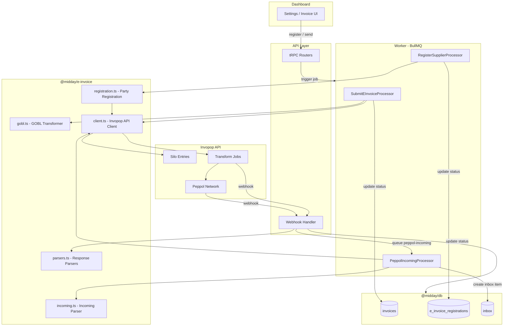
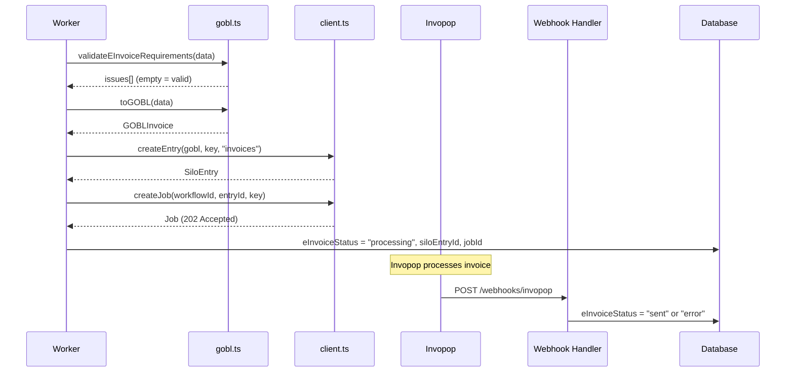
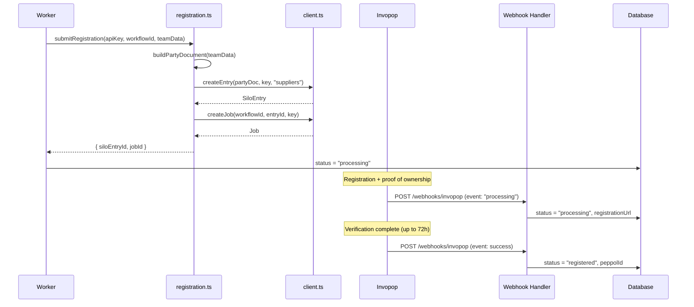
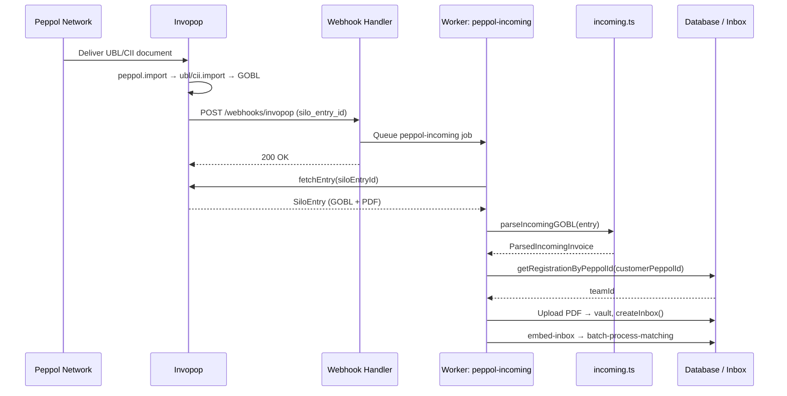

# E-Invoice Package

Technical documentation for Midday's e-invoicing integration via [Invopop](https://invopop.com) and the [GOBL](https://gobl.org) open-source business document format.

## Table of Contents

1. [Overview](#overview)
2. [Architecture](#architecture)
3. [Package Structure](#package-structure)
4. [Data Flow](#data-flow)
5. [Database Schema](#database-schema)
6. [Configuration](#configuration)
7. [API Reference](#api-reference)
8. [Testing](#testing)

---

## Overview

The `@midday/e-invoice` package handles converting Midday invoices into [GOBL](https://gobl.org) format and submitting them to [Invopop](https://invopop.com) for compliant electronic invoicing via the [Peppol](https://peppol.org) network. It also manages supplier (company) registration as a Peppol participant and parsing incoming e-invoices received through the Peppol network.

### Key Features

- GOBL invoice transformation from Midday's data model
- Invopop REST API client (silo entries, transform jobs, workflows, file downloads)
- Peppol supplier registration with proof-of-ownership flow
- Incoming e-invoice parsing (GOBL bill/invoice to inbox-compatible data)
- Response parsers for webhook payloads and silo entry data
- Pre-submission validation of required e-invoicing fields
- Idempotency keys to prevent duplicate submissions
- EN 16931 addon for Peppol BIS 3.0 compliance

### External Services

| Service | Role | Protocol |
|---------|------|----------|
| Invopop | E-invoice orchestration platform | REST API (Bearer JWT) |
| Peppol | B2B document exchange network | Via Invopop |
| GOBL | Universal business document format | Data format |

---

## Architecture



---

## Package Structure

```
packages/e-invoice/src/
  client.ts         Invopop REST API client (silo entries, jobs, workflows, file downloads)
  gobl.ts           GOBL invoice transformer and validation
  incoming.ts       Incoming e-invoice parser (GOBL bill/invoice → inbox data)
  registration.ts   Peppol supplier registration (org.party builder)
  parsers.ts        Response parsers (faults, Peppol ID, registration URL, PDF attachments)
  types.ts          TypeScript types for Invopop API and GOBL documents
  constants.ts      Shared constants (provider names)

  gobl.test.ts          Tests for validation, transformation, key helpers
  incoming.test.ts      Tests for GOBL invoice parsing, amount extraction, line item summary
  registration.test.ts  Tests for party document builder, key helpers
  parsers.test.ts       Tests for mapFaults, extractPeppolId, extractRegistrationUrl, findPdfAttachment
```

---

## Data Flow

### Invoice Submission



### Supplier Registration



### Incoming E-Invoice (Receive)



---

## Database Schema

### `e_invoice_registrations` table

| Column | Type | Description |
|--------|------|-------------|
| `id` | uuid | Primary key |
| `team_id` | uuid | FK to teams |
| `provider` | text | Provider name (`"peppol"`) |
| `status` | text | `pending`, `processing`, `registered`, `error` |
| `silo_entry_id` | text | Invopop silo entry UUID for the org.party |
| `peppol_id` | text | Assigned Peppol participant ID |
| `peppol_scheme` | text | Peppol scheme ID (e.g. `"0208"`) |
| `registration_url` | text | Proof-of-ownership form URL |
| `faults` | jsonb | Error details array `{ message, ... }[]` |
| `created_at` | timestamptz | Row creation time |
| `updated_at` | timestamptz | Last update time |

### E-invoice columns on `invoices` table

| Column | Type | Description |
|--------|------|-------------|
| `e_invoice_status` | text | `null`, `"processing"`, `"sent"`, `"error"` |
| `e_invoice_silo_entry_id` | text | Invopop silo entry UUID |
| `e_invoice_job_id` | text | Invopop transform job UUID |
| `e_invoice_faults` | jsonb | Error details array `{ message, ... }[]` |

---

## Configuration

| Variable | Required | Description |
|----------|----------|-------------|
| `INVOPOP_API_KEY` | Yes | Invopop workspace API key (Bearer JWT) |
| `INVOPOP_WORKFLOW_ID` | Yes | Workflow ID for invoice submission |
| `INVOPOP_PARTY_WORKFLOW_ID` | Yes | Workflow ID for supplier registration |
| `INVOPOP_WEBHOOK_SECRET` | Yes | Bearer token for webhook authentication |
| `INVOPOP_RECEIVE_WORKFLOW_ID` | No | Workflow ID for receiving incoming documents |

---

## API Reference

### `gobl.ts`

| Function | Description |
|----------|-------------|
| `validateEInvoiceRequirements(data)` | Check required fields for e-invoicing. Returns `ValidationIssue[]`. |
| `toGOBL(data)` | Transform Midday invoice data into a GOBL invoice document. |
| `invoiceKey(invoiceId)` | Generate idempotency key: `midday-invoice-{id}`. |
| `parseInvoiceKey(key)` | Extract invoice ID from webhook key. Returns `string \| null`. |

### `client.ts`

| Function | Description |
|----------|-------------|
| `ping(apiKey)` | Verify API key validity. |
| `buildDocument(apiKey, data)` | Validate and calculate GOBL without storing. |
| `createEntry(apiKey, data, key?, folder?)` | Create silo entry (validated + stored). |
| `fetchEntry(apiKey, entryId)` | Fetch silo entry by UUID. |
| `fetchEntryFile(apiKey, entryId, fileId)` | Download a file attachment from a silo entry. Returns `ArrayBuffer`. |
| `updateEntry(apiKey, entryId, data)` | Patch an existing silo entry. |
| `fetchWorkflows(apiKey, schema?)` | List workflows in workspace. |
| `createJob(apiKey, workflowId, entryId, key?)` | Create transform job (returns 202). |
| `fetchJob(apiKey, jobId)` | Fetch job status. |

### `incoming.ts`

| Function | Description |
|----------|-------------|
| `parseIncomingGOBL(entry)` | Parse a GOBL `bill/invoice` from a silo entry into `ParsedIncomingInvoice`. Returns `null` if not a valid invoice. |

### `registration.ts`

| Function | Description |
|----------|-------------|
| `buildPartyDocument(data)` | Build GOBL `org.party` document for Peppol registration. |
| `submitRegistration(apiKey, workflowId, data)` | Create silo entry + job for party registration. |
| `partyKey(teamId)` | Generate idempotency key: `midday-party-{id}`. |
| `parsePartyKey(key)` | Extract team ID from webhook key. Returns `string \| null`. |

### `parsers.ts`

| Function | Description |
|----------|-------------|
| `mapFaults(faults?)` | Map Invopop faults to DB-compatible format (ensures `message` is always a string). |
| `extractPeppolId(entry)` | Extract Peppol participant ID and scheme from silo entry. |
| `extractRegistrationUrl(entry)` | Extract proof-of-ownership URL from silo entry meta. |
| `findPdfAttachment(entry)` | Find the first PDF file in a silo entry's attachments. Returns `InvopopFile \| null`. |

---

## Testing

Run the unit tests:

```bash
cd packages/e-invoice
bun test --exit src
```

Tests cover all pure functions (GOBL transformation, validation, party document building, key parsing, fault mapping, silo entry extraction). See `*.test.ts` files for details.
